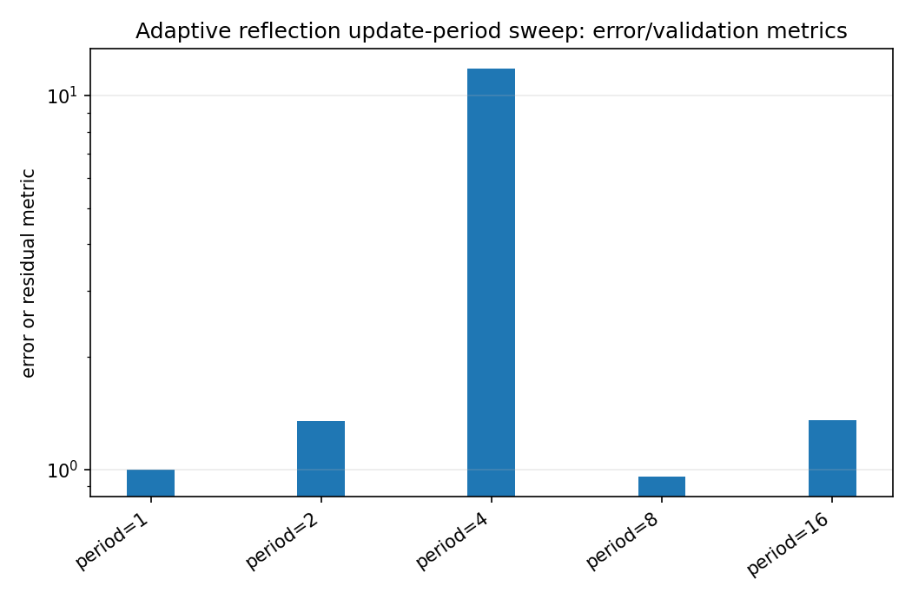
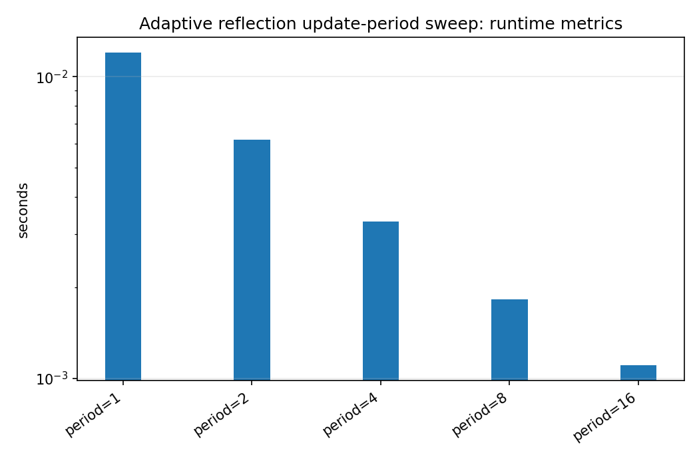
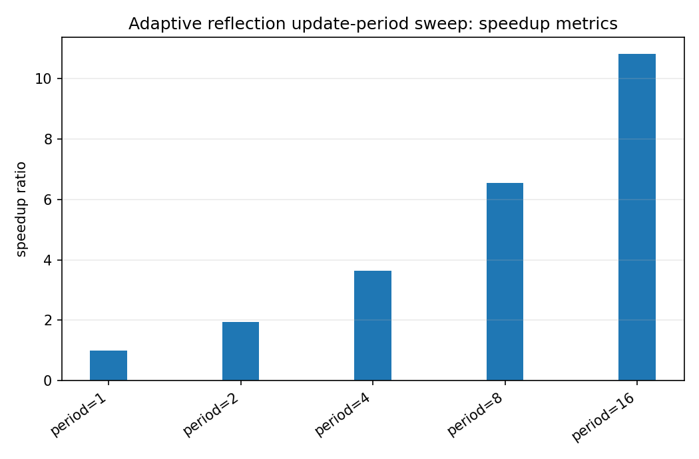

Adaptive reflection update-period sweep
=======================================

.. admonition:: Tutorial goal

   Measure speed/quality effects of updating reflection coefficients less often.

.. note::

   New to the terminology? See the :doc:`lattice DSP concept map <../../algorithms/concept_map>` and the :doc:`causality/data-use guide <../../theory/causality_and_data_use>` for how online, offline, block, and MIMO examples should be read.

Context
-------

Adaptive IIR models can save work by updating denominator/reflection coefficients less
frequently than numerator taps.  The benchmark sweeps the update period and writes both JSON
and CSV outputs.

Key idea and equations
----------------------

Larger update periods reduce update count.  The question is whether tail MSE remains close
to the period-1 baseline.

How to read the result
----------------------

Look for the largest period with a good speedup and modest tail-MSE degradation.

Run command
-----------

.. code-block:: bash

   python benchmarks/adaptive_period_sweep.py --periods 1 2 4 8 16 --samples 12000 --repeats 3 --output docs/benchmarks/generated/_artifacts/adaptive_period_sweep/adaptive-period-sweep.json --csv-output docs/benchmarks/generated/_artifacts/adaptive_period_sweep/adaptive-period-sweep.csv

Run status
----------

Return code: ``0``

Visual and data readout
-----------------------

When the benchmark gallery is built with results, this page embeds PNG summaries generated from the same JSON/CSV artifacts.  The raw data stay available below as downloads so exact numbers remain reproducible without making the public page read like console output.

Figures
-------

   ``adaptive_period_sweep_error_summary.png``

   ``adaptive_period_sweep_runtime_summary.png``

   ``adaptive_period_sweep_speedup_summary.png``

Generated data files
--------------------

* :download:`adaptive-period-sweep.csv <_artifacts/adaptive_period_sweep/adaptive-period-sweep.csv>`
* :download:`adaptive-period-sweep.json <_artifacts/adaptive_period_sweep/adaptive-period-sweep.json>`

Source code
-----------

.. literalinclude:: ../../../benchmarks/adaptive_period_sweep.py
   :language: python
   :linenos:
