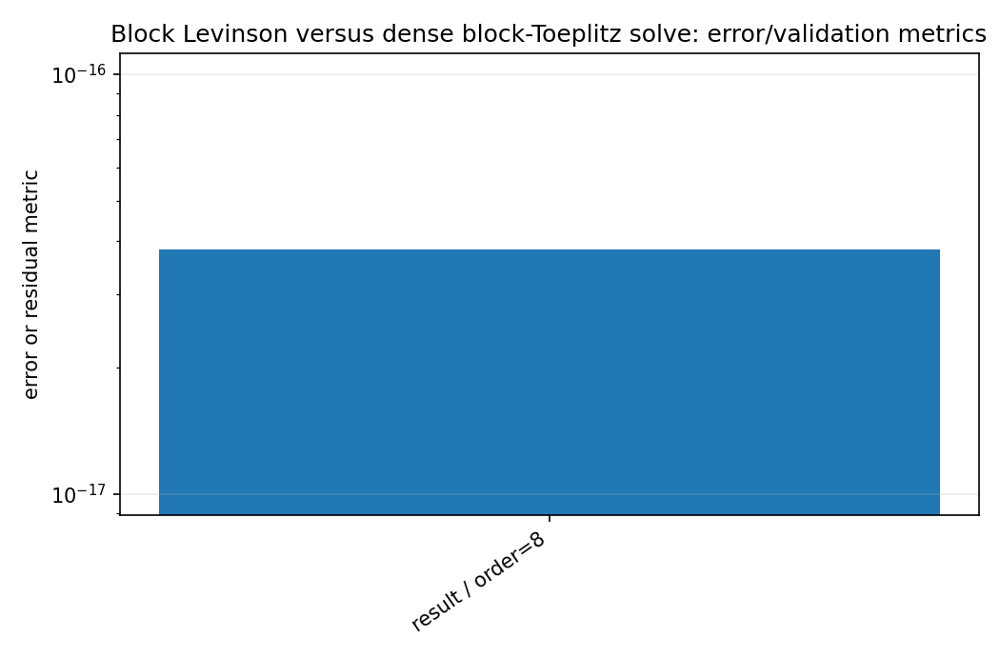
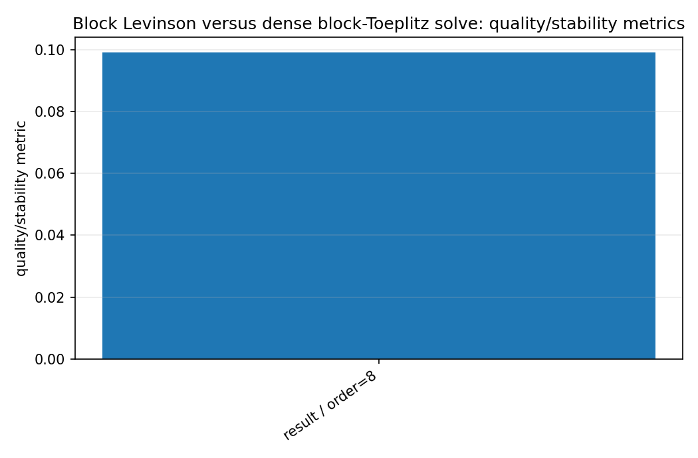
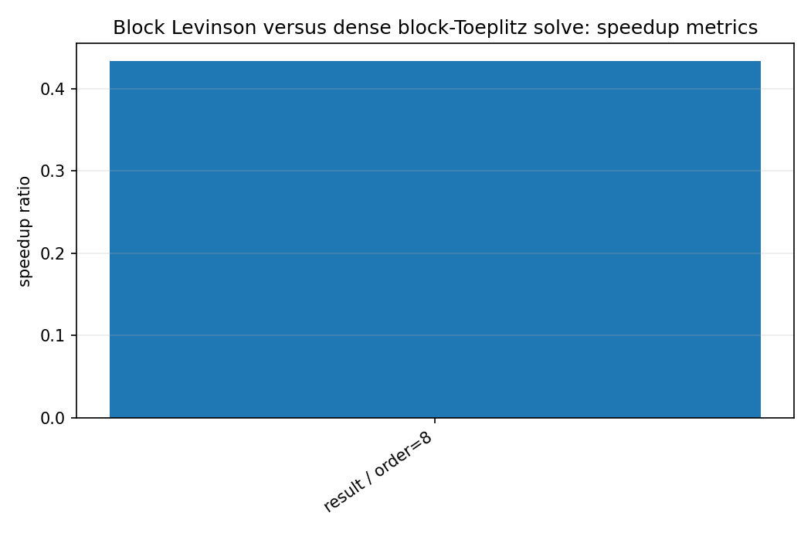
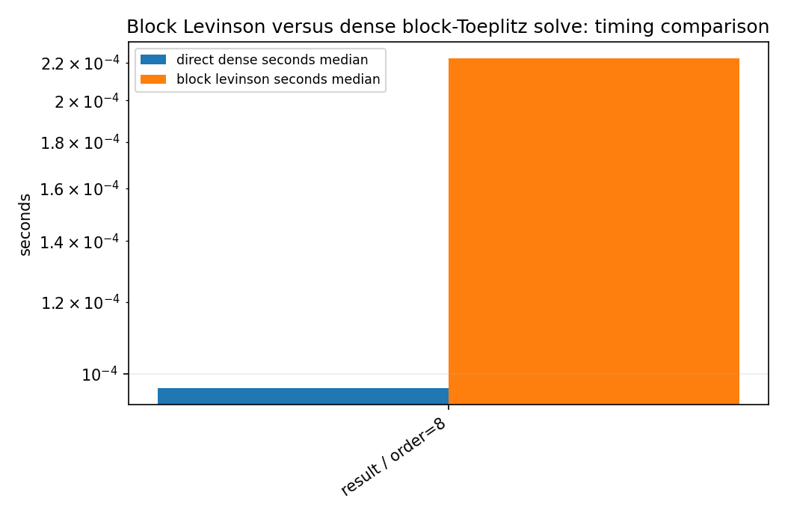

Block Levinson versus dense block-Toeplitz solve
================================================

.. admonition:: Tutorial goal

   Compare structured vector AR estimation against a dense direct solve.

.. note::

   New to the terminology? See the :doc:`lattice DSP concept map <../../algorithms/concept_map>` and the :doc:`causality/data-use guide <../../theory/causality_and_data_use>` for how online, offline, block, and MIMO examples should be read.

Context
-------

This benchmark validates the multichannel AR implementation by comparing block
Levinson-Durbin coefficients with a dense block-Toeplitz solve.  It is currently more of a
numerical validation benchmark than a speedup claim.

Key idea and equations
----------------------

The key numerical diagnostic is the coefficient difference norm between the two solutions.

How to read the result
----------------------

Small coefficient differences validate the recursion.  Reflection spectral norms below one indicate a stable matrix-reflection sequence.

Run command
-----------

.. code-block:: bash

   python benchmarks/block_levinson_benchmark.py --channels 4 --order 8 --samples 20000 --repeats 3 --output docs/benchmarks/generated/_artifacts/block_levinson/block-levinson.json

Run status
----------

Return code: ``0``

Visual and data readout
-----------------------

When the benchmark gallery is built with results, this page embeds PNG summaries generated from the same JSON/CSV artifacts.  The raw data stay available below as downloads so exact numbers remain reproducible without making the public page read like console output.

Figures
-------

   ``block_levinson_error_summary.png``

   ``block_levinson_quality_summary.png``

   ``block_levinson_speedup_summary.png``

   ``block_levinson_timing_comparison.png``

Generated data files
--------------------

* :download:`block-levinson.json <_artifacts/block_levinson/block-levinson.json>`

Source code
-----------

.. literalinclude:: ../../../benchmarks/block_levinson_benchmark.py
   :language: python
   :linenos:
