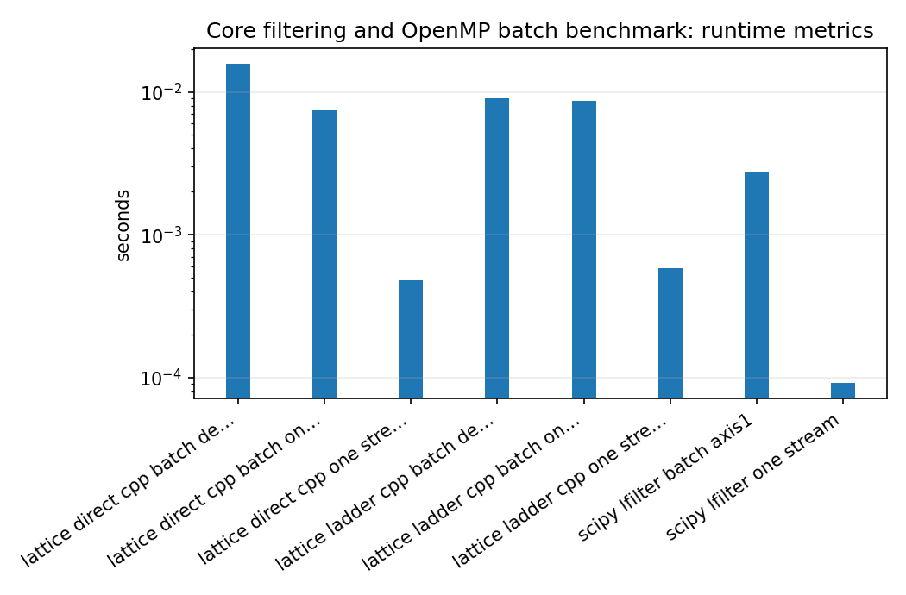

Core filtering and OpenMP batch benchmark
=========================================

.. admonition:: Tutorial goal

   Compare scalar/batch lattice filtering against SciPy lfilter baselines.

.. note::

   New to the terminology? See the :doc:`lattice DSP concept map <../../algorithms/concept_map>` and the :doc:`causality/data-use guide <../../theory/causality_and_data_use>` for how online, offline, block, and MIMO examples should be read.

Context
-------

This benchmark measures the core C++ filtering paths.  It is most meaningful for many
independent streams because the batch path can amortize Python overhead and use OpenMP.

Key idea and equations
----------------------

The speedup reported in the JSON is computed from median runtimes:

.. math::

   \text{speedup} = \frac{t_{\text{baseline}}}{t_{\text{method}}}.

How to read the result
----------------------

Single-stream SciPy may remain competitive.  The important comparison is batch C++/OpenMP versus batch SciPy for many channels.

Run command
-----------

.. code-block:: bash

   python benchmarks/run_benchmarks.py --channels 32 --samples 20000 --repeats 3 --output docs/benchmarks/generated/_artifacts/core_filtering/core-filtering.json

Run status
----------

Return code: ``0``

Visual and data readout
-----------------------

When the benchmark gallery is built with results, this page embeds PNG summaries generated from the same JSON/CSV artifacts.  The raw data stay available below as downloads so exact numbers remain reproducible without making the public page read like console output.

Figures
-------

   ``core_filtering_runtime_summary.png``

Generated data files
--------------------

* :download:`core-filtering.json <_artifacts/core_filtering/core-filtering.json>`

Source code
-----------

.. literalinclude:: ../../../benchmarks/run_benchmarks.py
   :language: python
   :linenos:
