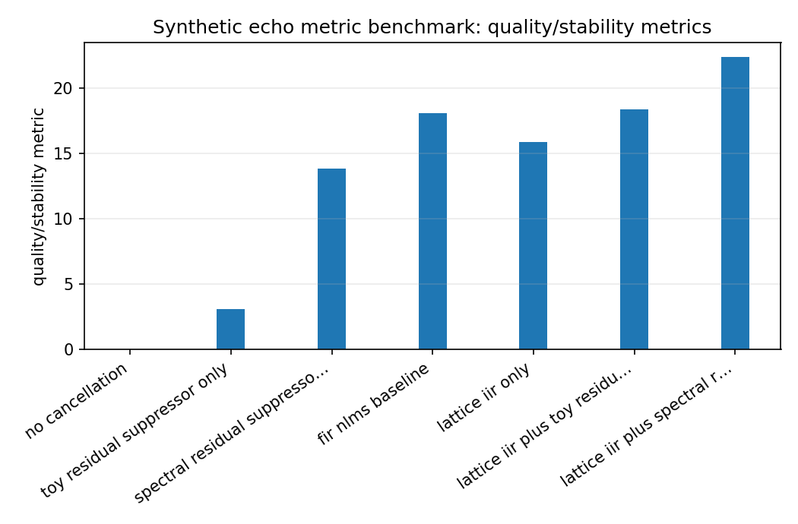
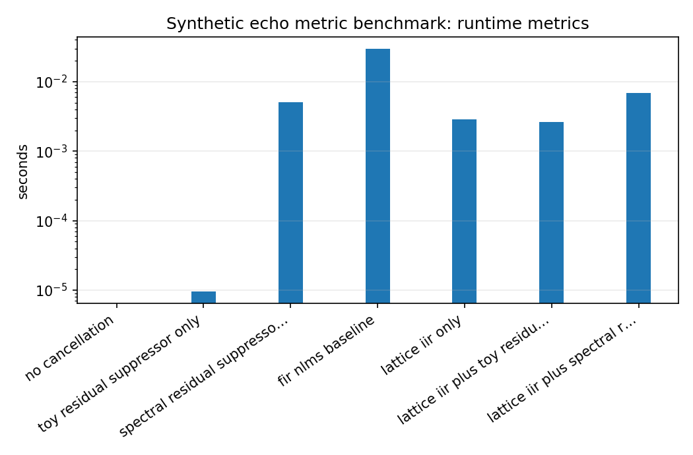

Synthetic echo metric benchmark
===============================

.. admonition:: Tutorial goal

   Compare synthetic echo-path metrics across simple baselines and lattice-based variants.

.. note::

   New to the terminology? See the :doc:`lattice DSP concept map <../../algorithms/concept_map>` and the :doc:`causality/data-use guide <../../theory/causality_and_data_use>` for how online, offline, block, and MIMO examples should be read.

Context
-------

This benchmark is included to exercise metrics such as ERLE and residual MSE on a controlled
synthetic problem.  It is not an acoustic echo cancellation product benchmark.

Key idea and equations
----------------------

ERLE is

.. math::

   10\log_{10}\frac{\mathbb{E}[d^2]}{\mathbb{E}[e^2]}.

How to read the result
----------------------

Use ERLE and MSE only within this controlled synthetic setup; do not compare the numbers to production AEC systems.

Run command
-----------

.. code-block:: bash

   python benchmarks/echo_cancellation_benchmark.py --samples 16000 --sample-rate 16000 --repeats 1 --output docs/benchmarks/generated/_artifacts/echo_metric/echo-metric.json

Run status
----------

Return code: ``0``

Visual and data readout
-----------------------

When the benchmark gallery is built with results, this page embeds PNG summaries generated from the same JSON/CSV artifacts.  The raw data stay available below as downloads so exact numbers remain reproducible without making the public page read like console output.

Figures
-------

   ``echo_metric_quality_summary.png``

   ``echo_metric_runtime_summary.png``

Generated data files
--------------------

* :download:`echo-metric.json <_artifacts/echo_metric/echo-metric.json>`

Source code
-----------

.. literalinclude:: ../../../benchmarks/echo_cancellation_benchmark.py
   :language: python
   :linenos:
