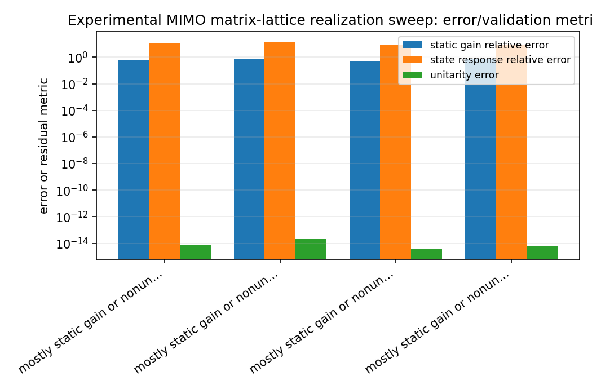
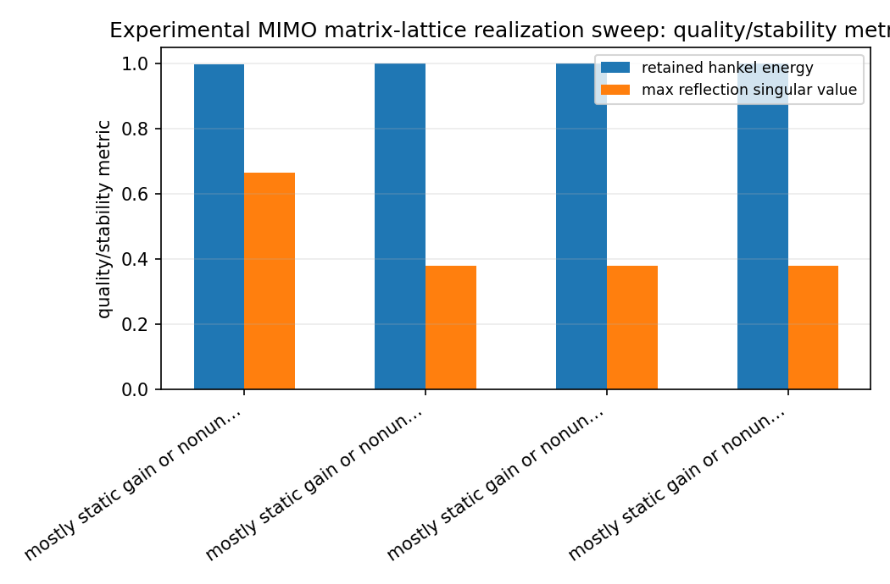
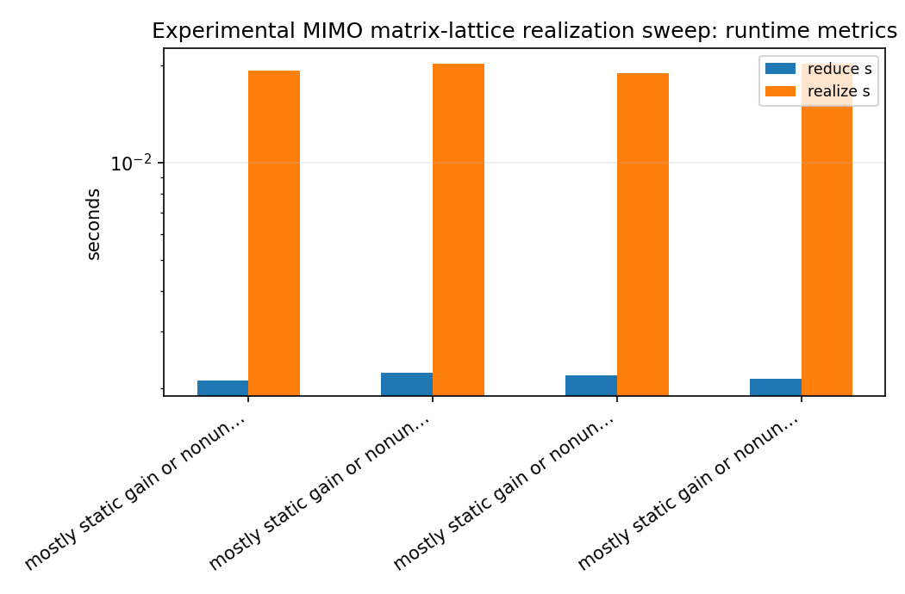
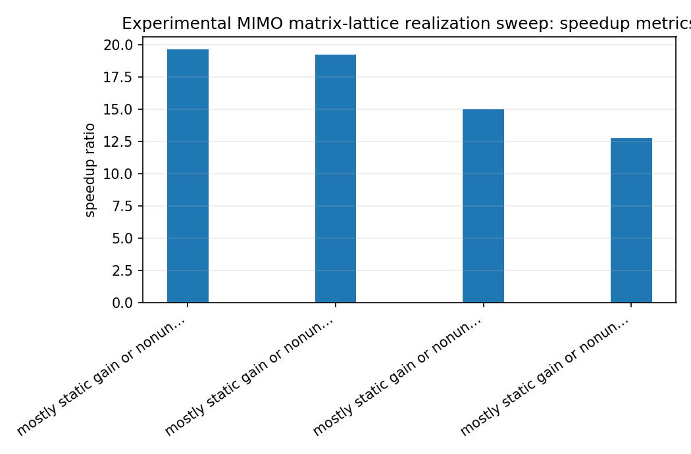

Experimental MIMO matrix-lattice realization sweep
==================================================

.. admonition:: Tutorial goal

   Sweep reduced and lattice orders for the experimental all-pass/polar matrix-lattice scaffold.

.. note::

   New to the terminology? See the :doc:`lattice DSP concept map <../../algorithms/concept_map>` and the :doc:`causality/data-use guide <../../theory/causality_and_data_use>` for how online, offline, block, and MIMO examples should be read.

Context
-------

The experimental state-space to matrix-lattice helper returns an all-pass scaffold, not a
full dynamic gain realization.  This benchmark runs that helper over a small grid of
reduced MIMO orders and lattice orders, then reports polar-factor error, raw state-response
error, static-gain-compensated error, gain conditioning, unitarity, and a diagnostic
classification.

This makes the current matrix-lattice realization story measurable: good all-pass fits,
mostly static-gain mismatch, and poor lattice-scaffold fits are separated explicitly.

Key idea and equations
----------------------

Static gain compensation fits

.. math::

   H(e^{j\omega}) \approx L\,G_{lattice}(e^{j\omega})\,R.

The improvement ratio is

.. math::

   I = \frac{\|H-G\|_F}{\|H-LGR\|_F}.

How to read the result
----------------------

Look for unitary lattice responses, stable reduced states, lower static-gain-compensated error than raw state-response error, and classifications that explain whether the mismatch is all-pass, static-gain, or scaffold-driven.

Run command
-----------

.. code-block:: bash

   python benchmarks/experimental_mimo_matrix_lattice_realization_sweep.py --full-order 12 --reduced-orders 4 6 --lattice-orders 2 4 --channels 3 --n-markov 128 --n-freq 128 --block-rows 20 --block-cols 20 --candidate-gains 0.20 0.40 0.60 0.80 --static-gain-iterations 10 --repeats 1 --n-threads 1 --output docs/benchmarks/generated/_artifacts/experimental_mimo_matrix_lattice_realization_sweep/experimental-mimo-matrix-lattice-realization-sweep.json

Run status
----------

Return code: ``0``

Visual and data readout
-----------------------

When the benchmark gallery is built with results, this page embeds PNG summaries generated from the same JSON/CSV artifacts.  The raw data stay available below as downloads so exact numbers remain reproducible without making the public page read like console output.

Figures
-------

   ``experimental_mimo_matrix_lattice_realization_sweep_error_summary.png``

   ``experimental_mimo_matrix_lattice_realization_sweep_quality_summary.png``

   ``experimental_mimo_matrix_lattice_realization_sweep_runtime_summary.png``

   ``experimental_mimo_matrix_lattice_realization_sweep_speedup_summary.png``

Generated data files
--------------------

* :download:`experimental-mimo-matrix-lattice-realization-sweep.json <_artifacts/experimental_mimo_matrix_lattice_realization_sweep/experimental-mimo-matrix-lattice-realization-sweep.json>`

Source code
-----------

.. literalinclude:: ../../../benchmarks/experimental_mimo_matrix_lattice_realization_sweep.py
   :language: python
   :linenos:
