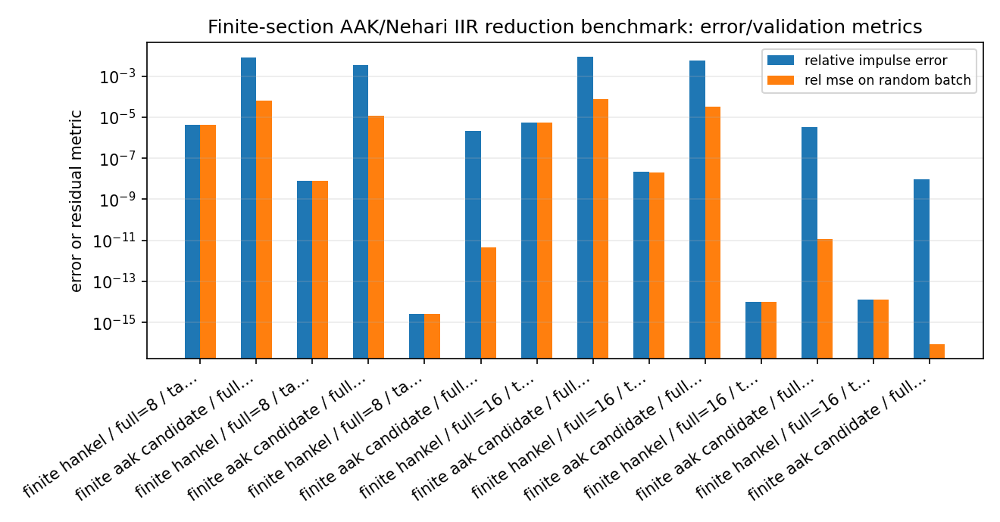
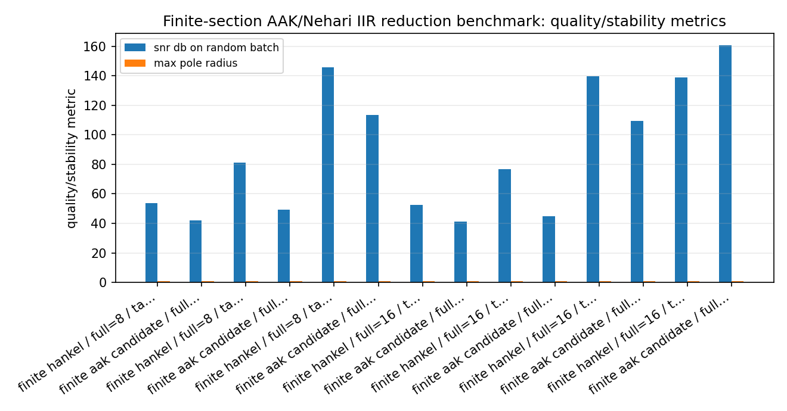
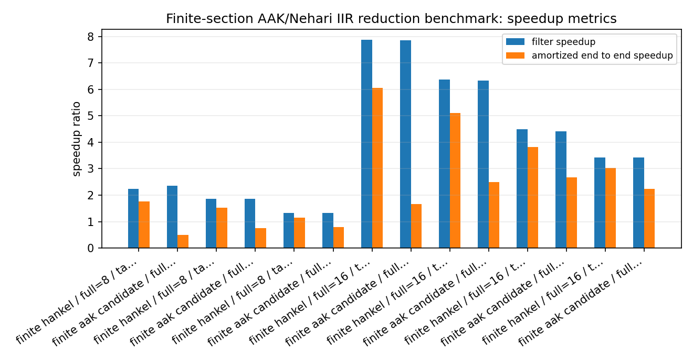
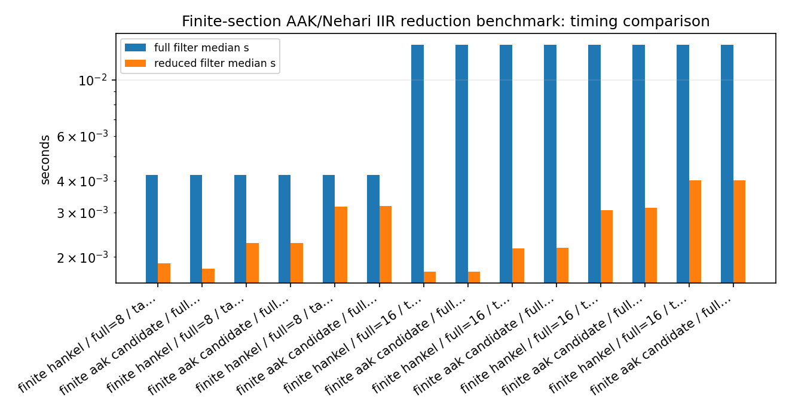

Finite-section AAK/Nehari IIR reduction benchmark
=================================================

.. admonition:: Tutorial goal

   Compare finite-Hankel and finite-section AAK/Nehari candidate reductions on the same stable SISO IIR filters.

.. note::

   New to the terminology? See the :doc:`lattice DSP concept map <../../algorithms/concept_map>` and the :doc:`causality/data-use guide <../../theory/causality_and_data_use>` for how online, offline, block, and MIMO examples should be read.

Context
-------

The finite-Hankel reducer and the finite-section AAK/Nehari candidate workflow are both
useful baselines.  This benchmark runs them side by side on compressible stable SISO IIR
filters and measures the practical tradeoff: reduction cost, filtering speedup,
end-to-end speedup including reduction, SNR, magnitude-response error, pole radius, and
break-even samples per channel.

The benchmark is deliberately finite-section.  It is not a claim of exact
infinite-dimensional AAK/Nehari optimality; it is a reproducible comparison of the mature
baselines currently implemented in the package.

Key idea and equations
----------------------

The end-to-end speedup includes the one-time reduction cost,

.. math::

   S_{end-to-end} = \frac{t_{full}}{t_{reduce}+t_{reduced}}.

The break-even sample count estimates when preprocessing has paid for itself,

.. math::

   N_{break-even}
   = \frac{t_{reduce}}
          {t_{full/sample}-t_{reduced/sample}}.

How to read the result
----------------------

Look for stable reduced models with useful SNR/magnitude error and end-to-end speedup above one for the intended signal length.

Run command
-----------

.. code-block:: bash

   python benchmarks/finite_aak_iir_reduction_speedup.py --full-orders 8 16 --target-orders 3 4 6 8 --channels 16 --samples 12000 --repeats 2 --n-impulse 384 --hankel-rows 48 --hankel-cols 48 --output docs/benchmarks/generated/_artifacts/finite_aak_iir_reduction_speedup/finite-aak-iir-reduction-speedup.json

Run status
----------

Return code: ``0``

Visual and data readout
-----------------------

When the benchmark gallery is built with results, this page embeds PNG summaries generated from the same JSON/CSV artifacts.  The raw data stay available below as downloads so exact numbers remain reproducible without making the public page read like console output.

Figures
-------

   ``finite_aak_iir_reduction_speedup_error_summary.png``

   ``finite_aak_iir_reduction_speedup_quality_summary.png``

   ``finite_aak_iir_reduction_speedup_speedup_summary.png``

   ``finite_aak_iir_reduction_speedup_timing_comparison.png``

Generated data files
--------------------

* :download:`finite-aak-iir-reduction-speedup.json <_artifacts/finite_aak_iir_reduction_speedup/finite-aak-iir-reduction-speedup.json>`

Source code
-----------

.. literalinclude:: ../../../benchmarks/finite_aak_iir_reduction_speedup.py
   :language: python
   :linenos:
