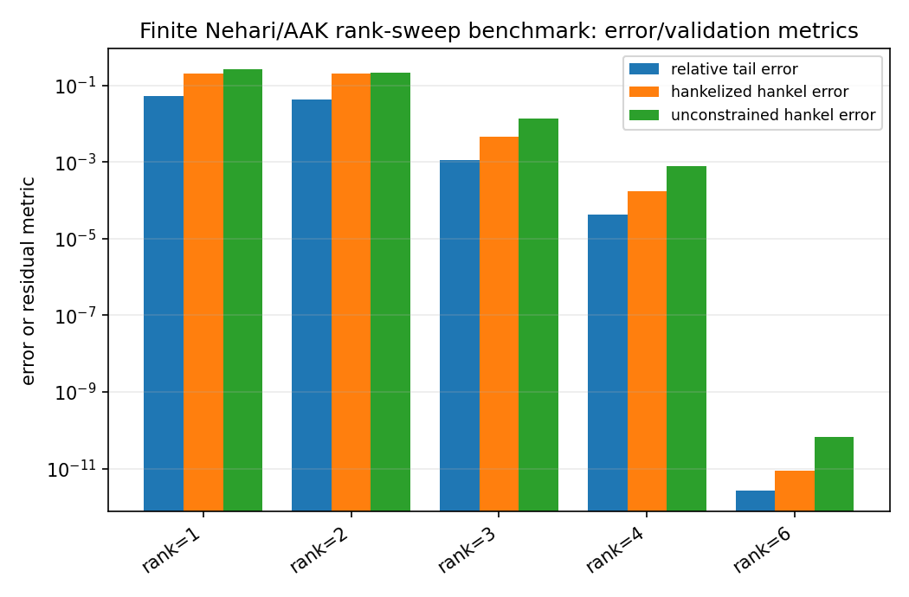
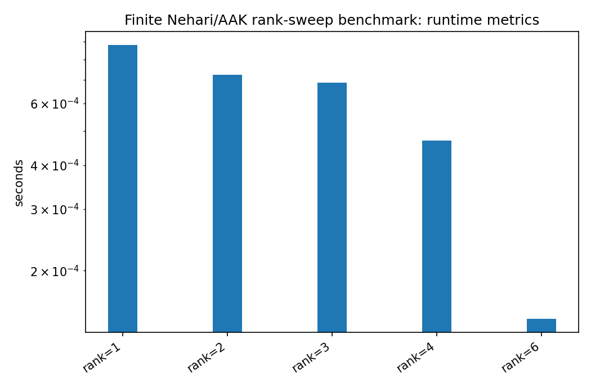

Finite Nehari/AAK rank-sweep benchmark
======================================

.. admonition:: Tutorial goal

   Measure how finite Hankel singular values and structured tail errors change with approximation rank.

.. note::

   New to the terminology? See the :doc:`lattice DSP concept map <../../algorithms/concept_map>` and the :doc:`causality/data-use guide <../../theory/causality_and_data_use>` for how online, offline, block, and MIMO examples should be read.

Context
-------

This benchmark is the conservative bridge between the finite-Hankel reducer and deeper
Nehari/AAK theory.  It builds a finite Hankel matrix from an anticausal tail, runs
``finite_nehari_approximate_tail`` for several ranks, and reports both the unconstrained
SVD error and the Hankelized structured approximation error.

The benchmark does not claim exact infinite-dimensional Nehari or AAK optimality.  It is a
numerical validation benchmark that makes the rank/error tradeoff visible within
the documented finite-section scope.

Key idea and equations
----------------------

For the finite matrix problem, the Eckart--Young theorem gives

.. math::

   \min_{\operatorname{rank}(X)\le r} \|H-X\|_2 = \sigma_{r+1}(H).

After anti-diagonal averaging, the approximation is Hankel-structured again but need not
remain rank ``r``.  Its error is therefore reported as a separate diagnostic.

How to read the result
----------------------

Look for monotone decay of sigma_{r+1}, agreement between unconstrained SVD error and sigma_{r+1}, and decreasing tail-relative error as rank increases.

Run command
-----------

.. code-block:: bash

   python benchmarks/finite_nehari_rank_sweep.py --rows 32 --cols 32 --ranks 1 2 3 4 6 --output docs/benchmarks/generated/_artifacts/finite_nehari_rank_sweep/finite-nehari-rank-sweep.json --csv-output docs/benchmarks/generated/_artifacts/finite_nehari_rank_sweep/finite-nehari-rank-sweep.csv

Run status
----------

Return code: ``0``

Visual and data readout
-----------------------

When the benchmark gallery is built with results, this page embeds PNG summaries generated from the same JSON/CSV artifacts.  The raw data stay available below as downloads so exact numbers remain reproducible without making the public page read like console output.

Figures
-------

   ``finite_nehari_rank_sweep_error_summary.png``

   ``finite_nehari_rank_sweep_runtime_summary.png``

Generated data files
--------------------

* :download:`finite-nehari-rank-sweep.csv <_artifacts/finite_nehari_rank_sweep/finite-nehari-rank-sweep.csv>`
* :download:`finite-nehari-rank-sweep.json <_artifacts/finite_nehari_rank_sweep/finite-nehari-rank-sweep.json>`

Source code
-----------

.. literalinclude:: ../../../benchmarks/finite_nehari_rank_sweep.py
   :language: python
   :linenos:
