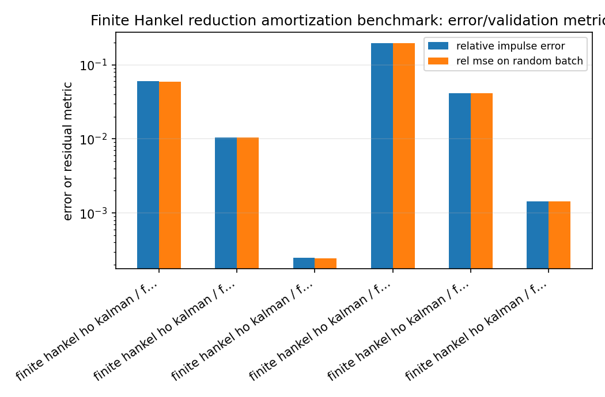
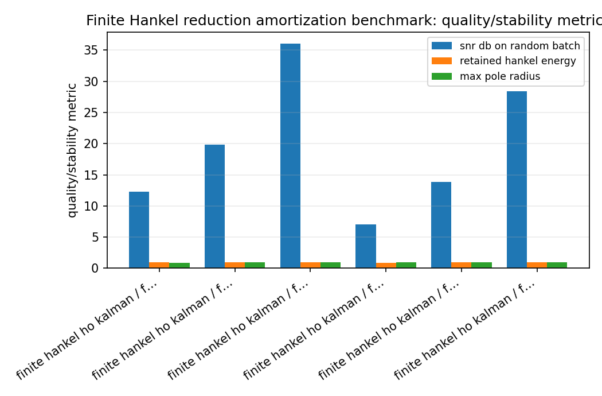
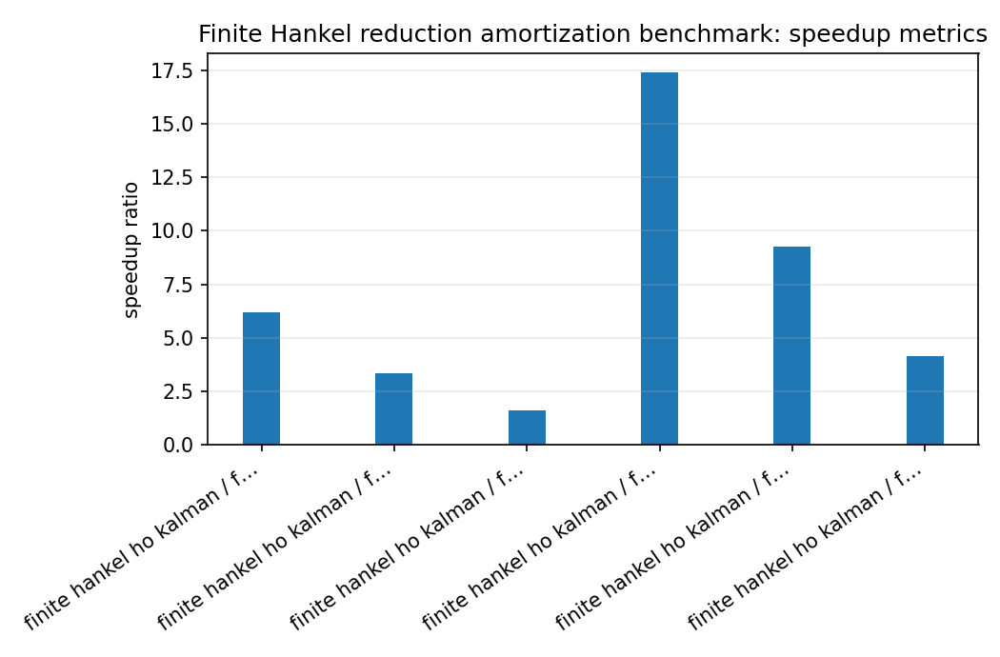
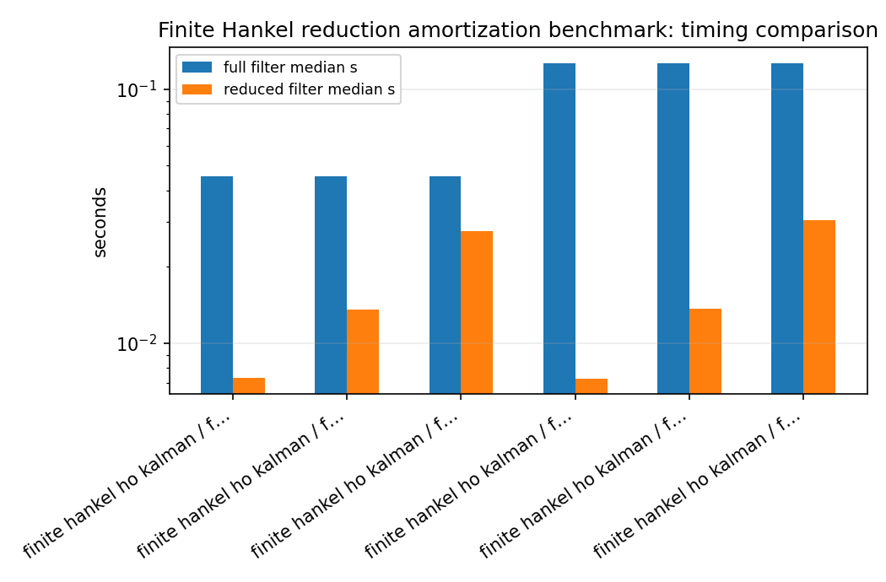

Finite Hankel reduction amortization benchmark
==============================================

.. admonition:: Tutorial goal

   Measure when a one-time finite-Hankel reduction pays off during repeated high-order IIR filtering.

.. note::

   New to the terminology? See the :doc:`lattice DSP concept map <../../algorithms/concept_map>` and the :doc:`causality/data-use guide <../../theory/causality_and_data_use>` for how online, offline, block, and MIMO examples should be read.

Context
-------

The finite-Hankel reducer is a preprocessing step.  This benchmark makes the speed argument
explicit by measuring reduction time, full-order filtering time, reduced-order filtering
time, and the break-even number of samples per channel.  It separates the
method is finite-Hankel/Ho--Kalman reduction, not an exact Nehari/AAK solver.

Key idea and equations
----------------------

The break-even sample count is estimated as

.. math::

   N_{break-even}
   = \frac{t_{reduce}}
          {t_{full/sample}-t_{reduced/sample}}.

How to read the result
----------------------

Look for high filter speedup, acceptable SNR/error, stable reduced denominators, and a break-even count that is small relative to the intended workload.

Run command
-----------

.. code-block:: bash

   python benchmarks/hankel_reduction_speedup.py --full-orders 16 32 --reduced-orders 4 8 12 --channels 32 --samples 20000 --repeats 3 --n-impulse 512 --hankel-rows 64 --hankel-cols 64 --output docs/benchmarks/generated/_artifacts/hankel_reduction_speedup/hankel-reduction-speedup.json

Run status
----------

Return code: ``0``

Visual and data readout
-----------------------

When the benchmark gallery is built with results, this page embeds PNG summaries generated from the same JSON/CSV artifacts.  The raw data stay available below as downloads so exact numbers remain reproducible without making the public page read like console output.

Figures
-------

   ``hankel_reduction_speedup_error_summary.png``

   ``hankel_reduction_speedup_quality_summary.png``

   ``hankel_reduction_speedup_speedup_summary.png``

   ``hankel_reduction_speedup_timing_comparison.png``

Generated data files
--------------------

* :download:`hankel-reduction-speedup.json <_artifacts/hankel_reduction_speedup/hankel-reduction-speedup.json>`

Source code
-----------

.. literalinclude:: ../../../benchmarks/hankel_reduction_speedup.py
   :language: python
   :linenos:
