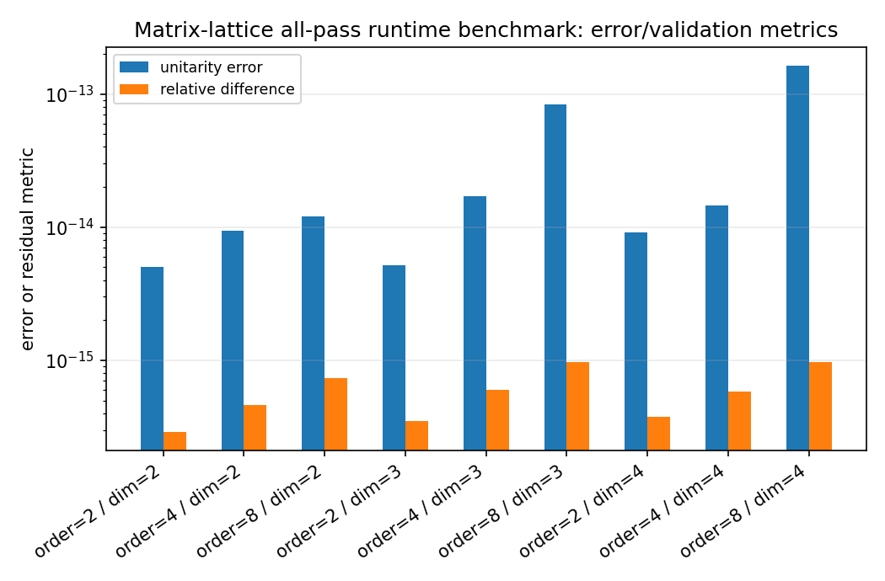
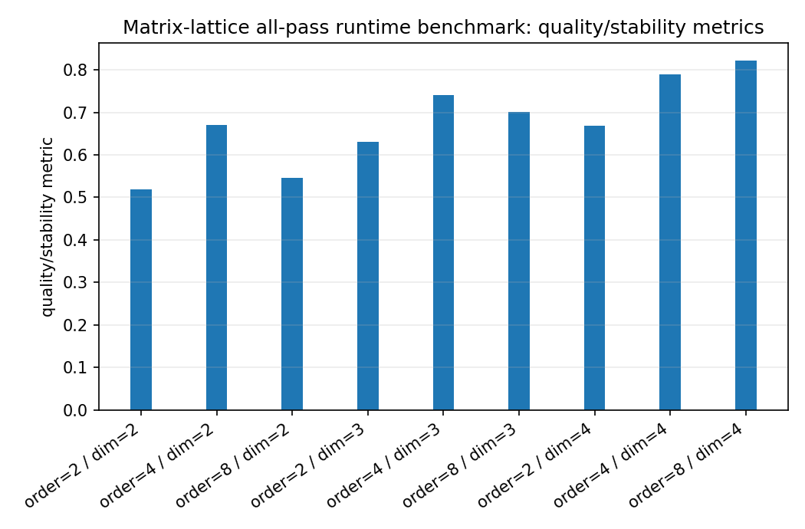
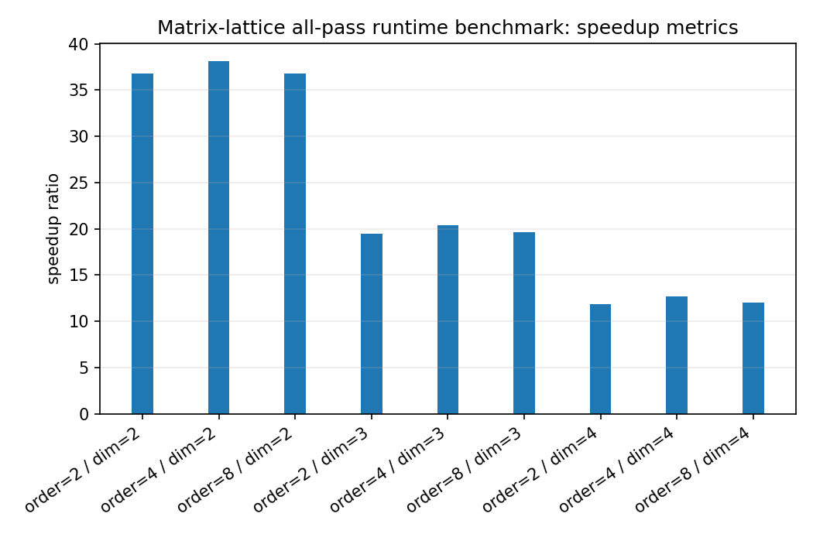
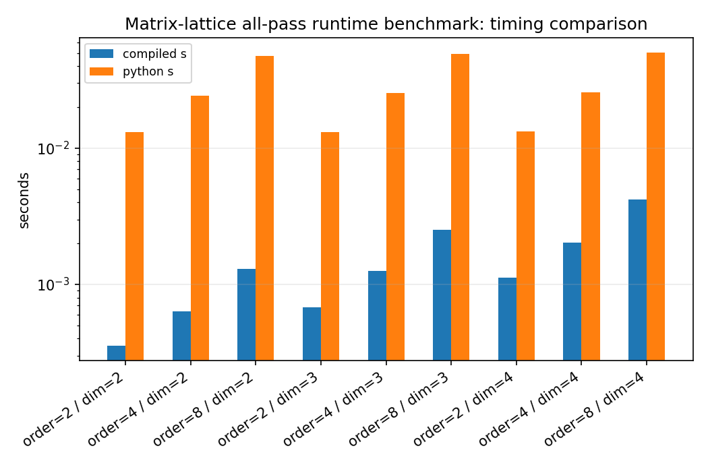

Matrix-lattice all-pass runtime benchmark
=========================================

.. admonition:: Tutorial goal

   Compare compiled matrix-lattice frequency-response evaluation with the NumPy reference evaluator.

.. note::

   New to the terminology? See the :doc:`lattice DSP concept map <../../algorithms/concept_map>` and the :doc:`causality/data-use guide <../../theory/causality_and_data_use>` for how online, offline, block, and MIMO examples should be read.

Context
-------

Matrix lattice filters are most often used as compact frequency-dependent multichannel
all-pass/scattering responses.  This benchmark measures the response-evaluation runtime
for different channel dimensions and lattice orders, comparing the compiled C++ evaluator
with the small NumPy reference implementation.

Key idea and equations
----------------------

The benchmark reports

.. math::

   S = \frac{t_{NumPy}}{t_{compiled}},

along with the relative difference between implementations and the maximum unitarity error
over the frequency grid.

How to read the result
----------------------

Look for relative differences near numerical precision, small unitarity error, and speedups above one for larger frequency grids/orders.

Run command
-----------

.. code-block:: bash

   python benchmarks/matrix_lattice_runtime.py --dims 2 3 4 --orders 2 4 8 --n-freq 1024 --repeats 2 --n-threads 1 --output docs/benchmarks/generated/_artifacts/matrix_lattice_runtime/matrix-lattice-runtime.json

Run status
----------

Return code: ``0``

Visual and data readout
-----------------------

When the benchmark gallery is built with results, this page embeds PNG summaries generated from the same JSON/CSV artifacts.  The raw data stay available below as downloads so exact numbers remain reproducible without making the public page read like console output.

Figures
-------

   ``matrix_lattice_runtime_error_summary.png``

   ``matrix_lattice_runtime_quality_summary.png``

   ``matrix_lattice_runtime_speedup_summary.png``

   ``matrix_lattice_runtime_timing_comparison.png``

Generated data files
--------------------

* :download:`matrix-lattice-runtime.json <_artifacts/matrix_lattice_runtime/matrix-lattice-runtime.json>`

Source code
-----------

.. literalinclude:: ../../../benchmarks/matrix_lattice_runtime.py
   :language: python
   :linenos:
