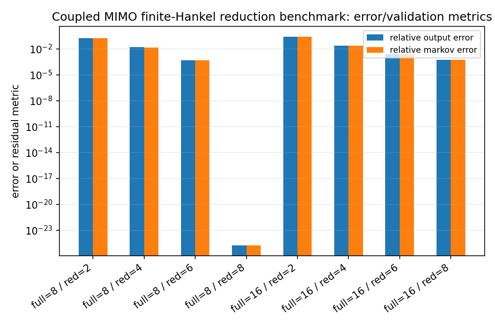
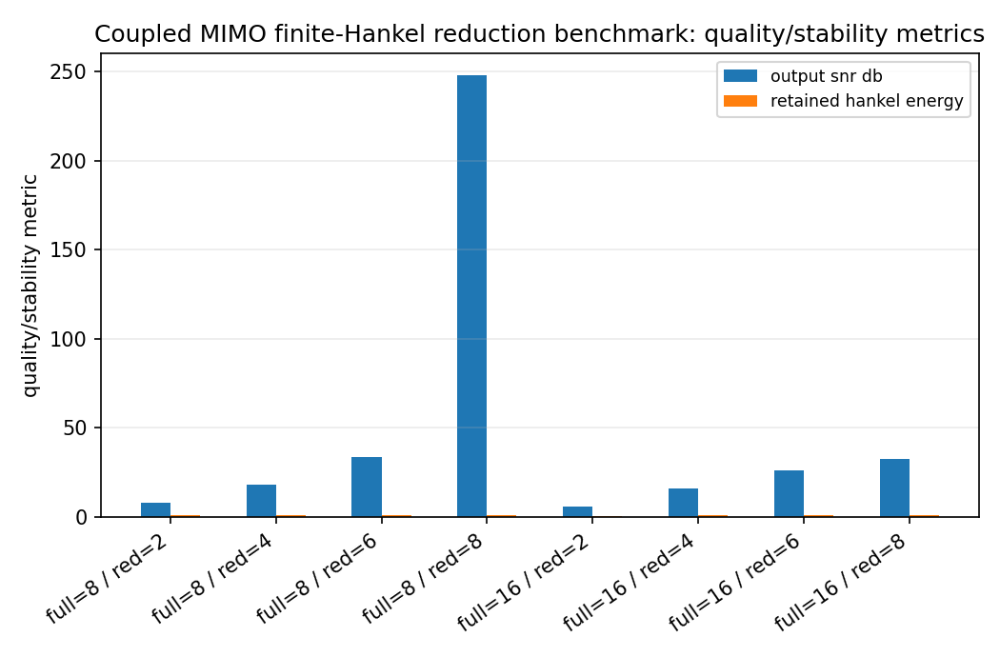
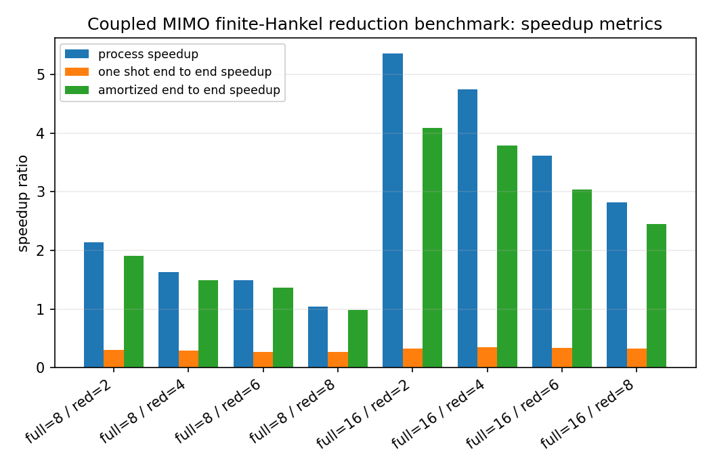
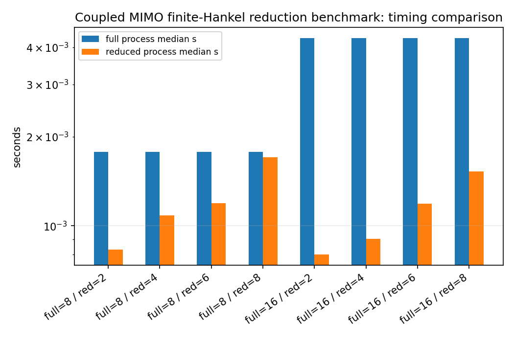

Coupled MIMO finite-Hankel reduction benchmark
==============================================

.. admonition:: Tutorial goal

   Measure finite block-Hankel reduction cost and repeated state-space simulation speedup on coupled MIMO systems.

.. note::

   New to the terminology? See the :doc:`lattice DSP concept map <../../algorithms/concept_map>` and the :doc:`causality/data-use guide <../../theory/causality_and_data_use>` for how online, offline, block, and MIMO examples should be read.

Context
-------

The MIMO reducer returns state-space matrices rather than scalar filter coefficients.  This
benchmark therefore measures the repeated cost of simulating the full and reduced MIMO
systems on batched multichannel input signals.  It uses the compiled
``mimo_state_space_process_batch`` kernel when available, so the measured processing time
reflects the current C++ state-space runtime rather than a pure Python loop.

The table deliberately separates three concepts: processing speedup, one-shot end-to-end
speedup including a single reduction, and amortized end-to-end speedup after reusing the
reduced model for ``--reuse-count`` additional batches.  This keeps the benchmark scope explicit: the
reduction can have excellent repeated-runtime speedups while still needing enough reuse to
pay back preprocessing.

This is still the reference block-Hankel/ERA-style baseline.  It is not a matrix AAK/Nehari
solver; it is the finite block-Hankel reference point for comparison with matrix optimal-reduction methods.

Key idea and equations
----------------------

The benchmark reports processing speedup

.. math::

   S_{process}=\frac{t_{full}}{t_{reduced}},

one-shot end-to-end speedup including one reduction,

.. math::

   S_{one-shot}=\frac{t_{full}}{t_{reduce}+t_{reduced}},

and amortized end-to-end speedup across ``K`` reused batches,

.. math::

   S_{amortized}=\frac{K t_{full}}{t_{reduce}+K t_{reduced}}.

How to read the result
----------------------

Look for stable reduced state matrices, decreasing Markov/output error with order, high processing speedup, and amortized end-to-end speedup above one when the workload reuses the reduced model enough times.

Run command
-----------

.. code-block:: bash

   python benchmarks/mimo_hankel_reduction_speedup.py --full-orders 8 16 --reduced-orders 2 4 6 8 --inputs 3 --outputs 3 --batch 8 --samples 6000 --repeats 2 --reuse-count 50 --n-threads 1 --n-markov 256 --block-rows 32 --block-cols 32 --output docs/benchmarks/generated/_artifacts/mimo_hankel_reduction_speedup/mimo-hankel-reduction-speedup.json

Run status
----------

Return code: ``0``

Visual and data readout
-----------------------

When the benchmark gallery is built with results, this page embeds PNG summaries generated from the same JSON/CSV artifacts.  The raw data stay available below as downloads so exact numbers remain reproducible without making the public page read like console output.

Figures
-------

   ``mimo_hankel_reduction_speedup_error_summary.png``

   ``mimo_hankel_reduction_speedup_quality_summary.png``

   ``mimo_hankel_reduction_speedup_speedup_summary.png``

   ``mimo_hankel_reduction_speedup_timing_comparison.png``

Generated data files
--------------------

* :download:`mimo-hankel-reduction-speedup.json <_artifacts/mimo_hankel_reduction_speedup/mimo-hankel-reduction-speedup.json>`

Source code
-----------

.. literalinclude:: ../../../benchmarks/mimo_hankel_reduction_speedup.py
   :language: python
   :linenos:
