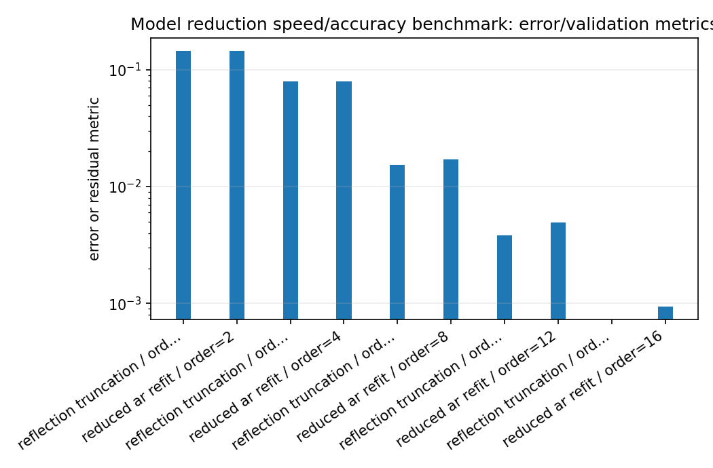
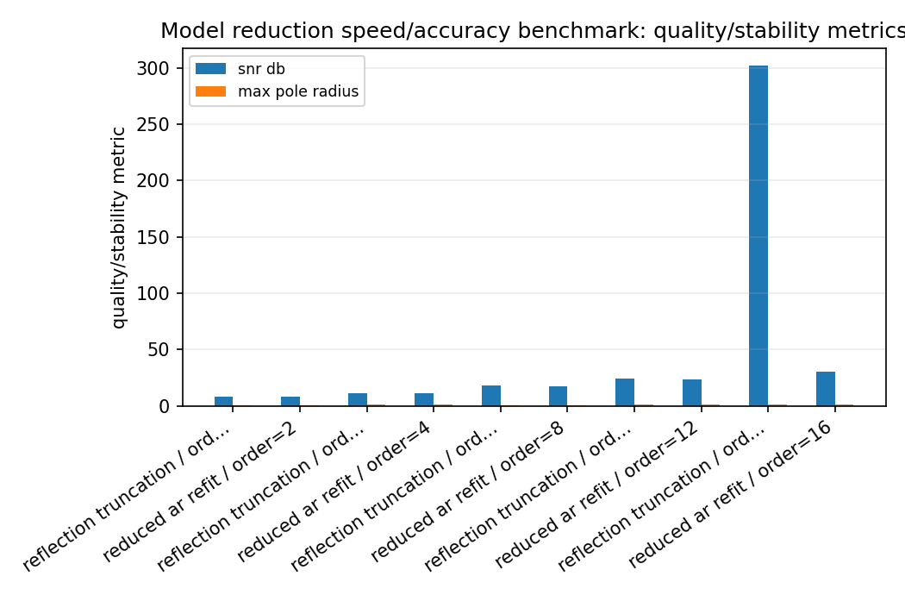
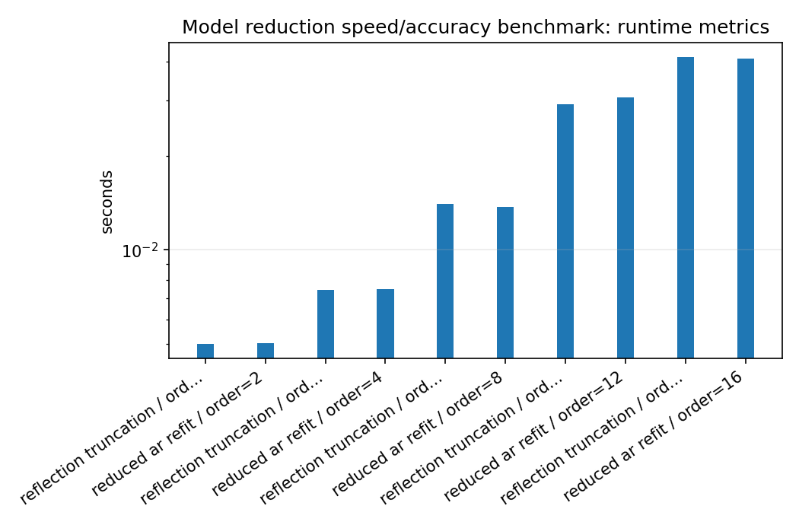
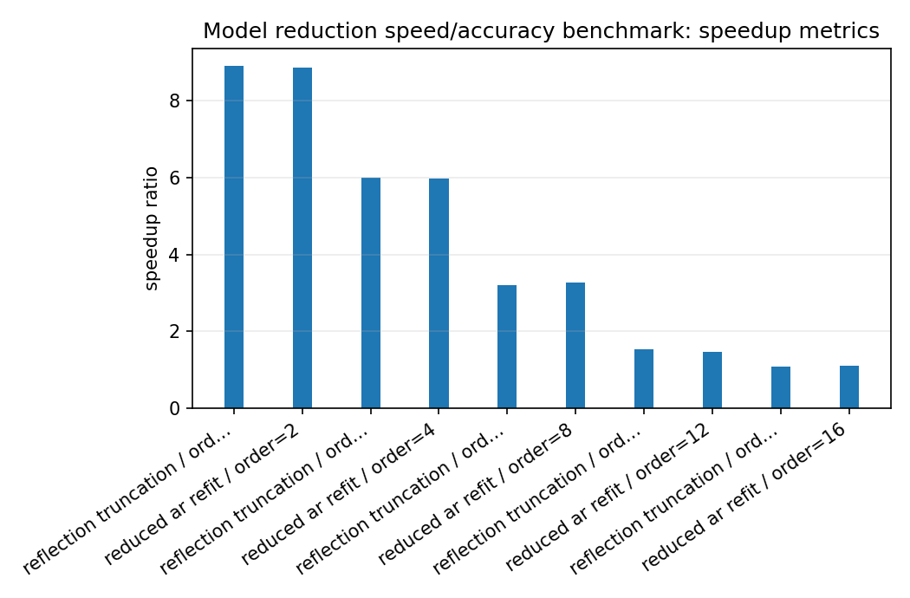

Model reduction speed/accuracy benchmark
========================================

.. admonition:: Tutorial goal

   Reduce a full-order all-pole model and measure speed, error, SNR, and pole radius.

.. note::

   New to the terminology? See the :doc:`lattice DSP concept map <../../algorithms/concept_map>` and the :doc:`causality/data-use guide <../../theory/causality_and_data_use>` for how online, offline, block, and MIMO examples should be read.

Context
-------

Model reduction is a tradeoff: lower order is cheaper, but it may no longer match the
original response.  This benchmark is intentionally a stable baseline, not a full
Nehari/AAK/Hankel-norm reducer.  The lattice parameterization makes simple reflection
truncation useful because it preserves scalar stability, while the theory documentation
explains how Hankel-operator diagnostics connect to SISO reduction quality.

Key idea and equations
----------------------

The benchmark reports relative MSE and SNR,

.. math::

   \operatorname{relMSE}=\frac{\|y_{full}-y_{reduced}\|_2^2}{\|y_{full}\|_2^2},
   \qquad
   \operatorname{SNR}=10\log_{10}\frac{\mathbb{E}[y_{full}^2]}{\mathbb{E}[(y_{full}-y_{reduced})^2]}.

How to read the result
----------------------

Look for the smallest order whose SNR and relative MSE are acceptable while keeping max pole radius below one.  Treat this as a stable baseline, not as a Hankel/Nehari/AAK optimality claim.

Run command
-----------

.. code-block:: bash

   python benchmarks/model_reduction_benchmark.py --full-order 16 --orders 2 4 8 12 16 --channels 32 --samples 20000 --repeats 3 --output docs/benchmarks/generated/_artifacts/model_reduction/model-reduction.json

Run status
----------

Return code: ``0``

Visual and data readout
-----------------------

When the benchmark gallery is built with results, this page embeds PNG summaries generated from the same JSON/CSV artifacts.  The raw data stay available below as downloads so exact numbers remain reproducible without making the public page read like console output.

Figures
-------

   ``model_reduction_error_summary.png``

   ``model_reduction_quality_summary.png``

   ``model_reduction_runtime_summary.png``

   ``model_reduction_speedup_summary.png``

Generated data files
--------------------

* :download:`model-reduction.json <_artifacts/model_reduction/model-reduction.json>`

Source code
-----------

.. literalinclude:: ../../../benchmarks/model_reduction_benchmark.py
   :language: python
   :linenos:
