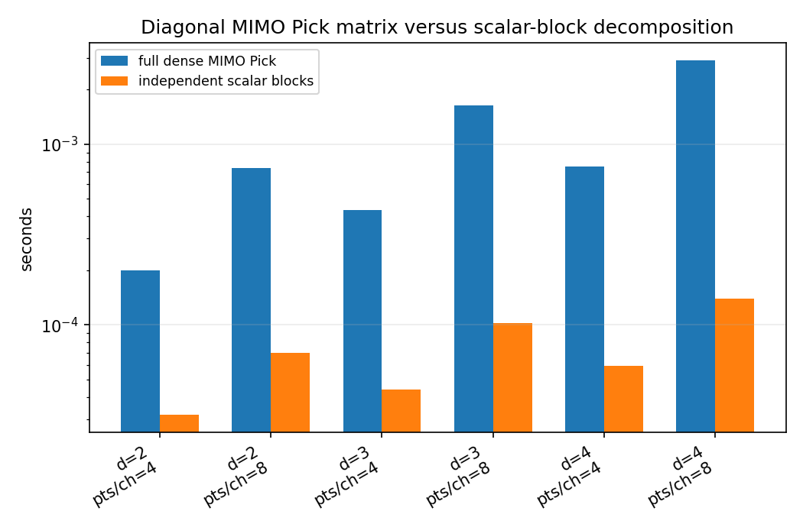
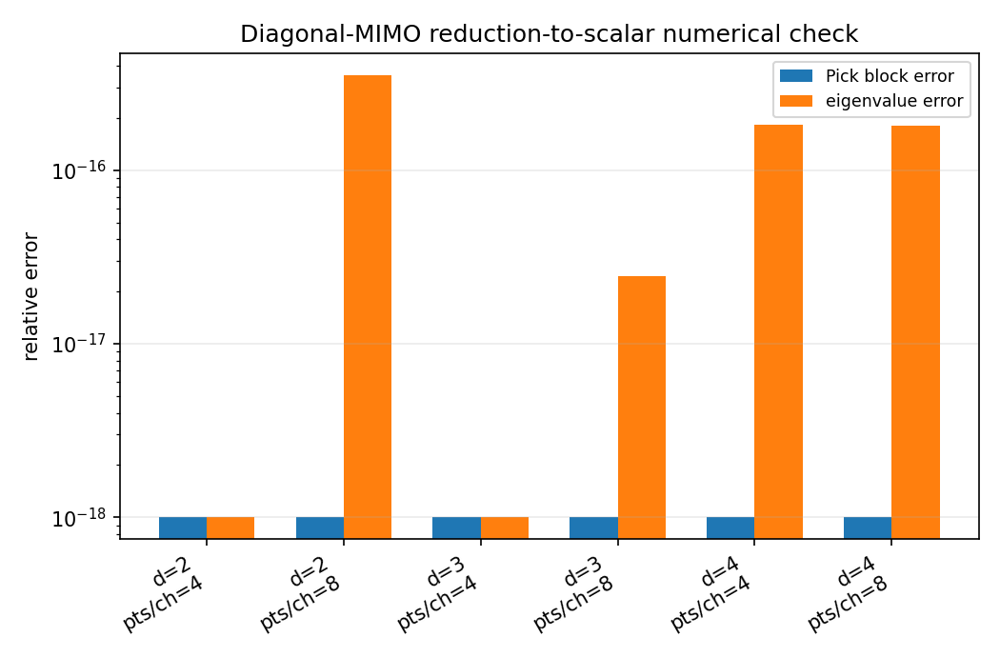
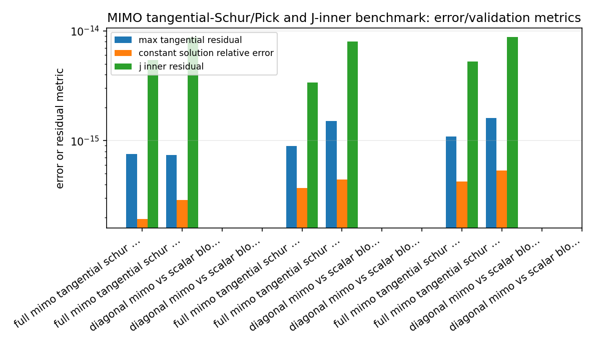
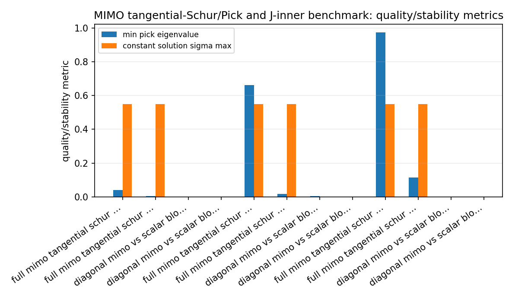
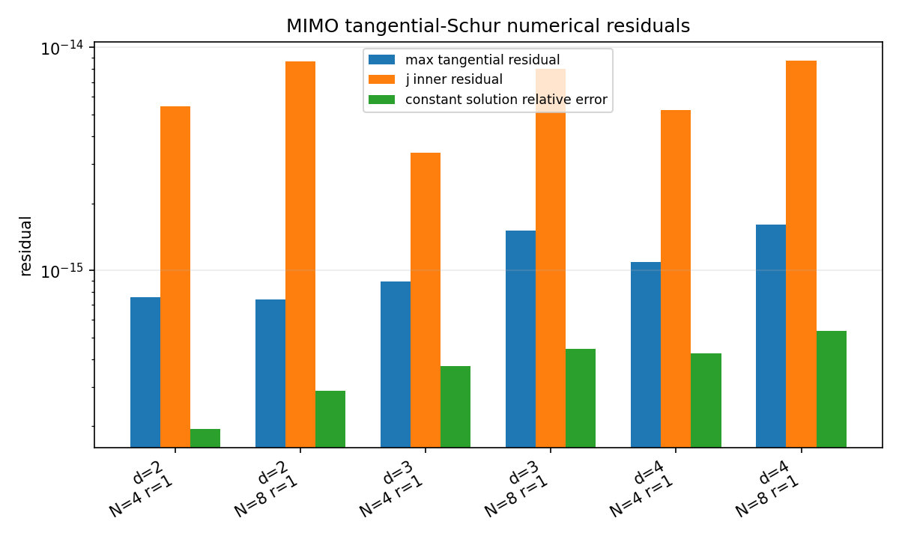
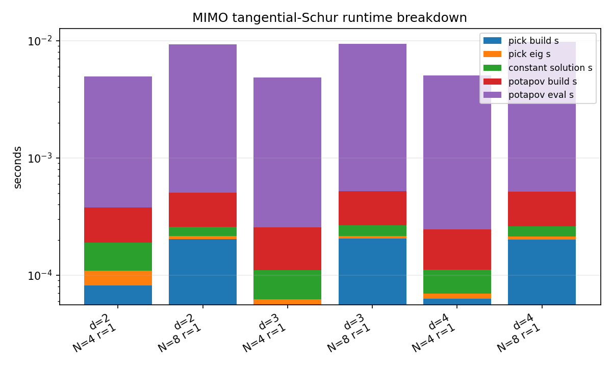
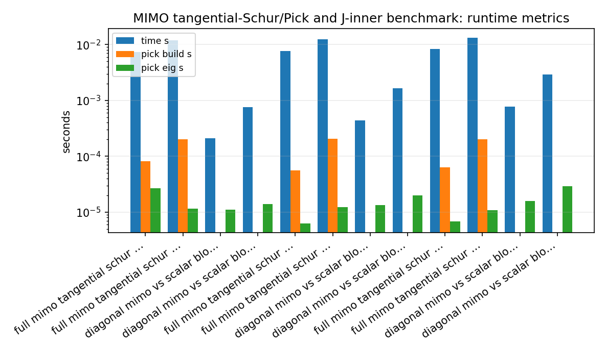
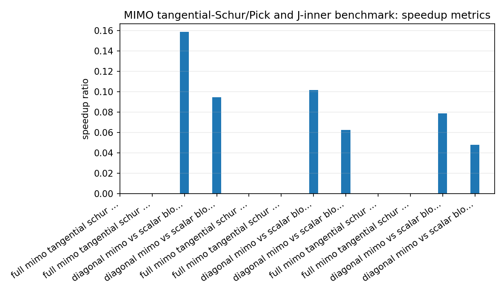

MIMO tangential-Schur/Pick and J-inner benchmark
================================================

.. admonition:: Tutorial goal

   Measure finite MIMO tangential Pick, constant Schur recovery, and Potapov/J-inner diagnostic costs.

.. note::

   New to the terminology? See the :doc:`lattice DSP concept map <../../algorithms/concept_map>` and the :doc:`causality/data-use guide <../../theory/causality_and_data_use>` for how online, offline, block, and MIMO examples should be read.

Context
-------

The tangential-Schur layer is a mathematical bridge between MIMO
interpolation, J-inner/lossless systems, and the matrix-lattice examples.
This benchmark measures the finite definite baseline: constructing the
right-tangential Pick matrix, checking its Hermitian spectrum, recovering
a compatible constant Schur matrix, and evaluating elementary Potapov
J-inner products on a boundary grid.

The benchmark also includes a diagonal-MIMO sanity case.  When tangential
directions are coordinate vectors and the Schur map is diagonal, the full
MIMO Pick matrix decomposes into independent scalar Pick blocks.  The
benchmark reports both numerical block/eigenvalue agreement and the cost
difference between treating the problem as dense MIMO data versus scalar
subproblems.

Key idea and equations
----------------------

For right tangential data

.. math::

   S(z_i) U_i = V_i,

the Pick blocks are

.. math::

   P_{ij} = \frac{U_i^H U_j - V_i^H V_j}{1 - \overline{z_i} z_j}.

A finite definite Schur-class certificate requires :math:`P \succeq 0`.
The J-inner diagnostic checks elementary Potapov products on the unit
circle:

.. math::

   \Theta(e^{j\omega})^H J \Theta(e^{j\omega}) \approx J.

In the diagonal case, coordinate directions should make the dense MIMO
Pick matrix equal a block diagonal assembly of scalar Pick matrices.

How to read the result
----------------------

Use the runtime-breakdown figure to see where cost goes, the residual figure to check interpolation and J-inner accuracy, and the diagonal comparison to verify reduction to independent scalar Schur problems.

Run command
-----------

.. code-block:: bash

   python benchmarks/tangential_schur_mimo_benchmark.py --dims 2 3 4 --points 4 8 --diagonal-points-per-channel 4 8 --boundary-grid 256 --repeats 2 --output docs/benchmarks/generated/_artifacts/tangential_schur_mimo/tangential-schur-mimo.json --csv-output docs/benchmarks/generated/_artifacts/tangential_schur_mimo/tangential-schur-mimo.csv

Run status
----------

Return code: ``0``

Visual and data readout
-----------------------

When the benchmark gallery is built with results, this page embeds PNG summaries generated from the same JSON/CSV artifacts.  The raw data stay available below as downloads so exact numbers remain reproducible without making the public page read like console output.

Figures
-------

   ``tangential_schur_diagonal_mimo_vs_scalar_blocks.png``

   ``tangential_schur_diagonal_scalar_block_errors.png``

   ``tangential_schur_mimo_error_summary.png``

   ``tangential_schur_mimo_quality_summary.png``

   ``tangential_schur_mimo_residuals.png``

   ``tangential_schur_mimo_runtime_breakdown.png``

   ``tangential_schur_mimo_runtime_summary.png``

   ``tangential_schur_mimo_speedup_summary.png``

Generated data files
--------------------

* :download:`tangential-schur-mimo.csv <_artifacts/tangential_schur_mimo/tangential-schur-mimo.csv>`
* :download:`tangential-schur-mimo.json <_artifacts/tangential_schur_mimo/tangential-schur-mimo.json>`

Source code
-----------

.. literalinclude:: ../../../benchmarks/tangential_schur_mimo_benchmark.py
   :language: python
   :linenos:
