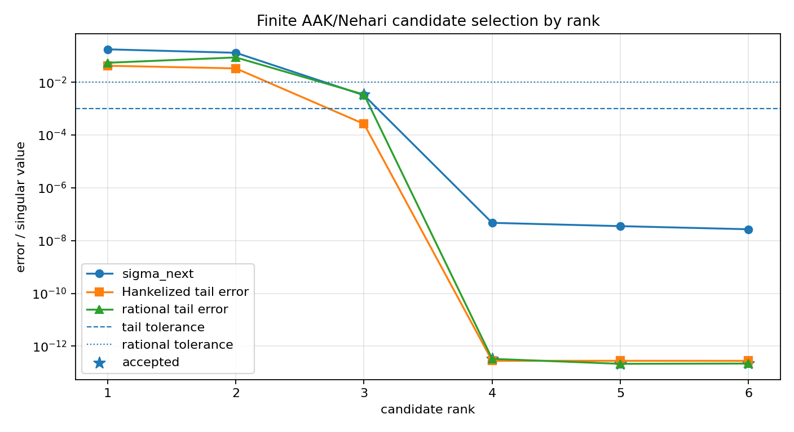
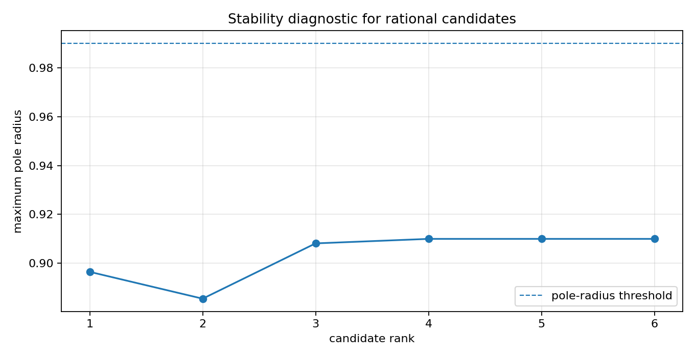

Selecting a finite SISO AAK/Nehari rational candidate
=====================================================

.. admonition:: Tutorial goal

   Turn the finite Schmidt-pair and rational-bridge diagnostics into a tolerance-based candidate-selection workflow.

.. note::

   New to the terminology? See the :doc:`lattice DSP concept map <../../algorithms/concept_map>` and the :doc:`causality/data-use guide <../../theory/causality_and_data_use>` for how online, offline, block, and MIMO examples should be read.

Context
-------

The Schmidt-pair tutorial visualizes the singular direction that blocks lower-rank
approximation.  This page uses a practical candidate workflow: choose a rank, build the finite
Nehari Hankelized tail, fit a rational recurrence, and decide whether the candidate meets
accuracy and stability thresholds.

This is still a finite-dimensional candidate selector, not an exact infinite-dimensional
AAK/Nehari solver.  The reusable logic is exposed as
``finite_nehari_rational_candidates`` and ``select_finite_nehari_candidate``.  Its purpose
is to make the finite-section criteria explicit: singular-value target, Hankelized
tail error, rational realization error, and pole radius.

Key idea and equations
----------------------

For candidate rank ``r``, the tutorial reports

.. math::

   \sigma_{r+1},\qquad
   \frac{\|\gamma-\widehat\gamma_r\|_2}{\|\gamma\|_2},\qquad
   \frac{\|\gamma-g_r\|_2}{\|\gamma\|_2},\qquad
   \max_i |p_i|.

Here ``\widehat\gamma_r`` is the Hankelized finite Nehari tail, ``g_r`` is the rational
recurrence realization, and ``p_i`` are the fitted poles.  The first rank satisfying all
tolerances is selected.

How to read the result
----------------------

Look for the first accepted rank and verify that its rational error is below tolerance while the fitted poles remain inside the unit disk.

Run command
-----------

.. code-block:: bash

   python examples/aak_siso_candidate_selection.py

Run status
----------

Return code: ``0``

Captured stdout
---------------

.. code-block:: text

   finite Hankel matrix: 48 x 48
   candidate ranks: [1, 2, 3, 4, 5, 6]
   criteria: tail_error <= 0.001, rational_error <= 0.01, pole_radius <= 0.99
   rank=1: sigma_next=1.771e-01, tail_error=4.229e-02, rational_error=5.481e-02, pole_radius=0.8965, reject
   rank=2: sigma_next=1.309e-01, tail_error=3.358e-02, rational_error=8.731e-02, pole_radius=0.8856, reject
   rank=3: sigma_next=3.221e-03, tail_error=2.639e-04, rational_error=3.433e-03, pole_radius=0.9082, ACCEPT
   rank=4: sigma_next=4.723e-08, tail_error=2.791e-13, rational_error=3.322e-13, pole_radius=0.9100, ACCEPT
   rank=5: sigma_next=3.541e-08, tail_error=2.797e-13, rational_error=2.149e-13, pole_radius=0.9100, ACCEPT
   rank=6: sigma_next=2.697e-08, tail_error=2.789e-13, rational_error=2.201e-13, pole_radius=0.9100, ACCEPT
   selected rank: 3

Figures
-------

   ``aak_siso_candidate_selection_errors.png``

   ``aak_siso_candidate_selection_poles.png``

Generated data files
--------------------

* :download:`aak_siso_candidate_selection_summary.csv <_artifacts/aak_siso_candidate_selection/aak_siso_candidate_selection_summary.csv>`

Source code
-----------

.. literalinclude:: ../../../examples/aak_siso_candidate_selection.py
   :language: python
   :linenos:
