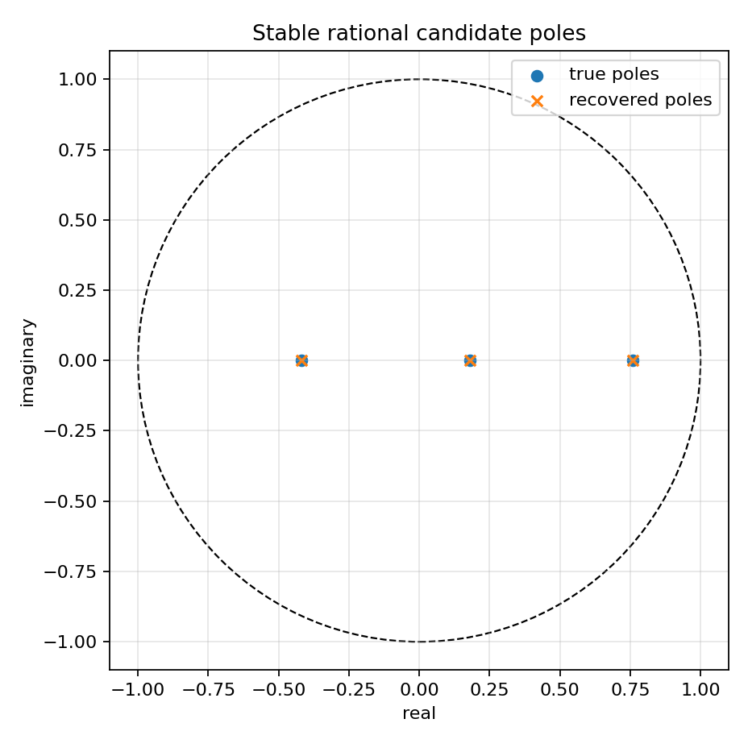
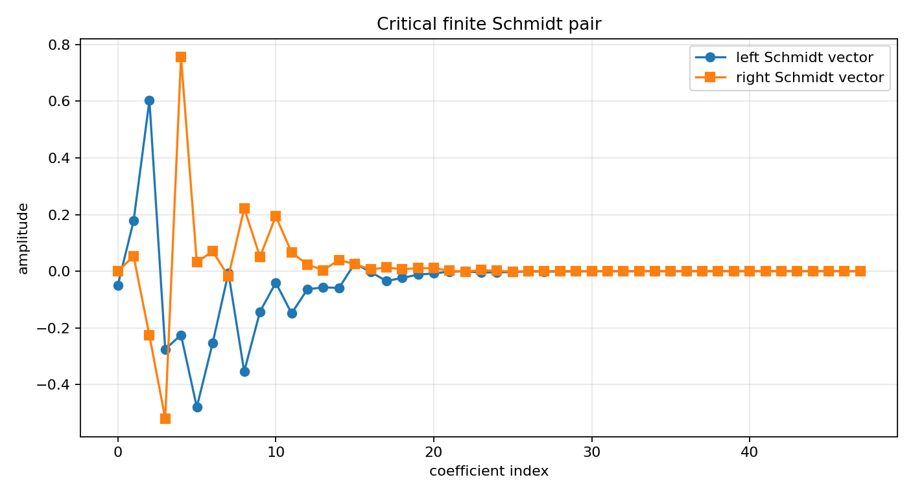
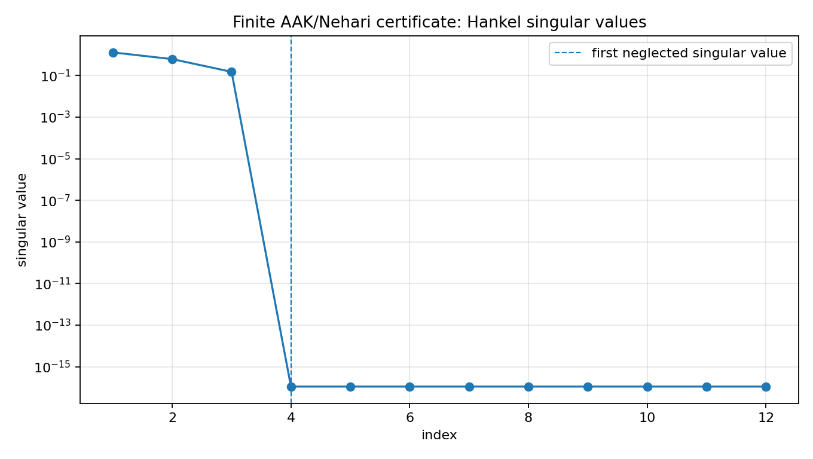
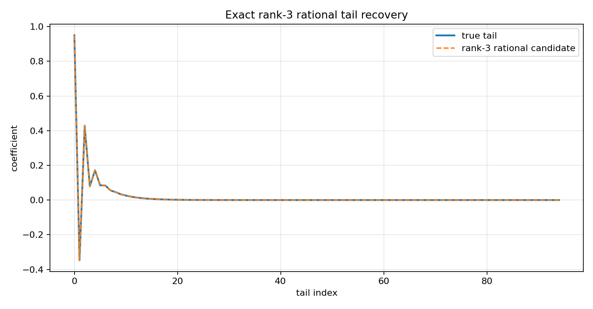

Finite-section SISO AAK/Nehari certificate
==========================================

.. admonition:: Tutorial goal

   Use Schmidt-pair identities to certify the finite AAK/Nehari target and attach the rational candidate.

.. note::

   New to the terminology? See the :doc:`lattice DSP concept map <../../algorithms/concept_map>` and the :doc:`causality/data-use guide <../../theory/causality_and_data_use>` for how online, offline, block, and MIMO examples should be read.

Context
-------

This is the first tutorial whose structure is deliberately AAK/Nehari-shaped.  It builds a
finite Hankel matrix from an exact rational anticausal tail, computes the first neglected
Schmidt pair, checks the singular-vector identities, and attaches the finite Nehari/rational
candidate for the same rank.

The tutorial is intentionally finite-section.  It is closer to the AAK/Nehari construction
than the earlier rank sweeps because it verifies the Schmidt-pair equations directly, but it
is still not advertised as a full infinite-dimensional Hardy-space solver.

Key idea and equations
----------------------

For target rank ``r``, the finite certificate reports the first neglected singular value

.. math::

   \sigma_{r+1}.

It also checks the finite Schmidt-pair equations

.. math::

   H v_{r+1}=\sigma_{r+1}u_{r+1},\qquad
   H^T u_{r+1}=\sigma_{r+1}v_{r+1}.

On an exact rank-three rational tail, the rank-three certificate should recover the stable
poles and produce residuals near machine precision.

How to read the result
----------------------

Look for small Schmidt-pair residuals, rank-3 pole recovery, tiny rational error, and poles inside the unit disk.

Run command
-----------

.. code-block:: bash

   python examples/aak_siso_certificate_demo.py

Run status
----------

Return code: ``0``

Captured stdout
---------------

.. code-block:: text

   finite Hankel matrix: 48 x 48
   target rank: 3
   true poles: [-0.42, 0.18, 0.76]
   true weights: [1.25, -0.7, 0.4]
   leading singular values: [1.28016936, 0.61060229, 0.14951434, 0.0, 0.0, 0.0, 0.0, 0.0]
   sigma_next: 1.123664e-16
   rank-r SVD error: 6.575994e-16
   left Schmidt residual: 1.335e-16
   right Schmidt residual: 1.279e-16
   candidate tail error: 4.624e-15
   candidate rational error: 4.613e-15
   candidate pole radius: 0.7600
   candidate accepted: True
   recovered poles: [-0.42, 0.18, 0.76]

Figures
-------

   ``aak_certificate_poles.png``

   ``aak_certificate_schmidt_pair.png``

   ``aak_certificate_singular_values.png``

   ``aak_certificate_tail_recovery.png``

Generated data files
--------------------

* :download:`aak_siso_certificate_summary.csv <_artifacts/aak_siso_certificate_demo/aak_siso_certificate_summary.csv>`

Source code
-----------

.. literalinclude:: ../../../examples/aak_siso_certificate_demo.py
   :language: python
   :linenos:
