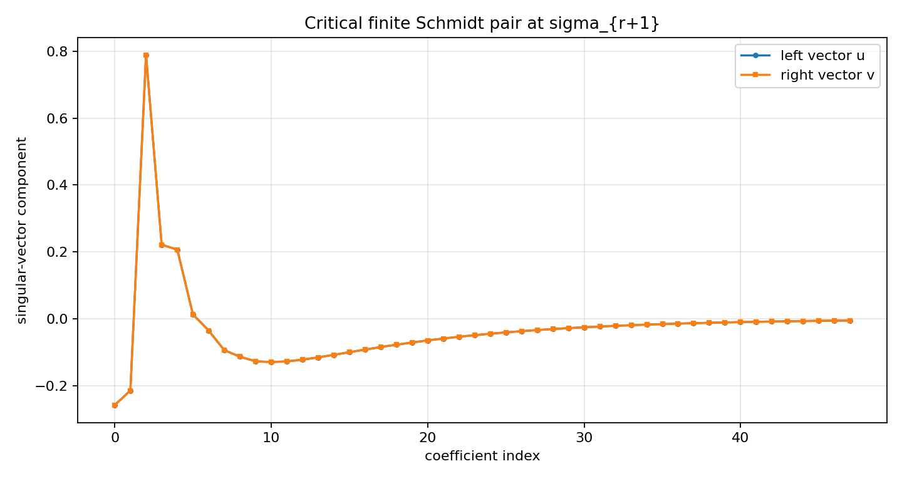
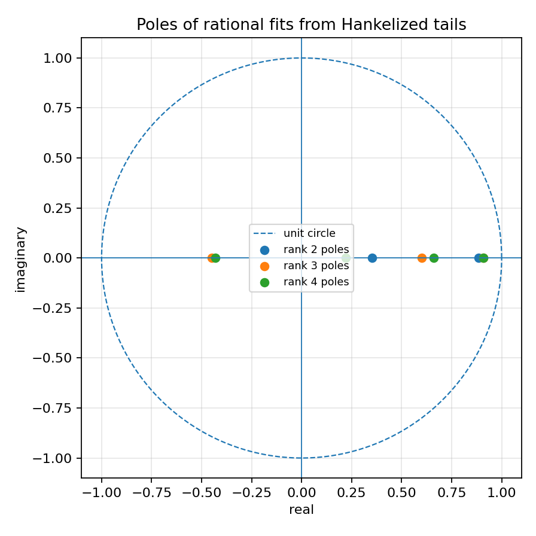
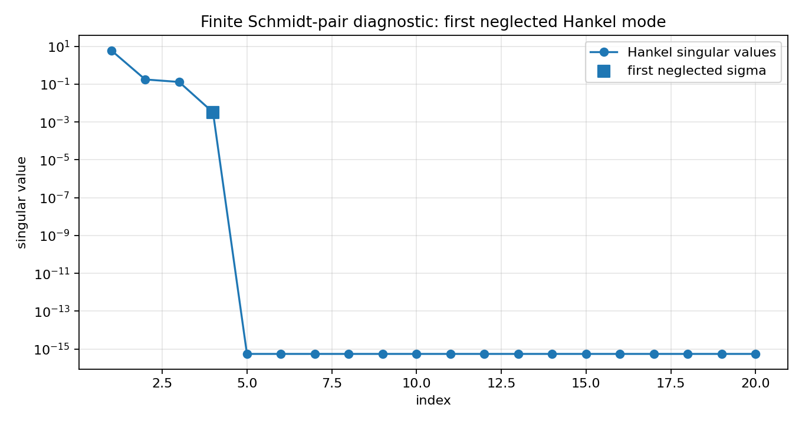
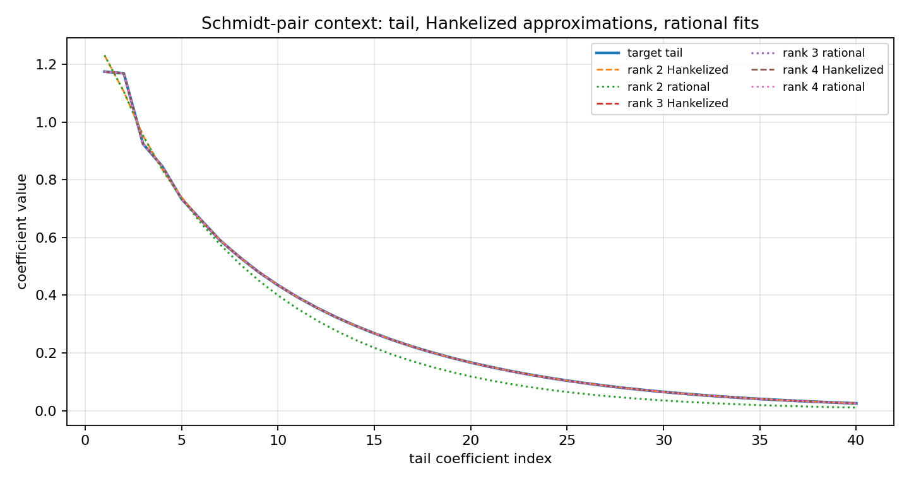

AAK Schmidt-pair diagnostics for SISO Hankel approximation
==========================================================

.. admonition:: Tutorial goal

   Visualize the first neglected Hankel singular direction that drives the AAK/Nehari approximation barrier.

.. note::

   New to the terminology? See the :doc:`lattice DSP concept map <../../algorithms/concept_map>` and the :doc:`causality/data-use guide <../../theory/causality_and_data_use>` for how online, offline, block, and MIMO examples should be read.

Context
-------

The finite Nehari toy and rational-bridge tutorials show the singular values and a practical
recurrence fit.  This tutorial focuses on the next AAK object: the finite Schmidt pair at
the first neglected singular value.  In the scalar AAK theory, analogous singular-vector
data carries the structure used to build an optimal rational approximant.

This page is still finite-dimensional and diagnostic.  It does not expose a production
``aak_reduce_iir`` routine.  Instead, it shows what such a routine would need to control:
the critical singular direction, the finite rank-r barrier, the Hankelized approximation,
and the resulting rational poles.

Key idea and equations
----------------------

For a finite Hankel matrix ``H`` with singular value decomposition

.. math::

   H = U\Sigma V^T,

the first neglected mode after a rank-``r`` approximation is the finite Schmidt pair
``(u_{r+1}, v_{r+1})`` satisfying

.. math::

   H v_{r+1}=\sigma_{r+1}u_{r+1},\qquad
   H^T u_{r+1}=\sigma_{r+1}v_{r+1}.

The scalar AAK/Nehari theory can be viewed as the infinite-dimensional rational analogue of
this finite singular-direction picture.

How to read the result
----------------------

Look for the highlighted first neglected singular value, small Schmidt-pair residuals, and how the rational fits improve as the rank crosses the critical modes.

Run command
-----------

.. code-block:: bash

   python examples/aak_siso_schmidt_pair_demo.py

Run status
----------

Return code: ``0``

Captured stdout
---------------

.. code-block:: text

   finite Hankel matrix: 48 x 48
   target rank: 3
   leading singular values: [6.126638, 0.177066, 0.130905, 0.003221, 0.0, 0.0, 0.0, 0.0]
   critical sigma: 3.220680e-03
   rank-r SVD error: 3.220680e-03
   left Schmidt residual: 3.058e-16
   right Schmidt residual: 3.345e-16
   rank=2: sigma_next=1.309e-01, tail_error=3.358e-02, rational_error=8.731e-02, pole_radius=0.8856
   rank=3: sigma_next=3.221e-03, tail_error=2.639e-04, rational_error=3.433e-03, pole_radius=0.9082
   rank=4: sigma_next=4.723e-08, tail_error=2.791e-13, rational_error=3.322e-13, pole_radius=0.9100

Figures
-------

   ``aak_schmidt_pair_vectors.png``

   ``aak_schmidt_rational_poles.png``

   ``aak_schmidt_singular_values.png``

   ``aak_schmidt_tail_and_rational_fit.png``

Generated data files
--------------------

* :download:`aak_siso_schmidt_pair_summary.csv <_artifacts/aak_siso_schmidt_pair_demo/aak_siso_schmidt_pair_summary.csv>`

Source code
-----------

.. literalinclude:: ../../../examples/aak_siso_schmidt_pair_demo.py
   :language: python
   :linenos:
