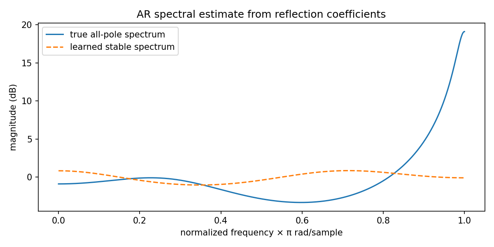

AR spectral estimation from reflection coefficients
===================================================

.. admonition:: Tutorial goal

   Estimate an all-pole spectrum from a stable adaptive model.

.. note::

   New to the terminology? See the :doc:`lattice DSP concept map <../../algorithms/concept_map>` and the :doc:`causality/data-use guide <../../theory/causality_and_data_use>` for how online, offline, block, and MIMO examples should be read.

Context
-------

This example turns stable AR/lattice parameters into a spectral plot.  It is useful because
many readers understand an estimated model more quickly from its frequency response than from
coefficient lists.

Key idea and equations
----------------------

For an all-pole AR model, the spectral shape is proportional to

.. math::

   S(\omega) \propto \frac{1}{|A(e^{j\omega})|^2}.

How to read the result
----------------------

The learned spectrum should follow the true all-pole spectrum, especially near the dominant resonances.

Run command
-----------

.. code-block:: bash

   python examples/ar_spectral_estimation.py

Run status
----------

Return code: ``0``

Captured stdout
---------------

.. code-block:: text

   true reflection: [0.72, -0.48, 0.24]
   learned reflection: [0.035, -0.0369, -0.0881]
   initial prediction MSE: 0.0652963118535798
   final prediction MSE: 0.0642074395182556

Figures
-------

   ``ar_spectral_estimation.png``

Source code
-----------

.. literalinclude:: ../../../examples/ar_spectral_estimation.py
   :language: python
   :linenos:
