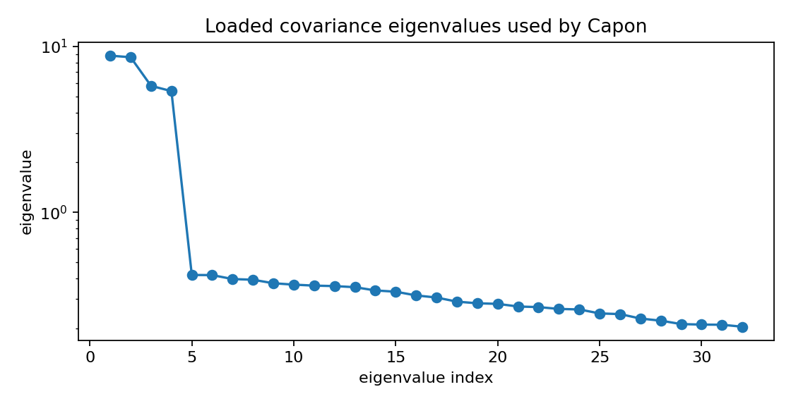
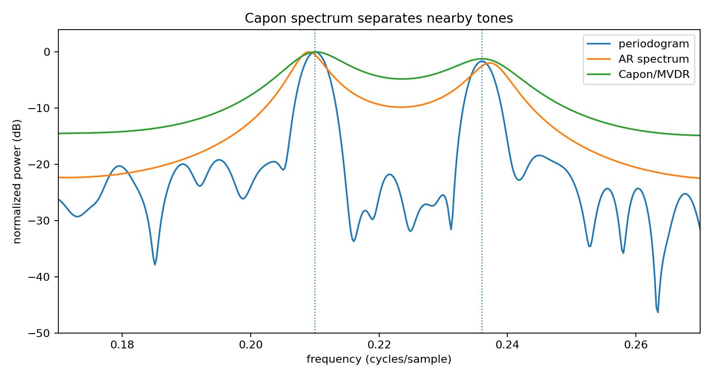

Capon/MVDR spectral estimation
==============================

.. admonition:: Tutorial goal

   Use an inverse-covariance Capon spectrum to resolve nearby tones.

.. note::

   New to the terminology? See the :doc:`lattice DSP concept map <../../algorithms/concept_map>` and the :doc:`causality/data-use guide <../../theory/causality_and_data_use>` for how online, offline, block, and MIMO examples should be read.

Context
-------

Capon/MVDR spectra are useful as a high-resolution diagnostic.  They are not a replacement
for every periodogram or AR model, but they are visually helpful when nearby narrowband
components are hard to separate.

Key idea and equations
----------------------

For steering vector ``a(ω)`` and loaded covariance matrix ``R``, the Capon spectrum is

.. math::

   \hat S_{\mathrm{Capon}}(\omega)=\frac{1}{a(\omega)^H R^{-1} a(\omega)}.

How to read the result
----------------------

The main figure compares periodogram, AR, and Capon curves.  The covariance-eigenvalue plot helps diagnose whether the covariance estimate is well conditioned.

Run command
-----------

.. code-block:: bash

   python examples/capon_spectrum_demo.py

Run status
----------

Return code: ``0``

Captured stdout
---------------

.. code-block:: text

   true tone frequencies: [0.21, 0.236]
   Capon aperture: 32
   AR model order: 20
   periodogram peak estimates: [0.21, 0.2361]
   Capon peak estimates: [0.2102, 0.2129]
   AR peak estimates: [0.209, 0.2373]

Figures
-------

   ``capon_covariance_eigenvalues.png``

   ``capon_spectrum_demo.png``

Generated data files
--------------------

* :download:`capon_spectrum_demo.csv <_artifacts/capon_spectrum_demo/capon_spectrum_demo.csv>`

Source code
-----------

.. literalinclude:: ../../../examples/capon_spectrum_demo.py
   :language: python
   :linenos:
