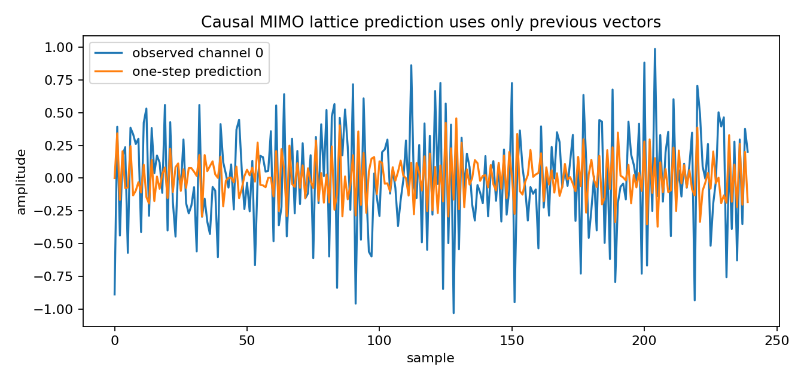
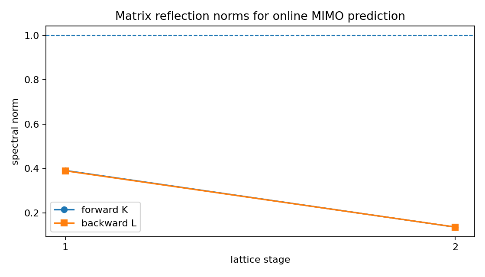
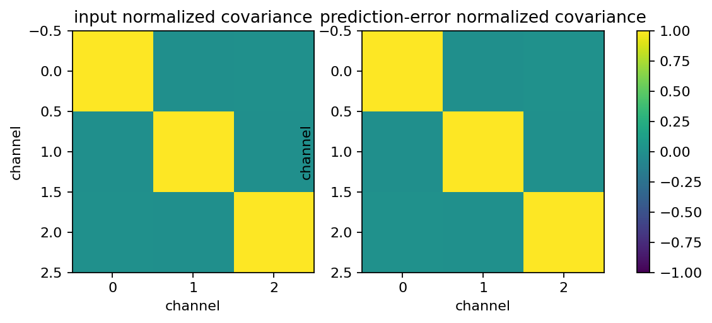

Causal online MIMO lattice prediction
=====================================

.. admonition:: Tutorial goal

   Use block-Levinson matrix reflections in a sample-by-sample causal MIMO lattice predictor.

.. note::

   New to the terminology? See the :doc:`lattice DSP concept map <../../algorithms/concept_map>` and the :doc:`causality/data-use guide <../../theory/causality_and_data_use>` for how online, offline, block, and MIMO examples should be read.

Context
-------

This tutorial separates coefficient estimation from runtime filtering.  The
matrix reflection coefficients are estimated once from a finite training
record, then a stateful lattice predictor runs online.  At each time step it
predicts the next vector from stored backward-error states before the current
vector is observed.

Key idea and equations
----------------------

With forward and backward matrix reflection coefficients :math:`K_m` and
:math:`L_m`, the online vector lattice recursion is

.. math::

   f_0[n] = b_0[n] = y[n],

.. math::

   f_m[n] = f_{m-1}[n] + K_m b_{m-1}[n-1],

.. math::

   b_m[n] = b_{m-1}[n-1] + L_m f_{m-1}[n].

The one-step prediction is obtained before seeing :math:`y[n]` by evaluating
the same recursion with :math:`y[n]=0` and negating the result:

.. math::

   \hat y[n] = -f_p[n]\big|_{y[n]=0}.

After the true vector is observed, :math:`f_p[n]=y[n]-\hat y[n]` is the
forward prediction error and the backward-error states are updated.  This is
causal in the prediction sense: :math:`\hat y[n]` depends only on stored
states from samples :math:`< n`.

Causality and data use
----------------------

The block-Levinson fit is a batch estimation step.  The ``MIMOLatticePredictor`` object created from those reflection matrices is a runtime object: ``predict()`` uses only previous vectors, and ``update(y_n)`` consumes the current vector afterward.

What this example verifies
--------------------------

This verifies the online contract for ``MIMOLatticePredictor``.  Prediction
is requested before the current vector is observed, then ``update(y_n)``
consumes the current vector and advances the backward-error state.  The
residual is compared with the direct VAR residual from the same fitted
block-Levinson model.

How to read the result
----------------------

Check that the online lattice residual matches the direct AR residual from the same block-Levinson fit, then inspect the trace, reflection-norm, and residual-covariance figures.

Run command
-----------

.. code-block:: bash

   python examples/causal_mimo_lattice_prediction.py

Run status
----------

Return code: ``0``

Captured stdout
---------------

.. code-block:: text

   channels: 3
   order: 2
   companion spectral radius: 0.499707
   forward reflection norms: [0.390826 0.135791]
   backward reflection norms: [0.38934  0.136001]
   online lattice/direct AR residual difference: 1.070e-16
   input/error mean absolute off-diagonal covariance: 0.0006 0.0008
   takeaway: after batch coefficient estimation, the MIMO lattice predictor is causal and online

Figures
-------

   ``causal_mimo_lattice_prediction_trace.png``

   ``causal_mimo_lattice_reflection_norms.png``

   ``causal_mimo_lattice_residual_covariance.png``

Source code
-----------

.. literalinclude:: ../../../examples/causal_mimo_lattice_prediction.py
   :language: python
   :linenos:
