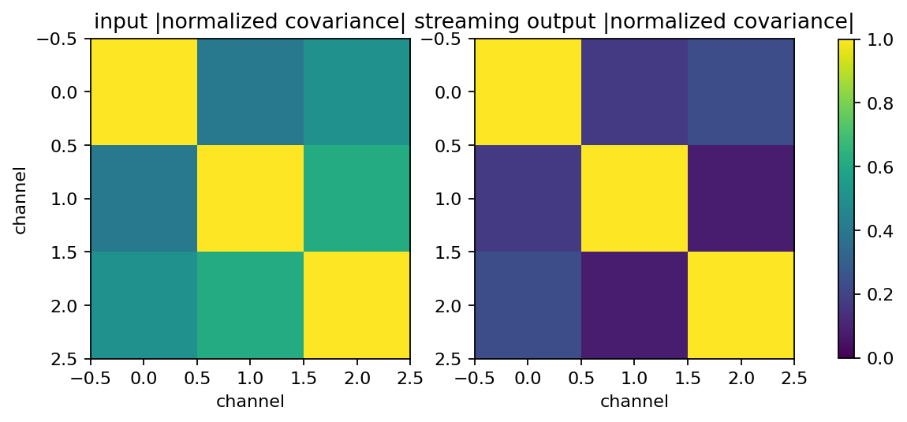
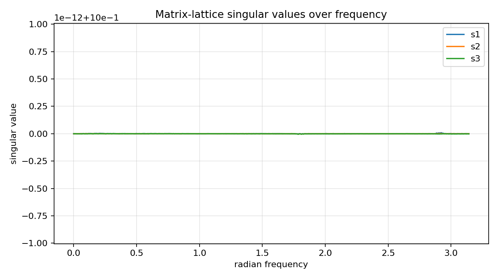
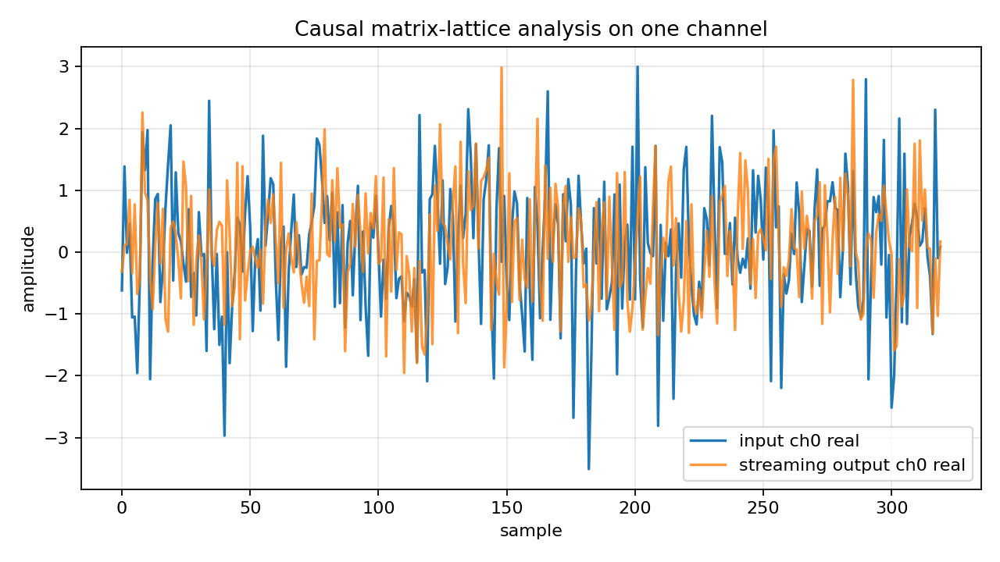

Coupled MIMO matrix-lattice filtering
=====================================

.. admonition:: Tutorial goal

   Apply a matrix-lattice all-pass to a coupled complex MIMO signal block and verify streaming energy preservation.

.. note::

   New to the terminology? See the :doc:`lattice DSP concept map <../../algorithms/concept_map>` and the :doc:`causality/data-use guide <../../theory/causality_and_data_use>` for how online, offline, block, and MIMO examples should be read.

Context
-------

This tutorial moves from static frequency-response diagnostics to a signal-processing use
case.  A coupled complex multichannel signal is transformed by the causal
``OnlineMatrixLatticeAllPass`` runtime.  A finite-record time-domain adjoint then checks
reconstruction.  The example verifies that the matrix-lattice response preserves energy
while still mixing channels in a frequency-dependent way.

Key idea and equations
----------------------

The matrix-lattice response :math:`G(z)` is designed as an all-pass multichannel
transform:

.. math::

   G(e^{j\omega})^H G(e^{j\omega}) = I.

The forward online runtime applies the causal convolution

.. math::

   y[n] = \sum_{k\ge 0} H_k x[n-k],

where :math:`H_k\in\mathbb{C}^{c\times c}` are matrix impulse-response
coefficients.  Energy preservation holds on the full stream, including the decaying
all-pass tail:

.. math::

   \sum_n \lVert y[n]\rVert_2^2
   \approx \sum_n \lVert x[n]\rVert_2^2.

The finite-record synthesis diagnostic applies the time-domain adjoint

.. math::

   x_{adj}[n] = \sum_{k\ge 0} H_k^H y[n+k].

This adjoint is noncausal as a streaming inverse because it needs future transformed
samples, but it is useful when the whole record is available.

Causality and data use
----------------------

The forward analysis path is causal and sample-by-sample.  The reconstruction check is a finite-record time-domain adjoint, so it is noncausal/transductive by design and should not be confused with a causal stable inverse.

What this example verifies
--------------------------

This verifies streaming coupled forward filtering.  The output is produced by
the online matrix-lattice runtime, off-diagonal impulse/Markov energy shows
channel coupling, and the finite-record adjoint is labeled separately as a
noncausal reconstruction diagnostic.

How to read the result
----------------------

Look for near-zero unitarity, energy, streaming-vs-impulse, and finite-adjoint reconstruction errors.  The covariance plots show that the streaming block is coupled even though it is norm preserving.

Run command
-----------

.. code-block:: bash

   python examples/coupled_mimo_lattice_filter.py

Run status
----------

Return code: ``0``

Captured stdout
---------------

.. code-block:: text

   channels: 3
   matrix-lattice order: 5
   samples: 2048
   tail samples for energy/reconstruction: 768
   max reflection singular value: 0.7944
   real scalar parameter count: 108
   max unitarity error: 2.229e-14
   streaming vs truncated impulse error: 3.796e-09
   energy relative error with tail: 3.145e-16
   finite-adjoint reconstruction error: 2.906e-09
   input/output mean off-diagonal covariance: 0.508 0.162
   causal analysis: y[n] is produced by OnlineMatrixLatticeAllPass before future x samples are seen
   finite adjoint: reconstruction uses the whole transformed block and is noncausal

Figures
-------

   ``coupled_mimo_lattice_covariance.png``

   ``coupled_mimo_lattice_singular_values.png``

   ``coupled_mimo_lattice_streaming_trace.png``

Generated data files
--------------------

* :download:`coupled_mimo_lattice_filter_summary.csv <_artifacts/coupled_mimo_lattice_filter/coupled_mimo_lattice_filter_summary.csv>`

Source code
-----------

.. literalinclude:: ../../../examples/coupled_mimo_lattice_filter.py
   :language: python
   :linenos:
