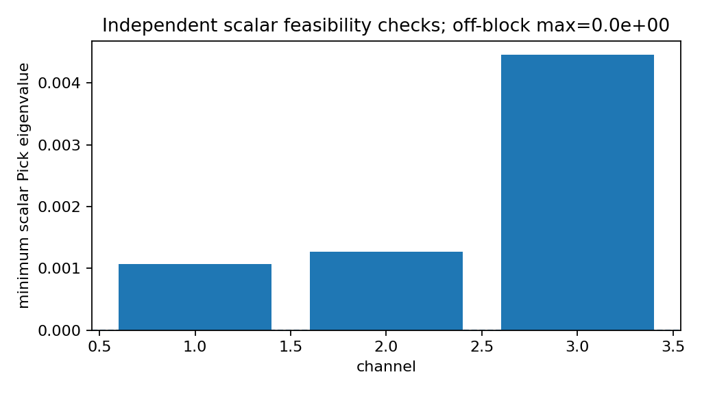
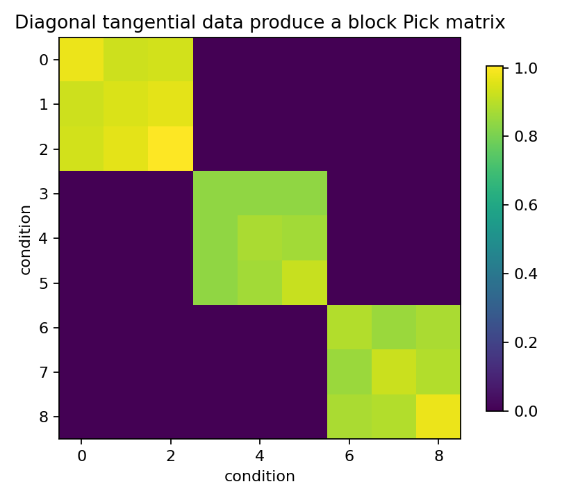

Diagonal tangential Schur equals independent scalar Pick problems
=================================================================

.. admonition:: Tutorial goal

   Show that diagonal MIMO tangential data decompose into independent scalar Schur/Pick checks.

.. note::

   New to the terminology? See the :doc:`lattice DSP concept map <../../algorithms/concept_map>` and the :doc:`causality/data-use guide <../../theory/causality_and_data_use>` for how online, offline, block, and MIMO examples should be read.

Context
-------

This tutorial mirrors the diagonal-MIMO-equals-SISO runtime check in the
interpolation setting.  If tangential directions are coordinate vectors and
the Schur function is diagonal, the MIMO Pick matrix splits into independent
scalar Pick blocks.  This gives a simple sanity check for the matrix-valued
tangential machinery.

Key idea and equations
----------------------

For a diagonal matrix Schur function

.. math::

   S(z)=\operatorname{diag}(s_1(z),\ldots,s_c(z)),

coordinate tangential data satisfy

.. math::

   S(z_i)e_k = s_k(z_i)e_k.

If the data are grouped by channel, the full Pick matrix is block diagonal,
and each block is the scalar Pick matrix for one :math:`s_k`.

Causality and data use
----------------------

This is an offline interpolation diagnostic.  It does not filter a time stream; it checks that the MIMO Schur/Pick machinery reduces to independent scalar problems when there is no channel coupling.

What this example verifies
--------------------------

This verifies the reduction-to-scalar sanity check for interpolation data.
When tangential directions are coordinate vectors and the Schur function is
diagonal, the full MIMO Pick matrix should split into independent scalar
Pick blocks with roundoff-level off-block error.

How to read the result
----------------------

The full MIMO Pick matrix should match the scalar block-diagonal Pick matrix up to roundoff, and the diagonal constant solution should interpolate exactly.

Run command
-----------

.. code-block:: bash

   python examples/diagonal_tangential_schur_equals_scalar.py

Run status
----------

Return code: ``0``

Captured stdout
---------------

.. code-block:: text

   channels: 3
   points per channel: 3
   total tangential conditions: 9
   diagonal Schur max singular value: 0.403113
   full Pick min eigenvalue: 1.071818e-03
   max |full Pick - scalar block diagonal Pick|: 0.000e+00
   constant diagonal interpolation residual: 0.000e+00
   scalar channel min eigenvalues: [0.001072 0.001265 0.00446 ]
   interpretation: diagonal MIMO tangential data decompose into independent scalar Schur/Pick problems

Figures
-------

   ``diagonal_scalar_pick_min_eigenvalues.png``

   ``diagonal_tangential_pick_matrix.png``

Source code
-----------

.. literalinclude:: ../../../examples/diagonal_tangential_schur_equals_scalar.py
   :language: python
   :linenos:
