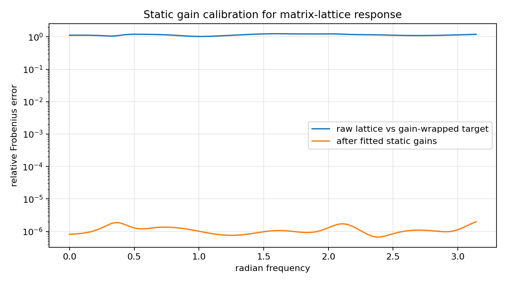
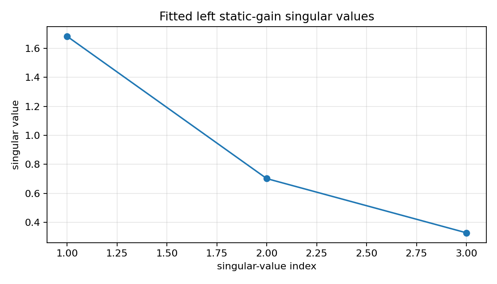

Calibrating matrix-lattice static gain diagnostics
==================================================

.. admonition:: Tutorial goal

   Use a known matrix-lattice all-pass response to validate static gain compensation diagnostics.

.. note::

   New to the terminology? See the :doc:`lattice DSP concept map <../../algorithms/concept_map>` and the :doc:`causality/data-use guide <../../theory/causality_and_data_use>` for how online, offline, block, and MIMO examples should be read.

Context
-------

This tutorial is a calibration case for the experimental realization scaffold.  It starts
from a known matrix-lattice all-pass response, wraps it in static nonunitary gains, and then
fits static left/right gains back around the lattice response.  The compensated error should
collapse when the only mismatch is static gain.

Key idea and equations
----------------------

Given a lattice all-pass response ``G(e^{j\omega})`` and a target

.. math::

   H(e^{j\omega}) = L\,G(e^{j\omega})\,R,

the diagnostic solves a least-squares problem for static matrices ``L`` and ``R``.  This
separates static nonunitary gain mismatch from dynamic lattice/all-pass mismatch.

How to read the result
----------------------

Look for near-zero all-pass calibration error and a large improvement after fitting static gains around the gain-wrapped lattice response.

Run command
-----------

.. code-block:: bash

   python examples/experimental_mimo_matrix_lattice_calibration.py

Run status
----------

Return code: ``0``

Captured stdout
---------------

.. code-block:: text

   known lattice dimension: 3
   known lattice order: 4
   known lattice unitarity error: 2.803e-14
   max reflection singular value: 0.7432
   all-pass calibration raw error: 0.000e+00
   all-pass calibration compensated error: 0.000e+00
   gain-wrapped raw error: 1.148e+00
   gain-wrapped compensated error: 1.142e-06
   static-gain improvement: 1.01e+06x
   left/right fitted gain condition: 5.143 1.000

Figures
-------

   ``experimental_mimo_matrix_lattice_calibration_error.png``

   ``experimental_mimo_matrix_lattice_calibration_gain.png``

Generated data files
--------------------

* :download:`experimental_mimo_matrix_lattice_calibration_summary.csv <_artifacts/experimental_mimo_matrix_lattice_calibration/experimental_mimo_matrix_lattice_calibration_summary.csv>`

Source code
-----------

.. literalinclude:: ../../../examples/experimental_mimo_matrix_lattice_calibration.py
   :language: python
   :linenos:
