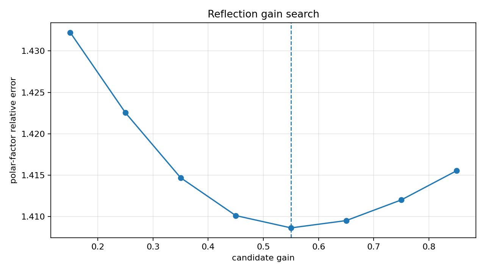
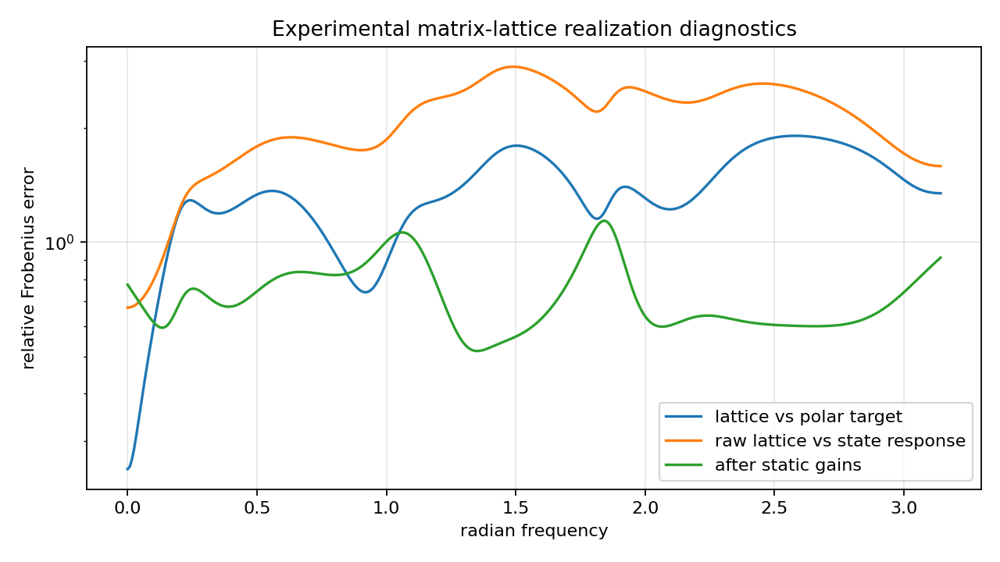
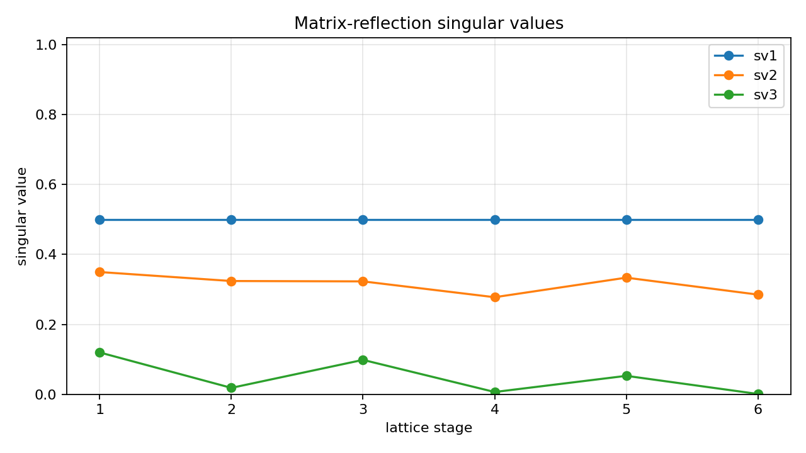

Experimental MIMO state-space to matrix-lattice realization
===========================================================

.. admonition:: Tutorial goal

   Fit a stable matrix-lattice all-pass scaffold to the polar factor of a reduced MIMO state-space response.

.. note::

   New to the terminology? See the :doc:`lattice DSP concept map <../../algorithms/concept_map>` and the :doc:`causality/data-use guide <../../theory/causality_and_data_use>` for how online, offline, block, and MIMO examples should be read.

Context
-------

This tutorial promotes the previous bridge diagnostic into a small experimental solver-style
API.  A stable MIMO state-space model is first reduced with the finite block-Hankel baseline.
The experimental matrix-lattice helper then builds Markov-initialized all-pass scaffolds,
searches over reflection gains, and returns the lattice with the smallest error against the
reduced model's unitary polar factor.

The result is a useful matrix-lattice realization scaffold and initialization diagnostic.
Optional static gain compensation reports how much of the remaining mismatch can be explained
by constant left/right gains around the all-pass lattice.  It is still not a full matrix
AAK/Nehari solver and it does not realize arbitrary dynamic gain responses exactly.

Key idea and equations
----------------------

For a square MIMO response ``H(e^{j\omega})``, the target is its polar factor

.. math::

   U_p(e^{j\omega}) = U(e^{j\omega})V(e^{j\omega})^H,
   \qquad H=U\Sigma V^H.

Candidate matrix-lattice all-pass responses ``G_\alpha`` are built from Markov directions
and reflection gain ``\alpha``.  Static gain diagnostics then fit

.. math::

   H(e^{j\omega}) \approx L\,G_\alpha(e^{j\omega})\,R.

How to read the result
----------------------

Look for a stable lattice, unitarity error near numerical precision, selected gain, polar-factor fit error, and static-gain compensated error.  Treat this as an experimental all-pass realization scaffold.

Run command
-----------

.. code-block:: bash

   python examples/experimental_mimo_matrix_lattice_realization.py

Run status
----------

Return code: ``0``

Captured stdout
---------------

.. code-block:: text

   full state order: 12
   reduced state order: 6
   channels: 3
   lattice realization order: 6
   selected reflection gain: 0.5500
   reduced state radius: 0.8775
   retained block-Hankel energy: 0.999174
   polar-factor fit error: 1.409e+00
   raw state-response error: 1.901e+00
   static-gain compensated error: 7.295e-01
   static-gain improvement: 2.61x
   static gain conditions: 24.482 107.399
   diagnostic classification: mostly_static_gain_or_nonunitary_mismatch
   lattice unitarity error: 1.464e-14
   max reflection singular value: 0.5005
   target gain condition span: 1.775e+01
   status: experimental all-pass/polar realization scaffold, not exact matrix AAK/Nehari

Figures
-------

   ``experimental_mimo_matrix_lattice_gain_search.png``

   ``experimental_mimo_matrix_lattice_realization_error.png``

   ``experimental_mimo_matrix_lattice_reflections.png``

Generated data files
--------------------

* :download:`experimental_mimo_matrix_lattice_realization_summary.csv <_artifacts/experimental_mimo_matrix_lattice_realization/experimental_mimo_matrix_lattice_realization_summary.csv>`

Source code
-----------

.. literalinclude:: ../../../examples/experimental_mimo_matrix_lattice_realization.py
   :language: python
   :linenos:
