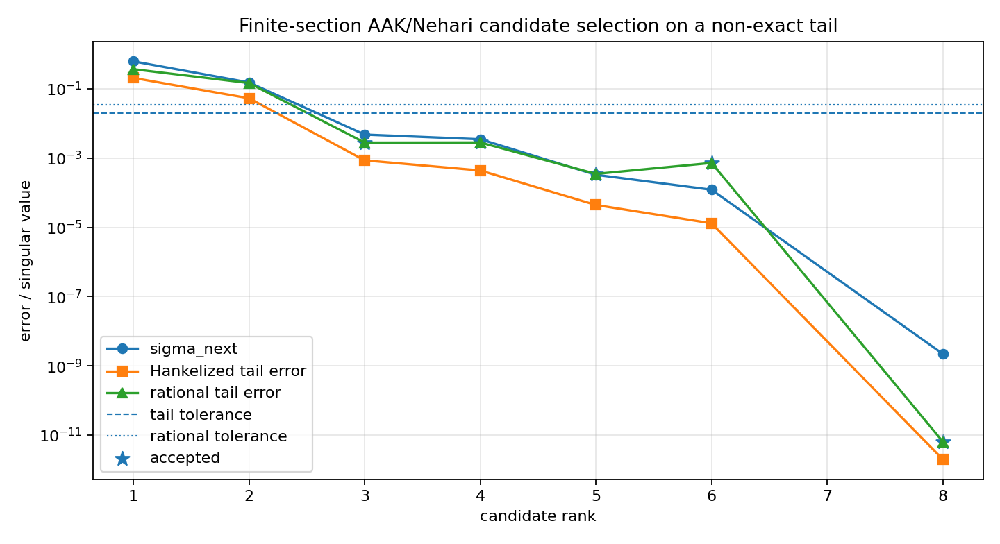
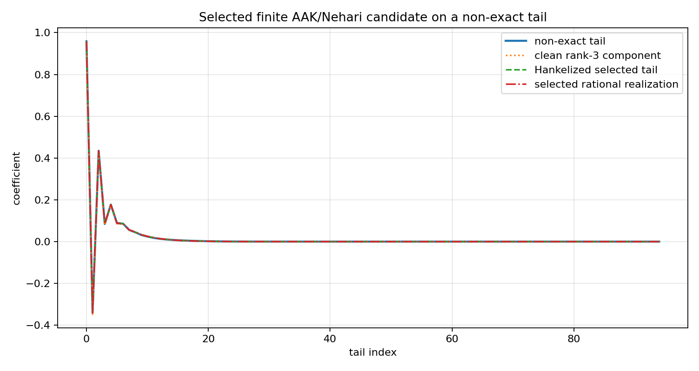
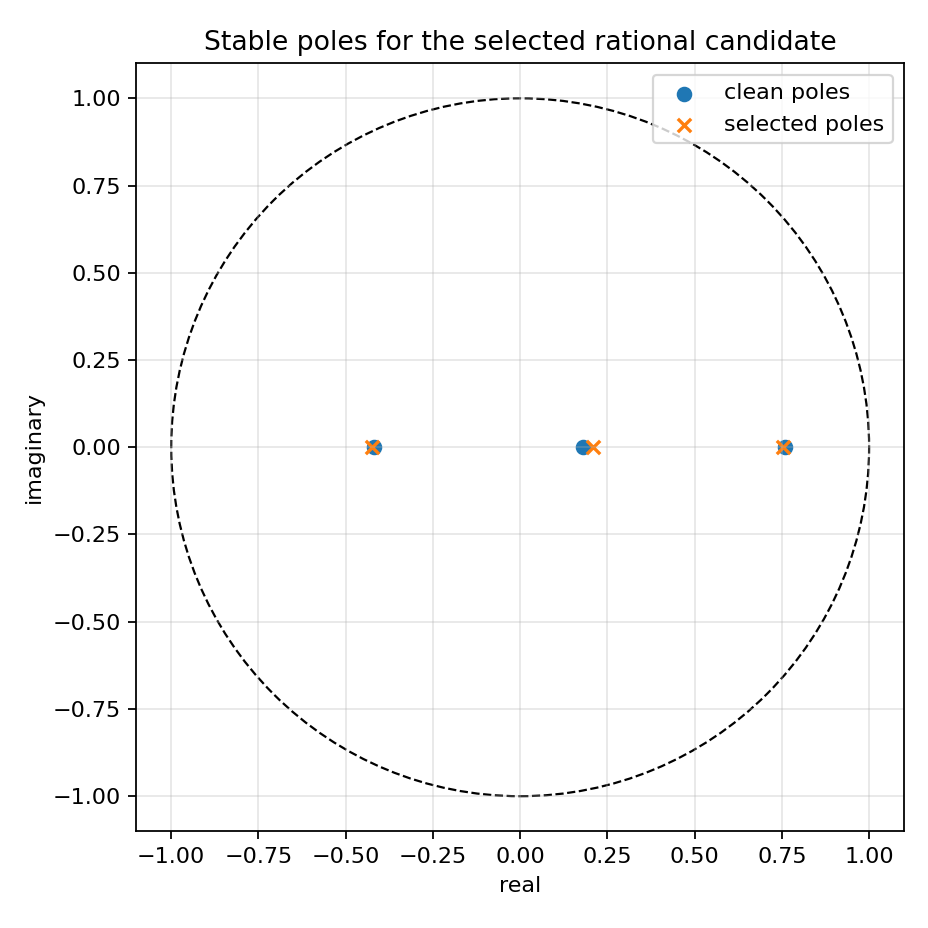

Finite-section AAK/Nehari reduction on a non-exact tail
=======================================================

.. admonition:: Tutorial goal

   Use the high-level finite AAK/Nehari reducer on a stable tail with a small non-rational residual.

.. note::

   New to the terminology? See the :doc:`lattice DSP concept map <../../algorithms/concept_map>` and the :doc:`causality/data-use guide <../../theory/causality_and_data_use>` for how online, offline, block, and MIMO examples should be read.

Context
-------

Exact rational-tail validation is necessary but too clean.  This tutorial adds a small
deterministic residual to a stable rank-three tail and then calls the high-level
``finite_aak_reduce_tail`` helper.  The helper evaluates candidate ranks, selects the first
stable rational model that meets user-chosen tolerances, and attaches a finite Schmidt-pair
certificate for the selected rank.

The tutorial is intentionally finite-section.  It shows how the current package behaves on
non-exact data while keeping the scope finite-dimensional.

Key idea and equations
----------------------

The observed tail is

.. math::

   \gamma_n = \sum_{i=1}^3 c_i p_i^n + \epsilon_n,
   \qquad |p_i|<1,

where ``epsilon_n`` is a small deterministic residual.  For each candidate rank ``r``, the
helper reports

.. math::

   \sigma_{r+1},\qquad
   \frac{\|\gamma-\widehat\gamma_r\|_2}{\|\gamma\|_2},\qquad
   \frac{\|\gamma-g_r\|_2}{\|\gamma\|_2},\qquad
   \max_i |p_i|.

The selected candidate is the first rank satisfying the supplied error and pole-radius
tolerances.

How to read the result
----------------------

Look for a selected stable rank, a rational error below tolerance, and Schmidt-pair residuals near numerical precision for the selected finite Hankel certificate.

Run command
-----------

.. code-block:: bash

   python examples/finite_aak_noisy_tail_demo.py

Run status
----------

Return code: ``0``

Captured stdout
---------------

.. code-block:: text

   finite Hankel matrix: 48 x 48
   true clean poles: [-0.42, 0.18, 0.76]
   candidate ranks: [1, 2, 3, 4, 5, 6, 8]
   criteria: tail_error <= 0.02, rational_error <= 0.035, pole_radius <= 0.99
   rank=1: sigma_next=6.226e-01, tail_error=2.062e-01, rational_error=3.697e-01, pole_radius=0.3427, reject
   rank=2: sigma_next=1.527e-01, tail_error=5.353e-02, rational_error=1.470e-01, pole_radius=0.8920, reject
   rank=3: sigma_next=4.780e-03, tail_error=8.624e-04, rational_error=2.803e-03, pole_radius=0.7527, ACCEPT
   rank=4: sigma_next=3.500e-03, tail_error=4.389e-04, rational_error=2.827e-03, pole_radius=0.7387, ACCEPT
   rank=5: sigma_next=3.289e-04, tail_error=4.421e-05, rational_error=3.493e-04, pole_radius=0.7666, ACCEPT
   rank=6: sigma_next=1.218e-04, tail_error=1.306e-05, rational_error=7.262e-04, pole_radius=0.7829, ACCEPT
   rank=8: sigma_next=2.209e-09, tail_error=1.986e-12, rational_error=6.453e-12, pole_radius=0.8300, ACCEPT
   selected rank: 3
   selected accepted: True
   selected poles: [-0.42351107, 0.20861461, 0.75268309]
   selected tail error: 8.624e-04
   selected rational error: 2.803e-03
   Schmidt residuals: 9.632e-17 1.875e-17

Figures
-------

   ``finite_aak_noisy_tail_errors.png``

   ``finite_aak_noisy_tail_fit.png``

   ``finite_aak_noisy_tail_poles.png``

Generated data files
--------------------

* :download:`finite_aak_noisy_tail_summary.csv <_artifacts/finite_aak_noisy_tail_demo/finite_aak_noisy_tail_summary.csv>`

Source code
-----------

.. literalinclude:: ../../../examples/finite_aak_noisy_tail_demo.py
   :language: python
   :linenos:
