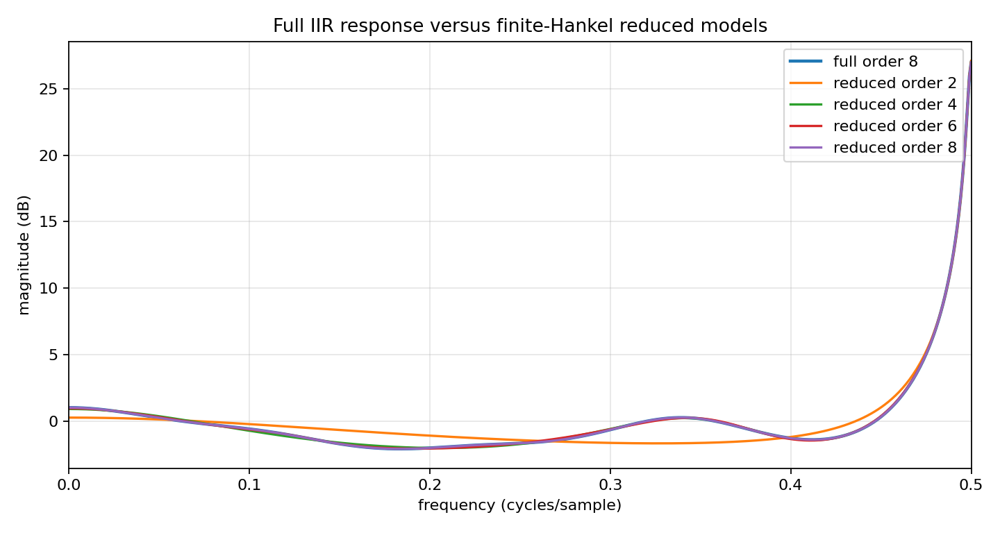
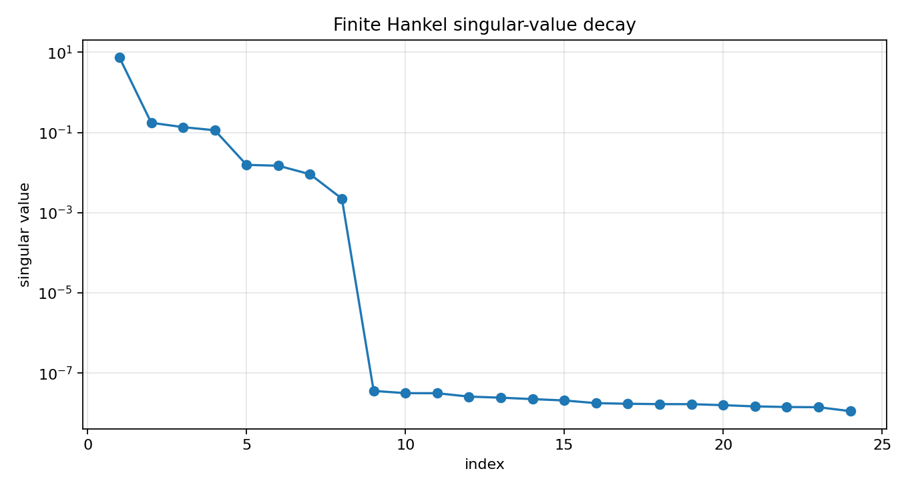

Finite Hankel SISO model reduction
==================================

.. admonition:: Tutorial goal

   Build a finite Hankel matrix from a stable IIR impulse response and construct lower-order rational models with the C++ backend.

.. note::

   New to the terminology? See the :doc:`lattice DSP concept map <../../algorithms/concept_map>` and the :doc:`causality/data-use guide <../../theory/causality_and_data_use>` for how online, offline, block, and MIMO examples should be read.

Context
-------

This tutorial is the first executable bridge between the model-reduction theory page and
the package API.  It is deliberately finite-dimensional: a truncated Hankel matrix is built
from the impulse response, its singular values are inspected, and a lower-order Ho--Kalman
realization is recovered from the leading Hankel factors.

Exact AAK/Nehari theory is an infinite-dimensional optimal rational-approximation theory.
The implementation here is a practical finite-section reducer inspired by the same
Hankel-operator viewpoint, but it does not claim exact Nehari or AAK optimality.

Key idea and equations
----------------------

Given an impulse response ``h[n]``, the finite Hankel matrix is

.. math::

   H_{ij}=h[i+j+1].

Its singular values measure input-output memory.  A reduced order ``r`` keeps the leading
singular directions and forms a balanced finite realization

.. math::

   H_0 \approx U_r \Sigma_r V_r^T,
   \qquad
   A_r = \Sigma_r^{-1/2}U_r^T H_1 V_r\Sigma_r^{-1/2}.

How to read the result
----------------------

Look for Hankel singular-value decay, retained Hankel energy, impulse-response error, and whether the reduced denominator remains stable.

Run command
-----------

.. code-block:: bash

   python examples/finite_hankel_model_reduction.py

Run status
----------

Return code: ``0``

Captured stdout
---------------

.. code-block:: text

   full order: 8
   finite Hankel matrix: 48 x 48
   leading Hankel singular values: [7.372965, 0.174286, 0.135451, 0.113361, 0.015519, 0.01479, 0.009059, 0.002232]
   order=2: stable=True, retained_energy=0.999417, rel_impulse_error=4.282e-03, max_mag_error=1.933 dB
   order=4: stable=True, retained_energy=0.999990, rel_impulse_error=3.880e-05, max_mag_error=0.175 dB
   order=6: stable=True, retained_energy=0.999998, rel_impulse_error=1.834e-05, max_mag_error=0.129 dB
   order=8: stable=True, retained_energy=1.000000, rel_impulse_error=1.115e-23, max_mag_error=0.000 dB

Figures
-------

   ``finite_hankel_reduced_responses.png``

   ``finite_hankel_singular_values.png``

Generated data files
--------------------

* :download:`finite_hankel_model_reduction_summary.csv <_artifacts/finite_hankel_model_reduction/finite_hankel_model_reduction_summary.csv>`

Source code
-----------

.. literalinclude:: ../../../examples/finite_hankel_model_reduction.py
   :language: python
   :linenos:
