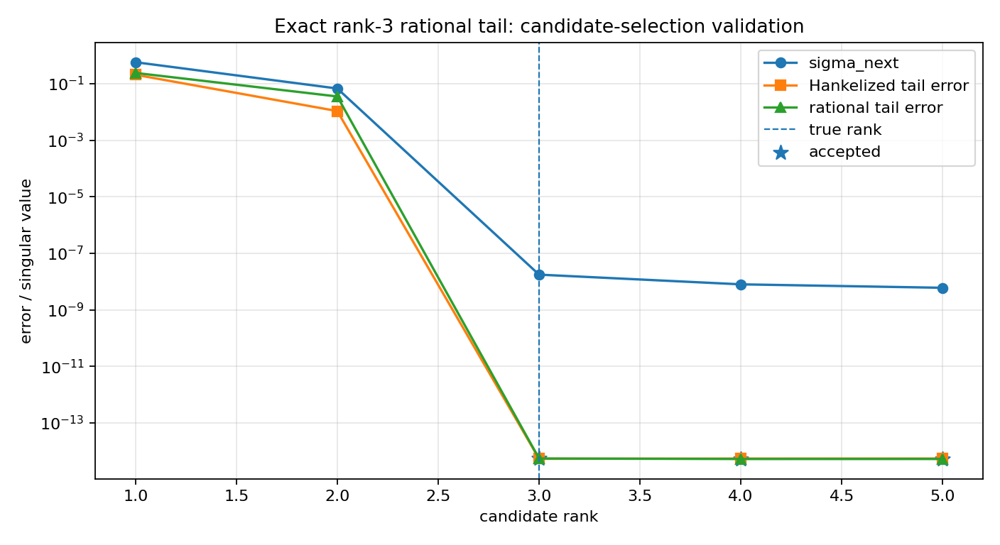
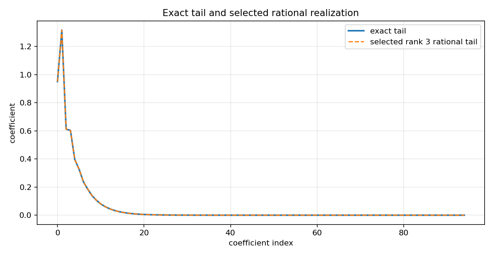
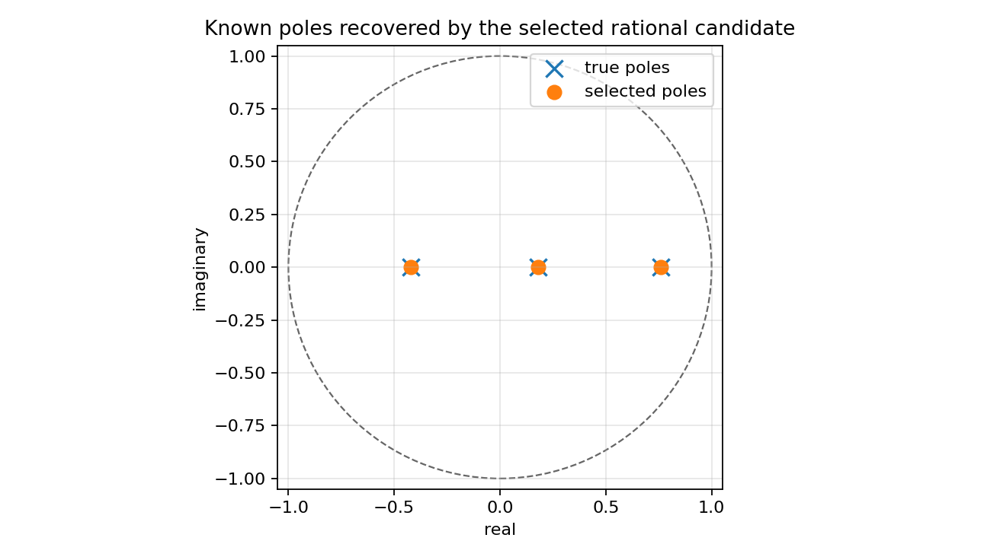

Exact rational-tail validation for finite Nehari candidates
===========================================================

.. admonition:: Tutorial goal

   Validate the finite Nehari/rational workflow on a known rank-3 exponential tail.

.. note::

   New to the terminology? See the :doc:`lattice DSP concept map <../../algorithms/concept_map>` and the :doc:`causality/data-use guide <../../theory/causality_and_data_use>` for how online, offline, block, and MIMO examples should be read.

Context
-------

The finite workflow is validated here on a controlled exact case.  This tutorial
constructs an anticausal tail as a known sum of three stable
exponentials.  Such a sequence has finite Hankel rank three, so ranks one and two should
fail the tolerance criteria while rank three should recover the tail and poles to near
numerical precision.

This page is a regression-style validation tutorial, not an optimality claim.  It checks
that the package-level candidate-selection workflow behaves correctly on a case where the
effective rational order is known in advance.

Key idea and equations
----------------------

The exact tail is

.. math::

   \gamma_n = \sum_{i=1}^3 c_i p_i^n, \qquad |p_i|<1.

This implies a rank-three Hankel structure and a third-order recurrence

.. math::

   \gamma_n + a_1\gamma_{n-1}+a_2\gamma_{n-2}+a_3\gamma_{n-3}=0.

A correct finite rational-candidate workflow should select rank three under tight error
and pole-radius thresholds.

How to read the result
----------------------

Look for ranks 1 and 2 to be rejected, rank 3 to be selected, tiny rational error, and fitted poles matching the known stable poles.

Run command
-----------

.. code-block:: bash

   python examples/finite_nehari_exact_rational_tail.py

Run status
----------

Return code: ``0``

Captured stdout
---------------

.. code-block:: text

   finite Hankel matrix: 48 x 48
   true poles: [-0.42, 0.18, 0.76]
   true weights: [1.25, -0.7, 0.4]
   candidate ranks: [1, 2, 3, 4, 5]
   criteria: tail_error <= 1e-08, rational_error <= 1e-08, pole_radius <= 0.99
   rank=1: sigma_next=5.729e-01, tail_error=2.063e-01, rational_error=2.394e-01, pole_radius=0.7859, reject
   rank=2: sigma_next=6.737e-02, tail_error=1.072e-02, rational_error=3.519e-02, pole_radius=0.7331, reject
   rank=3: sigma_next=1.749e-08, tail_error=5.346e-15, rational_error=5.466e-15, pole_radius=0.7600, ACCEPT
   rank=4: sigma_next=7.942e-09, tail_error=5.444e-15, rational_error=5.253e-15, pole_radius=0.7600, ACCEPT
   rank=5: sigma_next=5.997e-09, tail_error=5.452e-15, rational_error=5.265e-15, pole_radius=0.7600, ACCEPT
   selected rank: 3
   selected poles: [-0.42, 0.18, 0.76]

Figures
-------

   ``finite_nehari_exact_rational_tail_errors.png``

   ``finite_nehari_exact_rational_tail_fit.png``

   ``finite_nehari_exact_rational_tail_poles.png``

Generated data files
--------------------

* :download:`finite_nehari_exact_rational_tail_summary.csv <_artifacts/finite_nehari_exact_rational_tail/finite_nehari_exact_rational_tail_summary.csv>`

Source code
-----------

.. literalinclude:: ../../../examples/finite_nehari_exact_rational_tail.py
   :language: python
   :linenos:
