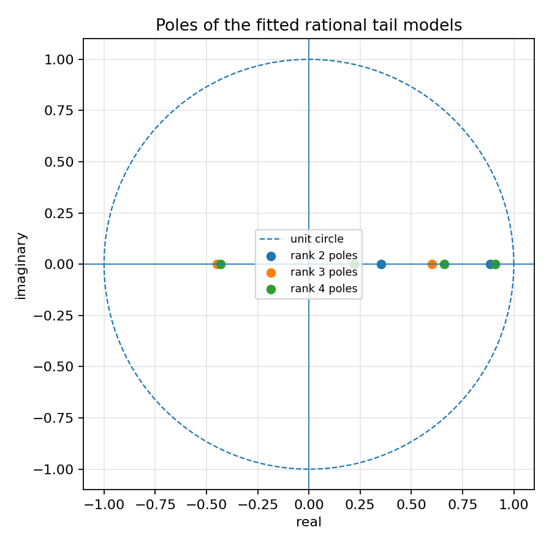
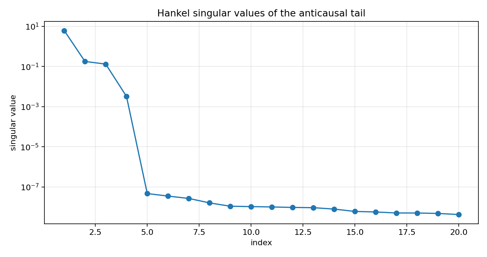
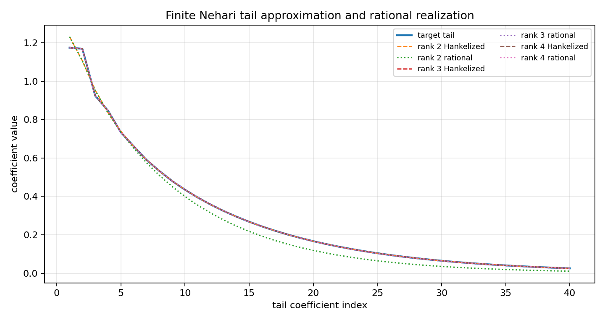

Finite Nehari tail to rational model
====================================

.. admonition:: Tutorial goal

   Connect the finite Nehari tail approximation to a low-order recursive/rational SISO model.

.. note::

   New to the terminology? See the :doc:`lattice DSP concept map <../../algorithms/concept_map>` and the :doc:`causality/data-use guide <../../theory/causality_and_data_use>` for how online, offline, block, and MIMO examples should be read.

Context
-------

The previous Nehari/AAK toy tutorial stops at the finite Hankel matrix.  This tutorial takes
one more conservative step: after calling ``finite_nehari_approximate_tail``, it fits a
short linear recurrence to the Hankelized tail and realizes that recurrence as a stable
rational/IIR impulse response.

This is the practical bridge from Hankel singular values to recursive filters.  It still is
not a full infinite-dimensional AAK or Nehari solver, but it shows how a low-rank Hankel
tail can become a small rational model with poles inside the unit circle.

Key idea and equations
----------------------

A finite-rank Hankel tail is generated by a sum of exponentials,

.. math::

   \gamma_n \approx \sum_{i=1}^r c_i p_i^n, \qquad |p_i|<1.

Equivalently, the tail satisfies a linear recurrence

.. math::

   \gamma_n + a_1\gamma_{n-1}+\cdots+a_r\gamma_{n-r}\approx 0.

The fitted recurrence gives a scalar denominator whose roots are the poles ``p_i``.

How to read the result
----------------------

Look for singular-value decay, agreement between the Hankelized tail and the rational realization, and fitted poles inside the unit circle.

Run command
-----------

.. code-block:: bash

   python examples/finite_nehari_rational_bridge.py

Run status
----------

Return code: ``0``

Captured stdout
---------------

.. code-block:: text

   finite Hankel matrix: 48 x 48
   leading singular values: [6.126638, 0.177066, 0.130905, 0.003221, 0.0, 0.0, 0.0, 0.0]
   rank=2: sigma_next=1.309e-01, tail_error=3.358e-02, rational_error=8.731e-02, pole_radius=0.8856
   rank=3: sigma_next=3.221e-03, tail_error=2.639e-04, rational_error=3.433e-03, pole_radius=0.9082
   rank=4: sigma_next=4.723e-08, tail_error=2.791e-13, rational_error=3.322e-13, pole_radius=0.9100

Figures
-------

   ``finite_nehari_rational_bridge_poles.png``

   ``finite_nehari_rational_bridge_singular_values.png``

   ``finite_nehari_rational_bridge_tail_fit.png``

Generated data files
--------------------

* :download:`finite_nehari_rational_bridge_summary.csv <_artifacts/finite_nehari_rational_bridge/finite_nehari_rational_bridge_summary.csv>`

Source code
-----------

.. literalinclude:: ../../../examples/finite_nehari_rational_bridge.py
   :language: python
   :linenos:
