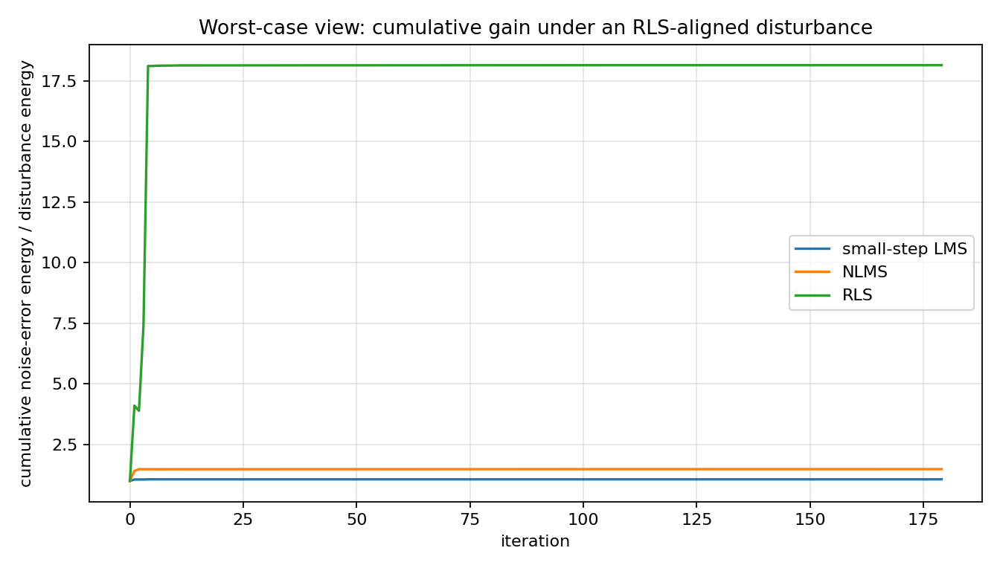
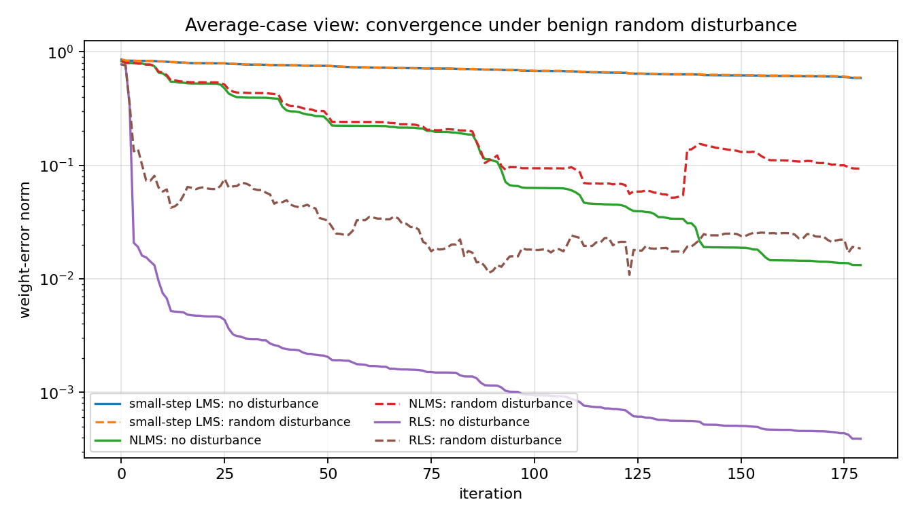
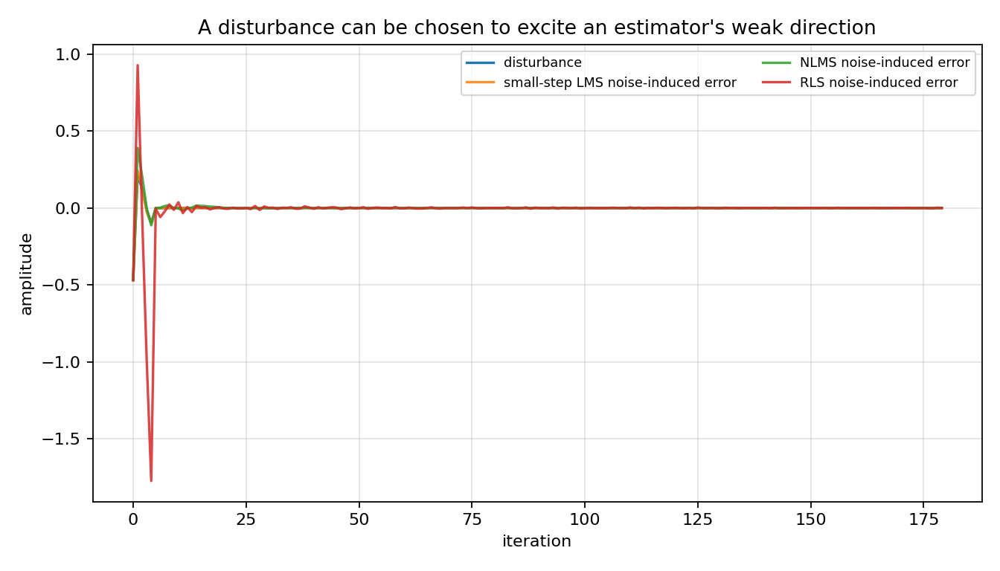

LMS through the H-infinity lens
===============================

.. admonition:: Tutorial goal

   Reproduce the qualitative message of Hassibi--Sayed--Kailath: LMS is not only crude least-squares descent; it also has a worst-case energy-gain interpretation.

.. note::

   New to the terminology? See the :doc:`lattice DSP concept map <../../algorithms/concept_map>` and the :doc:`causality/data-use guide <../../theory/causality_and_data_use>` for how online, offline, block, and MIMO examples should be read.

Context
-------

This flagship tutorial explains a historical surprise in adaptive filtering.  The LMS
idea goes back to Widrow and Hoff's 1960 adaptive switching work.  For more than three
decades, it was often introduced as the inexpensive stochastic-gradient approximation to
least squares, while RLS was the exact least-squares recursion.  Hassibi, Sayed, and
Kailath then showed that LMS also has a deterministic robust-filtering interpretation:
with the right viewpoint, the algorithm is tied to an H-infinity minimax energy-gain
problem rather than only to an average squared-error objective.

That historical angle is useful because it changes the way readers interpret a familiar
algorithm.  The script below does not try to reprint every derivation from the 1996 paper.
Instead it builds a finite-horizon diagnostic that readers can inspect: for fixed
regressors, the map from additive disturbance to prediction error is a linear operator.
Its largest singular value exposes the disturbance direction that causes the largest
error-energy amplification.

Key idea and equations
----------------------

The adaptive filtering model is

.. math::

   d_i = u_i^T w_\star + v_i,

where ``u_i`` is the regressor, ``w_*`` is the unknown vector, and ``v_i`` is a disturbance.
Least-squares thinking focuses on sums such as

.. math::

   \sum_i |d_i-u_i^T\hat w_i|^2.

The robust H-infinity diagnostic instead asks for a worst-case energy gain.  In this
tutorial we estimate, for each algorithm,

.. math::

   \sup_{v\ne0} \frac{\|e(v)-e(0)\|_2^2}{\|v\|_2^2},

by forming the finite-horizon sensitivity matrix from disturbance samples to
noise-induced prediction errors.

How to read the result
----------------------

Read the first plot in the classical least-squares way: RLS converges fastest under benign random noise.  Then read the gain plots in the minimax way: the same estimator can have a larger worst-case disturbance direction.  That change of viewpoint is the lesson.

Run command
-----------

.. code-block:: bash

   python examples/hinf_lms_reproduction.py

Run status
----------

Return code: ``0``

Captured stdout
---------------

.. code-block:: text

   H-infinity-inspired LMS/RLS diagnostic
   samples=180, order=4, noise_rms=0.04
   
   algorithm            worst gain  random gain  RLS-worst gain  random tail MSE
   ----------------------------------------------------------------------------------
   small-step LMS            2.568        1.052           1.064        3.016e-02
   NLMS                     15.040        1.539           1.486        3.900e-03
   RLS                      18.152        1.219          18.152        1.498e-03
   
   Interpretation:
     RLS usually converges fastest under benign random noise, but the sensitivity
     matrix exposes directions where disturbance energy is amplified more strongly.
     Small-step LMS is slower, yet its disturbance-to-error gain can be smaller.
     This illustrates the Hassibi-Sayed-Kailath message: LMS can be understood
     through a worst-case energy-gain lens, not only as crude least-squares descent.

Figures
-------

   ``hinf_lms_cumulative_gain.png``

   ``hinf_lms_random_convergence.png``

   ``hinf_lms_worst_case_disturbance.png``

Generated data files
--------------------

* :download:`hinf_lms_summary.csv <_artifacts/hinf_lms_reproduction/hinf_lms_summary.csv>`

Source code
-----------

.. literalinclude:: ../../../examples/hinf_lms_reproduction.py
   :language: python
   :linenos:
