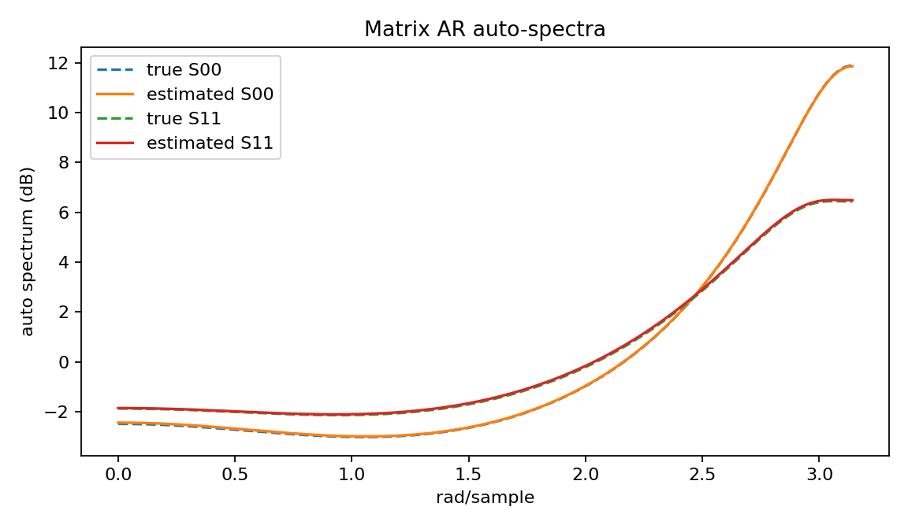
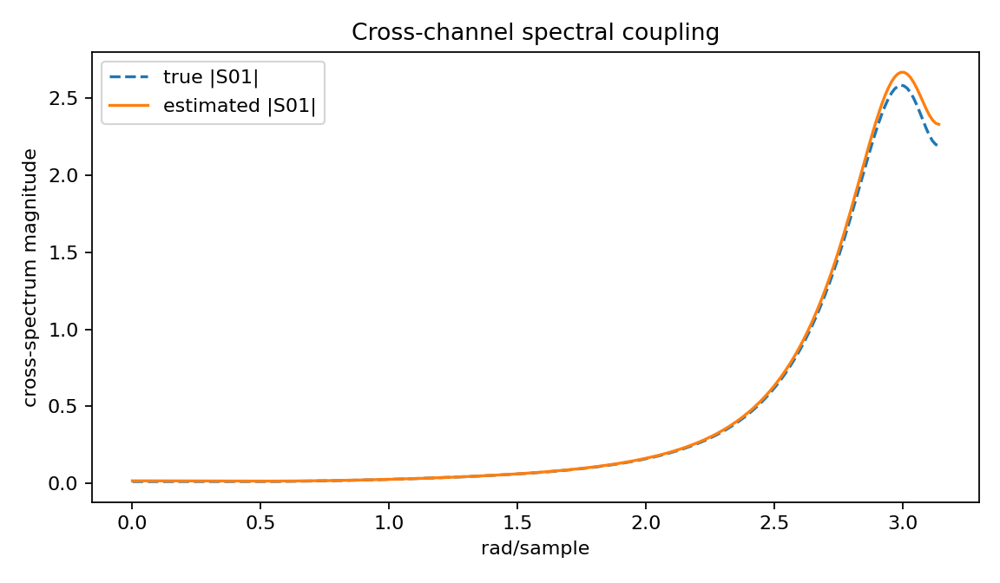
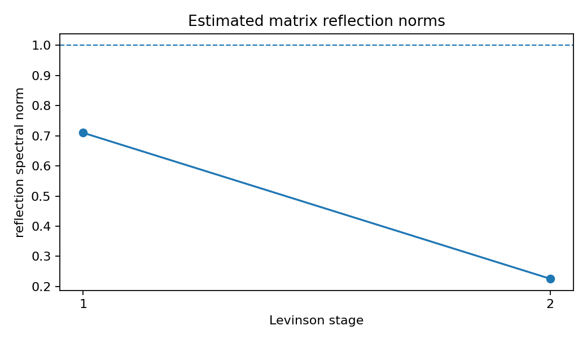

Matrix-valued AR spectral estimation
====================================

.. admonition:: Tutorial goal

   Compute a multichannel AR frequency response and spectral-matrix diagnostic.

.. note::

   New to the terminology? See the :doc:`lattice DSP concept map <../../algorithms/concept_map>` and the :doc:`causality/data-use guide <../../theory/causality_and_data_use>` for how online, offline, block, and MIMO examples should be read.

Context
-------

Multichannel spectra are matrices, not scalar curves.  This example evaluates matrix-valued
AR responses so channel interactions and cross-spectral behavior can be inspected.

Key idea and equations
----------------------

For the matrix AR model, define the polynomial matrix

.. math::

   A(z) = I + \sum_{k=1}^{p} A_k z^{-k}.

The transfer matrix from innovation :math:`e[n]` to signal :math:`x[n]` is

.. math::

   H(e^{j\omega}) = A(e^{j\omega})^{-1}.

If the innovation covariance is :math:`\Sigma_e`, the spectral-density
matrix is

.. math::

   S_x(e^{j\omega})
     = H(e^{j\omega})\,\Sigma_e\,H(e^{j\omega})^H.

Diagonal entries of :math:`S_x` are auto-spectra.  Off-diagonal entries are
cross-spectra, so their magnitude and phase indicate frequency-dependent
coupling between channels.

Causality and data use
----------------------

The spectral-density calculation is an offline frequency-grid diagnostic of an already fitted VAR model.  If the fitted model is stable, the corresponding time-domain VAR/IIR recursion is causal; the plot itself is not a streaming operation.

What this example verifies
--------------------------

This verifies the spectral interpretation of a fitted matrix AR model.  The
plotted spectral-density matrix separates auto-spectra from cross-spectra,
while companion radius and reflection norms diagnose whether the fitted model
can be used as a stable causal VAR/IIR recursion.

How to read the result
----------------------

Use the auto-spectrum and cross-spectrum figures to see both per-channel power and cross-channel coupling, then check the spectral radius and reflection norms for stability.

Run command
-----------

.. code-block:: bash

   python examples/matrix_ar_spectral_estimation.py

Run status
----------

Return code: ``0``

Captured stdout
---------------

.. code-block:: text

   channels: 2
   order: 2
   frequency bins: 256
   companion spectral radius: 0.725524
   relative spectral-matrix error: 1.244e-02
   channel-0 spectral peak rad/sample: 3.1416
   prediction error eigenvalues: [1.003893 1.007857]
   takeaway: multichannel Levinson supports matrix AR spectral estimates

Figures
-------

   ``matrix_ar_auto_spectra.png``

   ``matrix_ar_cross_spectrum.png``

   ``matrix_ar_reflection_norms.png``

Source code
-----------

.. literalinclude:: ../../../examples/matrix_ar_spectral_estimation.py
   :language: python
   :linenos:
