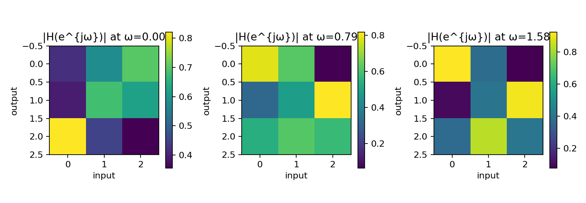
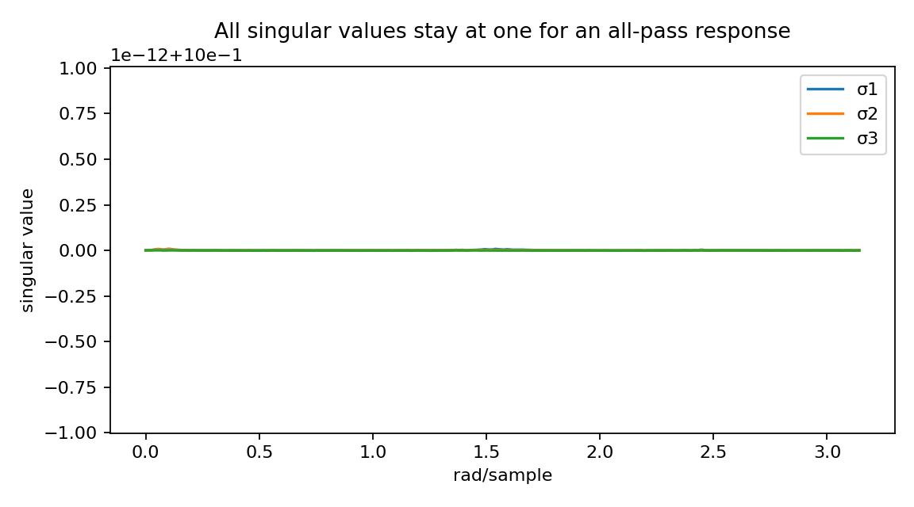
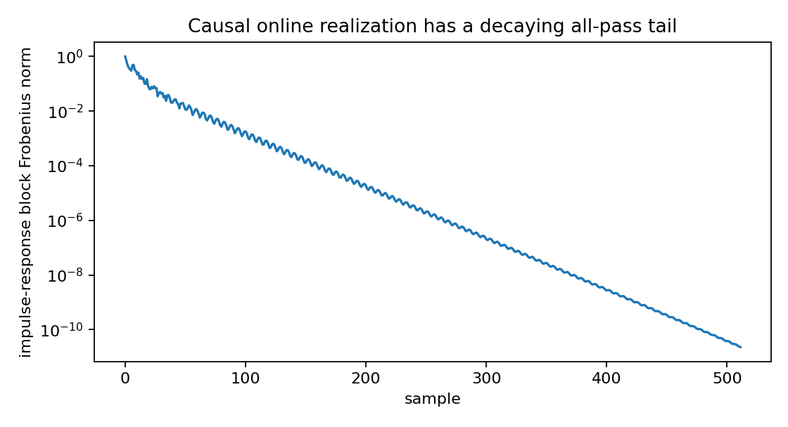
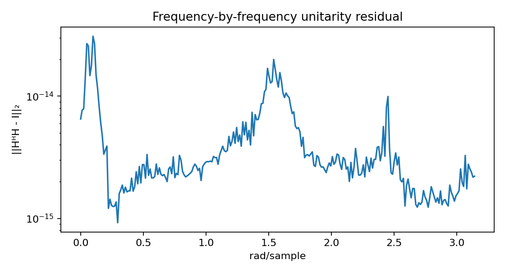

Matrix lattice all-pass response
================================

.. admonition:: Tutorial goal

   Build a matrix all-pass lattice and verify unitary response behavior.

.. note::

   New to the terminology? See the :doc:`lattice DSP concept map <../../algorithms/concept_map>` and the :doc:`causality/data-use guide <../../theory/causality_and_data_use>` for how online, offline, block, and MIMO examples should be read.

Context
-------

Matrix lattice filters generalize scalar reflection coefficients to matrix reflection
coefficients.  They are useful for compact multichannel unitary or paraunitary transforms.

Key idea and equations
----------------------

A matrix-lattice section replaces a scalar reflection coefficient with a
reflection matrix :math:`K_i`.  The contractive-stage diagnostic is

.. math::

   \lVert K_i\rVert_2 < 1.

Under the all-pass/scattering construction used here, the resulting transfer
matrix :math:`G(z)` should satisfy, on the unit circle,

.. math::

   G(e^{j\omega})^H G(e^{j\omega}) = I.

Equivalently, every singular value of :math:`G(e^{j\omega})` should be one.
The entry-magnitude plot shows how individual channel responses vary with
frequency; the singular-value and residual plots check the stronger unitary
matrix property.

Causality and data use
----------------------

This example verifies the all-pass transfer function on a frequency grid and also uses ``MatrixLatticeAllPass.to_online_filter()`` to realize the same object as a sample-by-sample causal runtime.  The streaming impulse-response check uses only current input and previous section states.

What this example verifies
--------------------------

This verifies that the causal online all-pass runtime matches the frequency
response represented by ``MatrixLatticeAllPass``.  The impulse-response FFT
should agree with the frequency-grid evaluator, and singular values should
remain close to one on the unit circle.

How to read the result
----------------------

The singular-value and unitarity-residual figures should be flat at one and near numerical precision if the generated matrix reflections are contractive.

Run command
-----------

.. code-block:: bash

   python examples/matrix_lattice_allpass.py

Run status
----------

Return code: ``0``

Captured stdout
---------------

.. code-block:: text

   dimension: 3
   order: 4
   max reflection singular value: 0.89981
   real scalar parameter count: 90
   max unitarity error: 3.085e-14
   streaming impulse/frequency relative error: 6.095e-11
   response shape: (256, 3, 3)

Figures
-------

   ``matrix_lattice_allpass_entry_magnitudes.png``

   ``matrix_lattice_allpass_singular_values.png``

   ``matrix_lattice_allpass_streaming_impulse.png``

   ``matrix_lattice_allpass_unitarity_error.png``

Source code
-----------

.. literalinclude:: ../../../examples/matrix_lattice_allpass.py
   :language: python
   :linenos:
