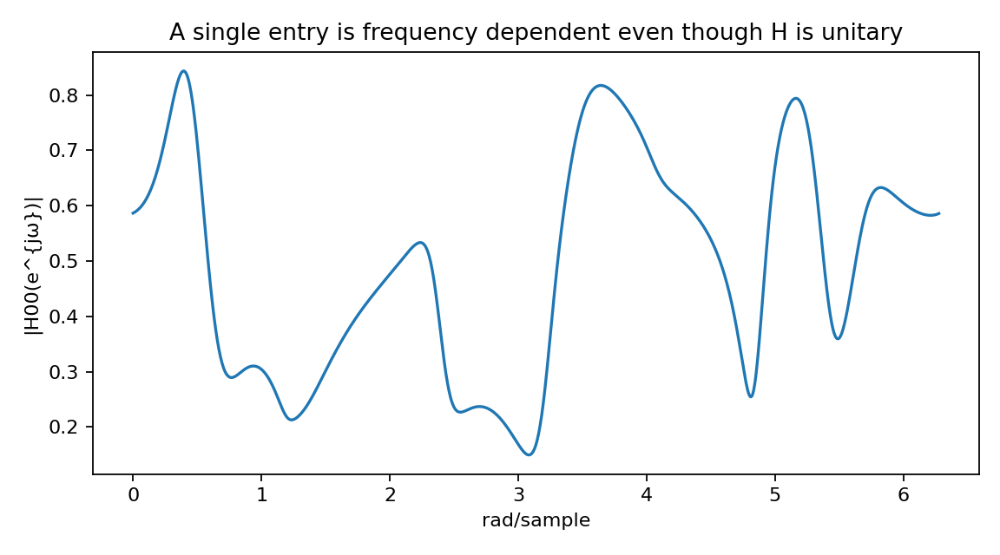
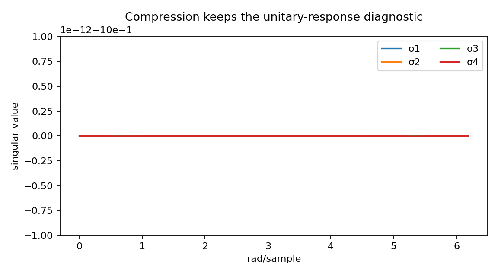
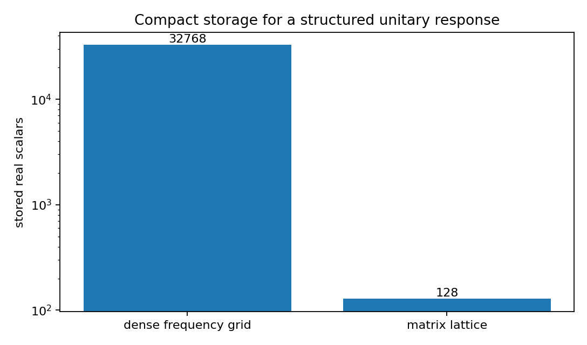
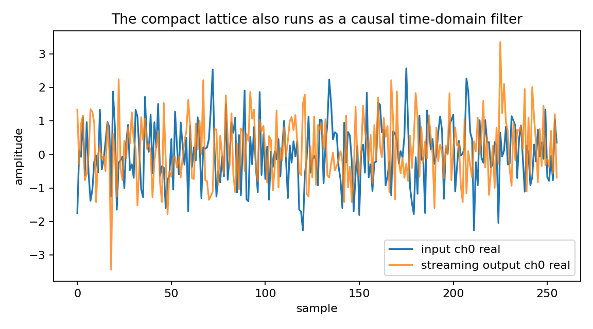

Compressing a frequency-dependent unitary response
==================================================

.. admonition:: Tutorial goal

   Represent a dense matrix-valued frequency response with a compact matrix lattice.

.. note::

   New to the terminology? See the :doc:`lattice DSP concept map <../../algorithms/concept_map>` and the :doc:`causality/data-use guide <../../theory/causality_and_data_use>` for how online, offline, block, and MIMO examples should be read.

Context
-------

Dense frequency grids can require many numbers.  A matrix lattice can represent a structured
unitary response with far fewer parameters when the response is compatible with the model.

Key idea and equations
----------------------

A dense sampled response stores one matrix per frequency bin,

.. math::

   \{G_\ell\}_{\ell=0}^{L-1},
   \qquad G_\ell\in\mathbb{C}^{c\times c},

which costs :math:`O(Lc^2)` scalar values.  A matrix-lattice model stores a
small number of section matrices :math:`K_1,\ldots,K_m`, roughly
:math:`O(mc^2)` scalar values for fixed realization details.

The compression diagnostic is therefore

.. math::

   \text{compression}
     = \frac{\text{dense scalar count}}{\text{lattice scalar count}}.

The approximation is useful only if the compact representation still matches
the target response and remains nearly unitary:

.. math::

   \sigma_i(G(e^{j\omega})) \approx 1.

Causality and data use
----------------------

This example still uses a dense grid to illustrate storage compression, but it also runs the same ``MatrixLatticeAllPass`` through ``to_online_filter()`` on a vector sequence.  The grid is a diagnostic; the compact lattice object has a causal streaming runtime.

What this example verifies
--------------------------

This verifies compact representation rather than online prediction.  The
dense frequency response is compared with a smaller matrix-lattice
parameterization; a streaming trace confirms that the same compact object can
also run as a causal forward filter.

How to read the result
----------------------

Compare the storage plot with the singular-value plot: the representation is compact, the frequency response should still look unitary, and the streaming trace confirms that the compact object is also a causal time-domain filter.

Run command
-----------

.. code-block:: bash

   python examples/matrix_unitary_response_compression.py

Run status
----------

Return code: ``0``

Captured stdout
---------------

.. code-block:: text

   MIMO dimension: 4
   frequency bins: 1024
   matrix lattice order: 3
   store all frequency-bin matrices, real scalars: 32768
   matrix lattice representation, real scalars: 128
   compression ratio: 256.0 x
   unitarity error: 1.014e-14
   streaming samples: 768
   tail samples: 512
   streaming energy error with tail: 4.464e-16
   example response[0] first row: [-0.151-0.567j -0.059+0.143j  0.279-0.237j -0.567-0.42j ]
   causal runtime: the compact response is not only stored on a grid; it can process vector samples online

Figures
-------

   ``matrix_unitary_compression_entry_response.png``

   ``matrix_unitary_compression_singular_values.png``

   ``matrix_unitary_compression_storage.png``

   ``matrix_unitary_compression_streaming_trace.png``

Source code
-----------

.. literalinclude:: ../../../examples/matrix_unitary_response_compression.py
   :language: python
   :linenos:
