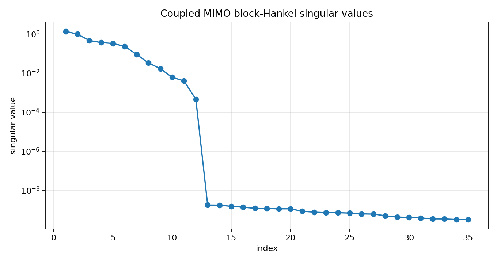
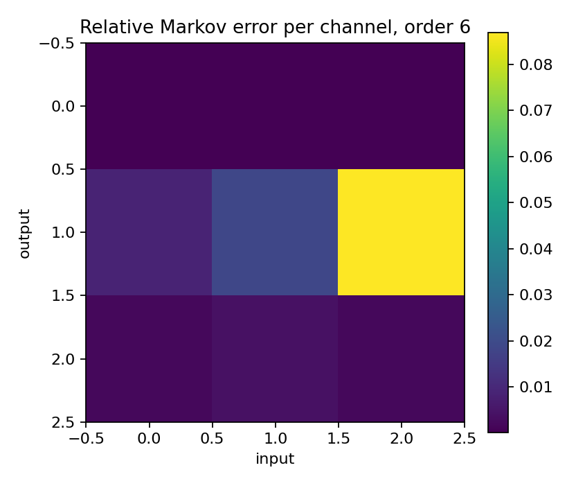
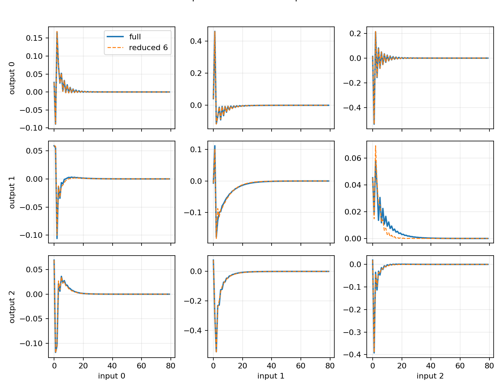
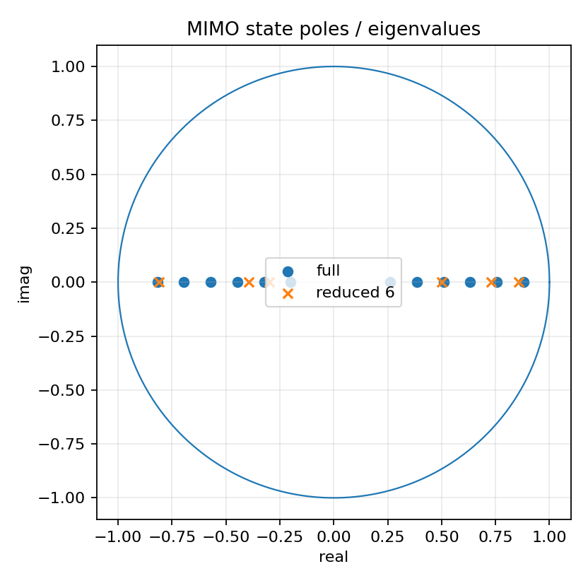

Coupled MIMO finite-Hankel model reduction
==========================================

.. admonition:: Tutorial goal

   Reduce a genuinely coupled MIMO state-space system with the finite block-Hankel baseline.

.. note::

   New to the terminology? See the :doc:`lattice DSP concept map <../../algorithms/concept_map>` and the :doc:`causality/data-use guide <../../theory/causality_and_data_use>` for how online, offline, block, and MIMO examples should be read.

Context
-------

The diagonal MIMO tutorial shows that independent SISO filters are a special case.  This
tutorial uses a dense, stable state-space system where each input can affect each output.
The goal is to validate the practical MIMO finite-section baseline on a coupled
system while keeping it separate from matrix AAK/Nehari algorithms.

The reducer works with Markov matrices and returns a reduced state-space realization.  This
is the natural representation for MIMO; scalar numerator/denominator coefficients are not
forced onto a multivariable system.

Key idea and equations
----------------------

A coupled MIMO state-space model has

.. math::

   x_{n+1}=Ax_n+Bu_n,\qquad y_n=Cx_n+Du_n.

Its Markov matrices are

.. math::

   M_0=D,\qquad M_k=CA^{k-1}B\quad(k\ge 1).

The finite block-Hankel reducer constructs a reduced model
``(A_r,B_r,C_r,D)`` from the leading singular directions of the block-Hankel matrix.

How to read the result
----------------------

Look for nonzero off-diagonal channels, block-Hankel singular-value decay, decreasing Markov/output error with order, and reduced state radii below one.

Run command
-----------

.. code-block:: bash

   python examples/mimo_coupled_model_reduction.py

Run status
----------

Return code: ``0``

Captured stdout
---------------

.. code-block:: text

   full state order: 12
   inputs: 3 outputs: 3
   full state spectral radius: 0.8800
   block Hankel matrix: 84 x 84
   leading block-Hankel singular values: [1.35522, 0.96156, 0.46076, 0.35792, 0.321092, 0.229692, 0.088418, 0.032477, 0.016566, 0.006026]
   order=2: stable=True, radius=0.7711, retained=0.845267, markov_error=1.456e-01, output_snr=8.32 dB
   order=4: stable=True, radius=0.8338, retained=0.949473, markov_error=5.220e-02, output_snr=12.78 dB
   order=6: stable=True, radius=0.8562, retained=0.997184, markov_error=3.630e-03, output_snr=24.45 dB
   order=8: stable=True, radius=0.8809, retained=0.999900, markov_error=1.589e-04, output_snr=38.02 dB

Figures
-------

   ``mimo_coupled_block_hankel_singular_values.png``

   ``mimo_coupled_error_heatmap.png``

   ``mimo_coupled_markov_responses.png``

   ``mimo_coupled_state_poles.png``

Generated data files
--------------------

* :download:`mimo_coupled_model_reduction_summary.csv <_artifacts/mimo_coupled_model_reduction/mimo_coupled_model_reduction_summary.csv>`

Source code
-----------

.. literalinclude:: ../../../examples/mimo_coupled_model_reduction.py
   :language: python
   :linenos:
