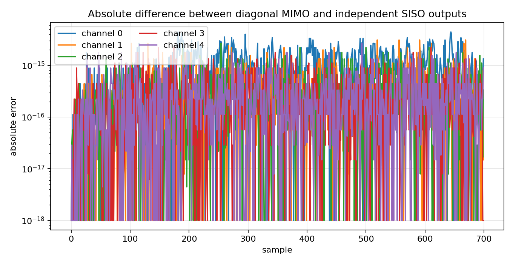
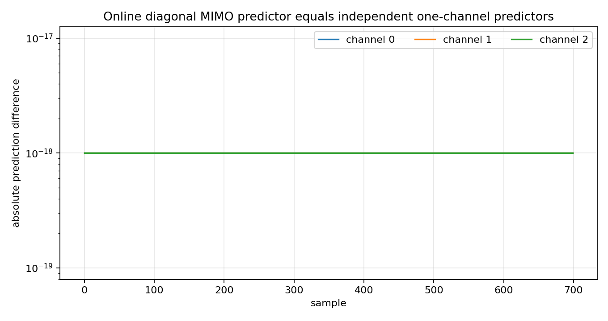
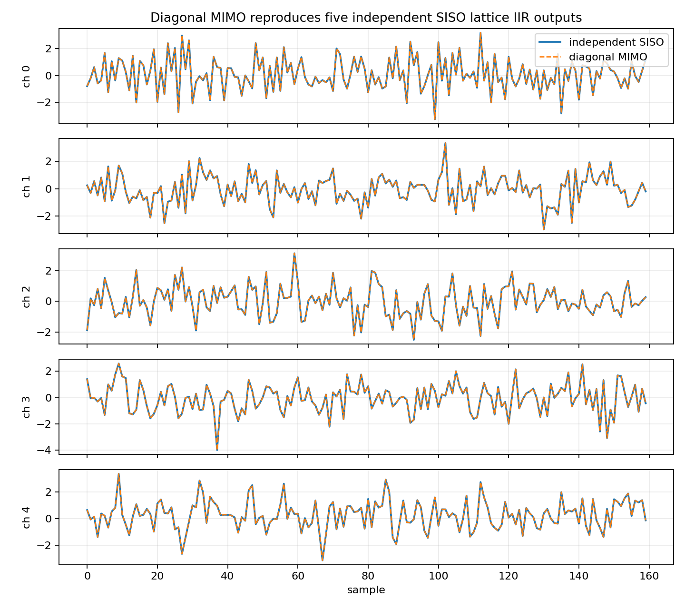

Diagonal MIMO equals independent SISO
=====================================

.. admonition:: Tutorial goal

   Use independent SISO lattice filters and online predictors as sanity checks for diagonal MIMO.

.. note::

   New to the terminology? See the :doc:`lattice DSP concept map <../../algorithms/concept_map>` and the :doc:`causality/data-use guide <../../theory/causality_and_data_use>` for how online, offline, block, and MIMO examples should be read.

Context
-------

Before studying coupled MIMO lattice systems, it helps to inspect the diagonal case.  If
every matrix Markov parameter or matrix reflection coefficient is diagonal, no output
channel depends on any other input channel.  The MIMO system is exactly several scalar SISO
systems running side by side.

This is the intuition bridge between scalar lattice filters and matrix-valued MIMO filters:
scalar reflection coefficients become diagonal entries first, and only later become
genuinely coupled matrices.

Key idea and equations
----------------------

A diagonal MIMO impulse response has Markov matrices

.. math::

   M_k = \operatorname{diag}(h^{(1)}_k, \ldots, h^{(p)}_k),

and therefore a diagonal transfer matrix

.. math::

   H(z)=\operatorname{diag}\bigl(H_1(z),\ldots,H_p(z)\bigr).

The convolution separates by channel:

.. math::

   y_i[n] = \sum_k h^{(i)}_k x_i[n-k],
   \qquad y_i \text{ does not depend on } x_j \text{ for } j\ne i.

The same diagonal reduction should hold for the online lattice predictor.  If
the matrix reflection coefficients are diagonal,

.. math::

   K_m = \operatorname{diag}(k_{m,1},\ldots,k_{m,p}),
   \qquad
   L_m = \operatorname{diag}(\ell_{m,1},\ldots,\ell_{m,p}),

then the vector recursion decouples into independent one-channel recursions:

.. math::

   \widehat y[n]
   = \begin{bmatrix}
      \widehat y_1[n] & \cdots & \widehat y_p[n]
     \end{bmatrix}^T.

This is the algebraic reason the diagonal MIMO result must match running scalar
SISO filters or one-channel online lattice predictors independently.  Any nonzero
off-diagonal Markov block or reflection entry would create true channel coupling.

Causality and data use
----------------------

The scalar ``LatticeIIR`` filters and the online ``MIMOLatticePredictor`` comparison are causal.  The Markov-convolution part is evaluated on a stored array as a validation check, but each output sample uses only lags ``x[n-k]``.  The online predictor part explicitly calls ``predict()`` before ``update(y_n)`` and therefore uses only previous samples when forming ``\widehat y[n]``.

What this example verifies
--------------------------

This is the reduction-to-SISO sanity check.  It verifies that when the MIMO
Markov matrices or matrix reflections are diagonal, the multichannel object
decomposes into independent scalar systems.  The expected diagnostic is
roundoff-level agreement between the MIMO result and stacked SISO results,
including the online ``predict()``/``update()`` predictor path.

How to read the result
----------------------

The MIMO/SISO differences should be near numerical precision for both the finite impulse-response comparison and the online predict-before-update comparison.

Run command
-----------

.. code-block:: bash

   python examples/mimo_diagonal_equals_independent_siso.py

Run status
----------

Return code: ``0``

Captured stdout
---------------

.. code-block:: text

   channels: 5
   samples: 700
   impulse truncation length: 160
   off-diagonal Markov energy: 0.000e+00
   diagonal Markov energy: 5.389e+00
   max |MIMO output - independent SISO output|: 4.441e-15
   RMS error: 7.699e-16
   online predictor channels: 3
   max |online diagonal MIMO prediction - independent SISO prediction|: 0.000e+00
   max |online diagonal MIMO error - independent SISO error|: 0.000e+00

Figures
-------

   ``mimo_diagonal_error.png``

   ``mimo_diagonal_online_prediction_error.png``

   ``mimo_diagonal_outputs.png``

Generated data files
--------------------

* :download:`mimo_diagonal_equals_independent_siso_summary.csv <_artifacts/mimo_diagonal_equals_independent_siso/mimo_diagonal_equals_independent_siso_summary.csv>`
* :download:`mimo_diagonal_online_predictor_summary.csv <_artifacts/mimo_diagonal_equals_independent_siso/mimo_diagonal_online_predictor_summary.csv>`

Source code
-----------

.. literalinclude:: ../../../examples/mimo_diagonal_equals_independent_siso.py
   :language: python
   :linenos:
