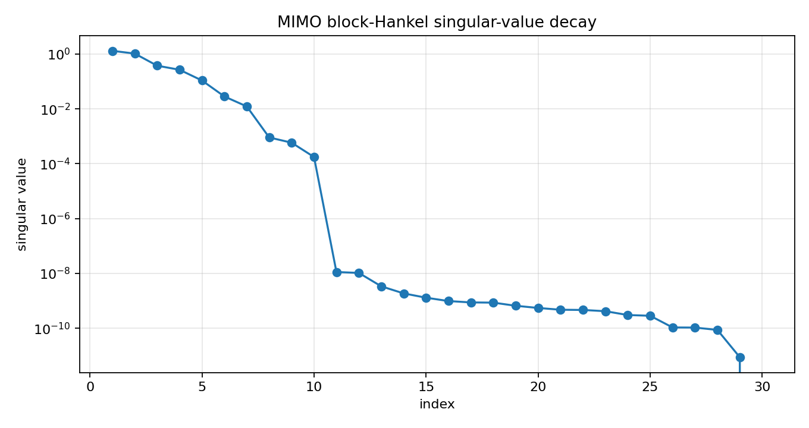
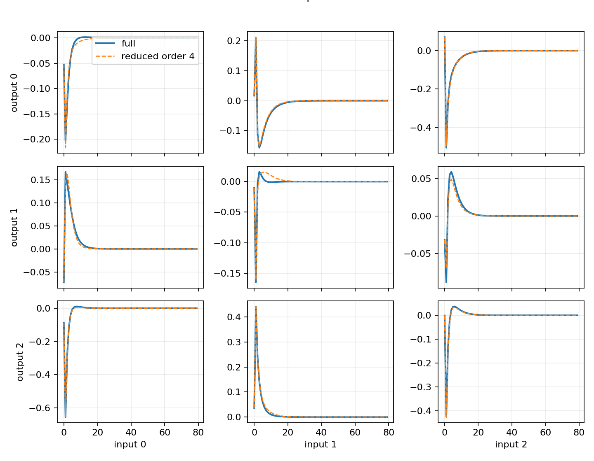
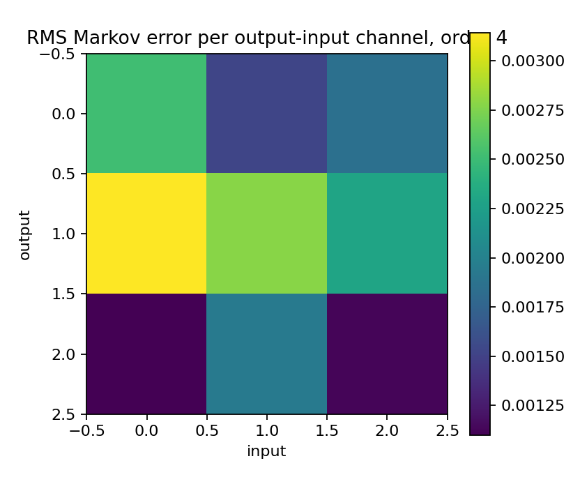

Finite block-Hankel MIMO model reduction
========================================

.. admonition:: Tutorial goal

   Generalize the SISO finite-Hankel reducer to MIMO Markov matrices and return a reduced state-space model.

.. note::

   New to the terminology? See the :doc:`lattice DSP concept map <../../algorithms/concept_map>` and the :doc:`causality/data-use guide <../../theory/causality_and_data_use>` for how online, offline, block, and MIMO examples should be read.

Context
-------

The SISO reducer works with one impulse response.  A MIMO system has a sequence of Markov
matrices instead, where each matrix maps input channels to output channels at a particular
lag.  The natural finite-Hankel baseline is therefore a block-Hankel matrix.

This tutorial is deliberately a baseline: it gives a reference MIMO Ho--Kalman/ERA-style
reduction as a finite block-Hankel baseline separate from matrix Nehari or AAK optimality claims.

Key idea and equations
----------------------

For Markov matrices ``M_k`` with shape ``outputs x inputs``, the finite block-Hankel matrix is

.. math::

   \mathcal{H}_0 =
   \begin{bmatrix}
     M_1 & M_2 & M_3 & \cdots \\
     M_2 & M_3 & M_4 & \cdots \\
     M_3 & M_4 & M_5 & \cdots \\
     \vdots & \vdots & \vdots & \ddots
   \end{bmatrix}.

The reduced model is returned as state-space matrices ``A, B, C, D`` rather than as scalar
numerator/denominator coefficients.

How to read the result
----------------------

Look for block-Hankel singular-value decay, retained energy, Markov-response error, and stable reduced state matrices.

Run command
-----------

.. code-block:: bash

   python examples/mimo_finite_hankel_model_reduction.py

Run status
----------

Return code: ``0``

Captured stdout
---------------

.. code-block:: text

   full state order: 10
   inputs: 3 outputs: 3
   block Hankel matrix: 72 x 72
   leading block-Hankel singular values: [1.314253, 1.043921, 0.377351, 0.26784, 0.108761, 0.028447, 0.012295, 0.000909, 0.000586, 0.000176]
   order=2: stable=True, retained_energy=0.925451, relative_markov_error=8.520e-02
   order=4: stable=True, retained_energy=0.995798, relative_markov_error=4.148e-03
   order=6: stable=True, retained_energy=0.999950, relative_markov_error=6.925e-05

Figures
-------

   ``mimo_block_hankel_singular_values.png``

   ``mimo_reduced_markov_responses.png``

   ``mimo_reduction_error_heatmap.png``

Generated data files
--------------------

* :download:`mimo_finite_hankel_model_reduction_summary.csv <_artifacts/mimo_finite_hankel_model_reduction/mimo_finite_hankel_model_reduction_summary.csv>`

Source code
-----------

.. literalinclude:: ../../../examples/mimo_finite_hankel_model_reduction.py
   :language: python
   :linenos:
