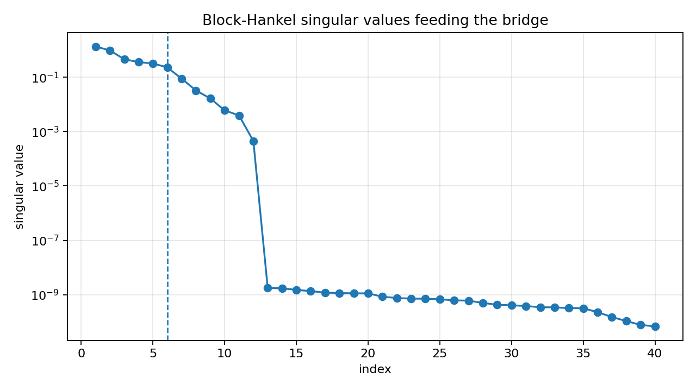
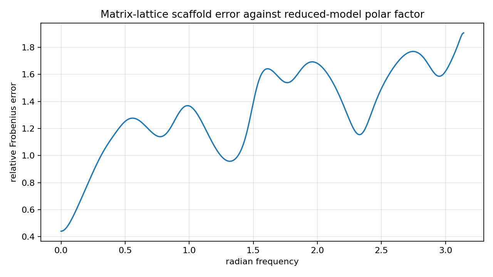
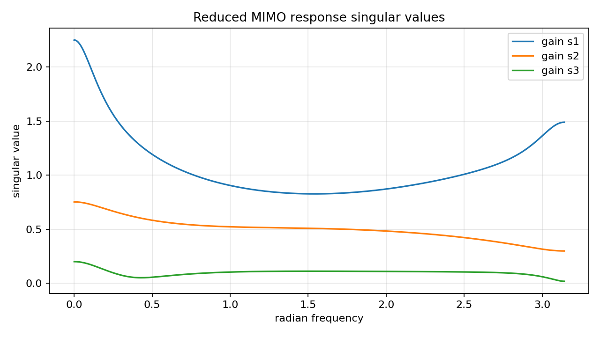

MIMO block-Hankel to matrix-lattice bridge diagnostics
======================================================

.. admonition:: Tutorial goal

   Use reduced MIMO Markov data to seed a stable matrix-lattice all-pass scaffold and measure the realization gap.

.. note::

   New to the terminology? See the :doc:`lattice DSP concept map <../../algorithms/concept_map>` and the :doc:`causality/data-use guide <../../theory/causality_and_data_use>` for how online, offline, block, and MIMO examples should be read.

Context
-------

This page defines the bridge scope between the MIMO block-Hankel reducer and the
matrix-lattice direction.  A general reduced MIMO state-space model has frequency-dependent
gains, while a matrix-lattice all-pass is unitary.  The example therefore compares a stable
lattice scaffold with the reduced model's unitary polar factor as a diagnostic, not an exact
realization solver.

Key idea and equations
----------------------

For a reduced response ``H(e^{j\omega})``, the polar factor is the unitary matrix

.. math::

   U_p(e^{j\omega}) = U(e^{j\omega})V(e^{j\omega})^H,

where ``H=U\Sigma V^H``.  The scaffold error reports how close a finite matrix-lattice
all-pass response is to this unitary part.

How to read the result
----------------------

Look for a stable reduced state model, a unitary scaffold, and the polar-factor error.  This is a diagnostic/initialization bridge, not a matrix AAK/Nehari solver.

Run command
-----------

.. code-block:: bash

   python examples/mimo_hankel_to_matrix_lattice_bridge.py

Run status
----------

Return code: ``0``

Captured stdout
---------------

.. code-block:: text

   full state order: 12
   reduced state order: 6
   channels: 3
   reduced state radius: 0.8562
   retained block-Hankel energy: 0.997184
   relative Markov error: 3.630e-03
   matrix-lattice scaffold order: 6
   max scaffold reflection singular value: 0.5005
   scaffold unitarity error: 1.096e-14
   polar-factor relative error: 1.373e+00
   reduced response gain condition span: 1.247e+02
   bridge status: scaffold diagnostic, not an exact matrix-lattice realization

Figures
-------

   ``mimo_bridge_block_hankel_singular_values.png``

   ``mimo_bridge_polar_error.png``

   ``mimo_bridge_reduced_response_gains.png``

Generated data files
--------------------

* :download:`mimo_hankel_to_matrix_lattice_bridge_summary.csv <_artifacts/mimo_hankel_to_matrix_lattice_bridge/mimo_hankel_to_matrix_lattice_bridge_summary.csv>`

Source code
-----------

.. literalinclude:: ../../../examples/mimo_hankel_to_matrix_lattice_bridge.py
   :language: python
   :linenos:
