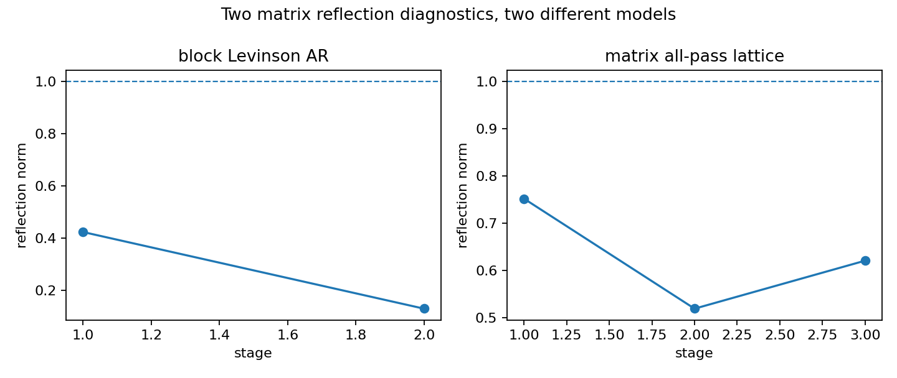
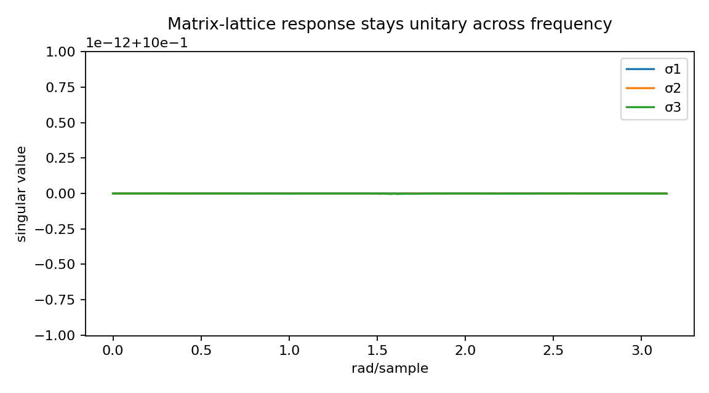
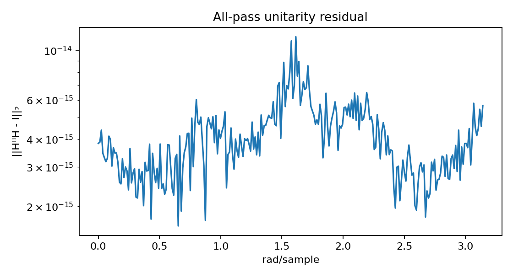

MIMO lattice response versus block Levinson AR
==============================================

.. admonition:: Tutorial goal

   Compare two matrix-valued views: all-pass lattice filtering and vector AR estimation.

.. note::

   New to the terminology? See the :doc:`lattice DSP concept map <../../algorithms/concept_map>` and the :doc:`causality/data-use guide <../../theory/causality_and_data_use>` for how online, offline, block, and MIMO examples should be read.

Context
-------

This tutorial puts MIMO/matrix lattice objects next to multichannel AR estimation.  They are
different models, but both rely on matrix-valued stability or reflection ideas.

Key idea and equations
----------------------

The block-Levinson side fits a predictive VAR model

.. math::

   A(z)=I+\sum_{k=1}^{p}A_k z^{-k},
   \qquad H_{AR}(z)=A(z)^{-1},

whose stability is checked through the companion matrix :math:`C_A`:

.. math::

   \rho(C_A) < 1.

The matrix-lattice side uses reflection matrices :math:`K_i` with
:math:`\lVert K_i\rVert_2<1` to build a frequency response :math:`G(z)`.
In this all-pass diagnostic example, the desired property is

.. math::

   G(e^{j\omega})^H G(e^{j\omega}) \approx I.

The point of the example is not to claim that the two constructions are the
same model.  It places their diagnostics side by side: VAR prediction error
and companion stability versus lattice reflection norms and frequency-wise
unitarity.

Causality and data use
----------------------

The block-Levinson side is batch coefficient estimation from covariance data.  The matrix-lattice side evaluates a response on a frequency grid.  This page compares diagnostics; it is not a sample-by-sample runtime filter.

What this example verifies
--------------------------

This is a side-by-side diagnostic, not an equivalence proof.  It verifies the
VAR side with block-Levinson prediction diagnostics and the matrix-lattice
side with contractive reflection norms and frequency-wise unitarity.

How to read the result
----------------------

Use the reflection-norm and singular-value figures to separate the two diagnostics: block Levinson validates VAR prediction, while the matrix lattice validates frequency-wise unitarity.

Run command
-----------

.. code-block:: bash

   python examples/mimo_lattice_vs_block_levinson.py

Run status
----------

Return code: ``0``

Captured stdout
---------------

.. code-block:: text

   channels: 3
   block Levinson order: 2
   block Levinson/direct coefficient difference: 1.083e-16
   block Levinson reflection norms: [0.42297  0.129587]
   matrix all-pass lattice order: 3
   matrix all-pass max reflection norm: 0.751394
   matrix all-pass unitarity error: 1.155e-14
   takeaway: block Levinson validates MIMO AR prediction; matrix lattice covers unitary MIMO filtering

Figures
-------

   ``mimo_lattice_vs_block_reflection_norms.png``

   ``mimo_lattice_vs_block_singular_values.png``

   ``mimo_lattice_vs_block_unitarity_error.png``

Source code
-----------

.. literalinclude:: ../../../examples/mimo_lattice_vs_block_levinson.py
   :language: python
   :linenos:
