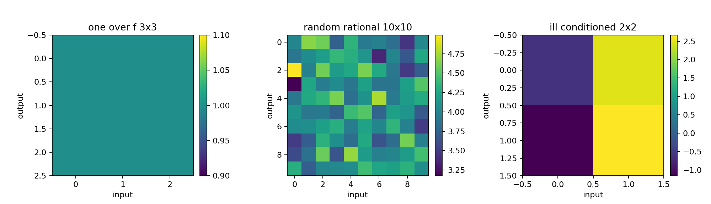
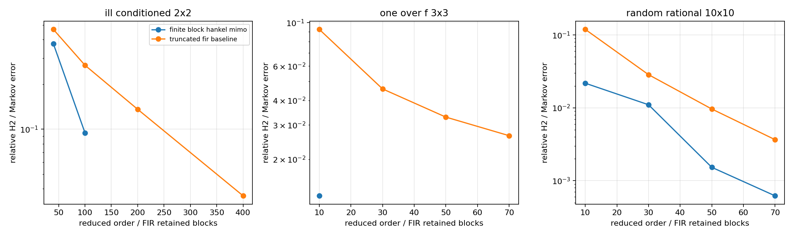
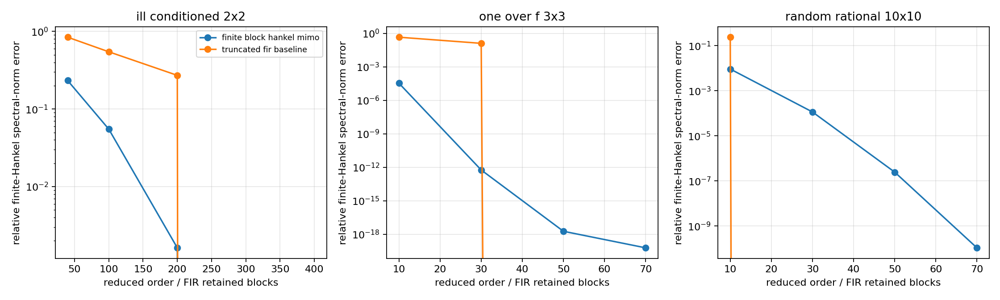
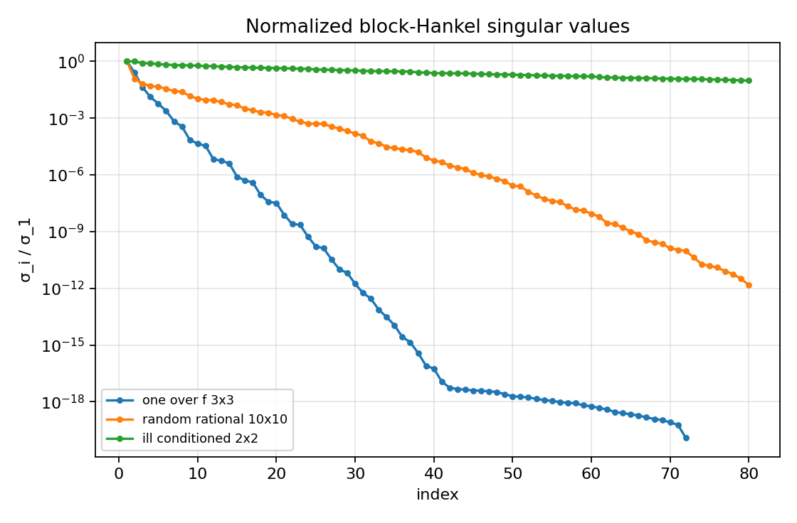
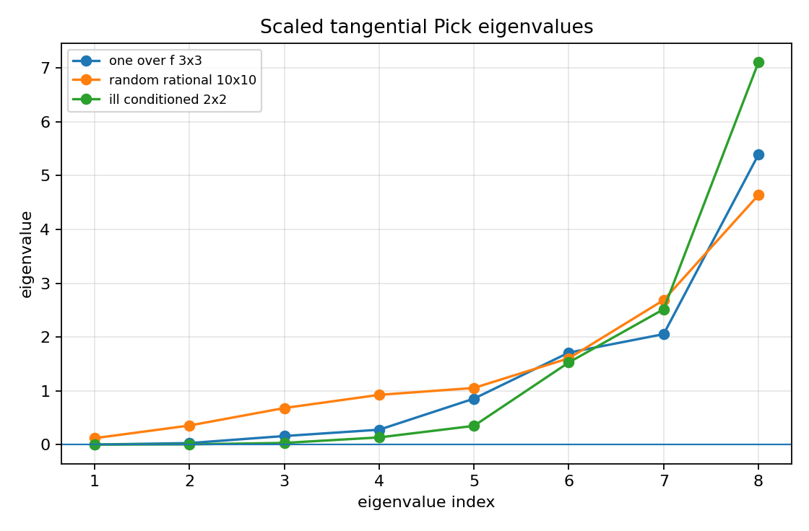
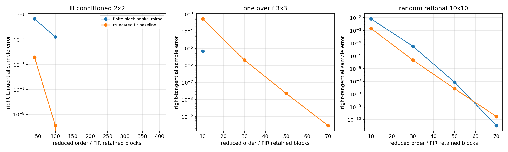
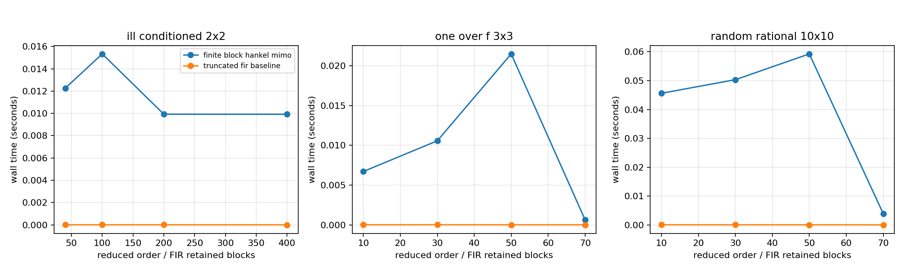

MIMO model-reduction stress cases
=================================

.. admonition:: Tutorial goal

   Compare finite block-Hankel MIMO reduction on three difficult matrix impulse-response families and attach tangential-Schur/Pick diagnostics.

.. note::

   New to the terminology? See the :doc:`lattice DSP concept map <../../algorithms/concept_map>` and the :doc:`causality/data-use guide <../../theory/causality_and_data_use>` for how online, offline, block, and MIMO examples should be read.

Context
-------

This tutorial collects three stress cases inspired by examples often used in
multivariable model-reduction discussions.  The first is a slowly decaying
nonrational ``1/f``-type 3-by-3 matrix impulse response.  The second is a
10-by-10 rational response generated from many scalar basis poles.  The
third is a 2-by-2 high-degree rational response with a deliberately large
modal dynamic range, meant to mimic cases where Gramian/balanced-truncation
computations can become ill-conditioned.

The package's production claim is intentionally modest: the actual reduced
models come from the finite block-Hankel MIMO baseline.  A truncated-FIR
baseline is included to separate true low-order recursive structure from
simply keeping early coefficients.  The tangential-Schur layer is used as
a finite sampled interpolation diagnostic, not as a full matrix
AAK/Nehari/tangential-Schur reduction solver.

Key idea and equations
----------------------

Each case provides Markov matrices :math:`M_k\in\mathbb{R}^{p\times m}`.
The finite block-Hankel matrix is

.. math::

   \mathcal H_0 =
   \begin{bmatrix}
     M_1 & M_2 & \cdots \\
     M_2 & M_3 & \cdots \\
     \vdots & \vdots & \ddots
   \end{bmatrix}.

The tutorial compares two explicit reduction methods.

**Finite block-Hankel MIMO reduction.**  For a reduced state dimension
:math:`r`, the finite Ho--Kalman/block-Hankel reducer takes the leading
singular directions of :math:`\mathcal H_0` and returns
:math:`(A_r,B_r,C_r,D)`.  The reduced Markov matrices are

.. math::

   \widehat M_0^{(r)}=D,\qquad
   \widehat M_k^{(r)}=C_r A_r^{k-1}B_r \quad (k\ge1).

**Truncated FIR baseline.**  The order-:math:`r` FIR baseline keeps the
first :math:`r+1` Markov blocks and sets the tail to zero:

.. math::

   \widehat M_k^{FIR,r}=\begin{cases}
     M_k, & 0\le k\le r,\\
     0, & k>r.
   \end{cases}

Both are compared on the first :math:`N` coefficients using

.. math::

   \frac{\left(\sum_{k=0}^{N-1}\lVert M_k-\widehat M_k^{(r)}\rVert_F^2\right)^{1/2}}
        {\left(\sum_{k=0}^{N-1}\lVert M_k\rVert_F^2\right)^{1/2}}.

The second error figure reports a finite-Hankel spectral-norm diagnostic:
the block-Hankel method uses :math:`\sigma_{r+1}(\mathcal H_0)/\sigma_1(\mathcal H_0)`,
while the FIR baseline uses the normalized spectral norm of the
block-Hankel matrix built from the FIR truncation error.

The tangential-Schur diagnostic samples points :math:`z_i` in the unit disk
and right directions :math:`u_i`, then checks scaled data

.. math::

   S(z_i)u_i = F(z_i)u_i/\gamma

with the Pick matrix

.. math::

   P_{ij}=\frac{u_i^*u_j-v_i^*v_j}{1-\overline z_i z_j}.

Increasing :math:`\gamma` until :math:`P\succeq0` gives a finite sampled
Schur-feasibility scale.  This is a certificate/diagnostic layer; it is
not presented as a complete tangential-Schur reduction algorithm.

Causality and data use
----------------------

All three cases are offline model-reduction diagnostics.  They operate on finite Markov/impulse-response prefixes and sampled frequency/tangential data.  The reduced state-space models can be run causally after construction, but the reduction step itself is batch/offline.

What this example verifies
--------------------------

This verifies the finite MIMO model-reduction baseline on three deliberately
different matrix impulse-response families: a slow 1/f-type tail, a large
random rational 10-by-10 response, and an ill-conditioned high-degree 2-by-2
response.  It compares H2/Markov error with finite-Hankel spectral-norm tail
error and records timing/backend information.  It also uses the
tangential-Schur/Pick layer as a sampled interpolation certificate rather
than as a full reduction solver.

How to read the result
----------------------

Compare H2/Markov error, finite-Hankel spectral-norm tail error, timing curves, block-Hankel singular-value decay, scaled Pick eigenvalues, and the conditioning note for the high-degree case.  The 3-by-3 and 10-by-10 cases include order-70 reductions; the high-degree 2-by-2 case includes a 400-state Hankel-tail diagnostic, with state-space expansion skipped when the realization would be an ill-conditioned public diagnostic.

Run command
-----------

.. code-block:: bash

   python examples/mimo_model_reduction_stress_cases.py

Run status
----------

Return code: ``0``

Captured stdout
---------------

.. code-block:: text

   MIMO model-reduction stress cases
   ---------------------------------
   case: one_over_f_3x3
     shape: samples=3000, outputs=3, inputs=3
     block Hankel: rows=24, cols=24
     first/20th normalized HSV: 1.000e+00 / 3.245e-08
     tangential Schur scale: 4.04458
     scaled Pick min eigenvalue: 1.067e-03
     best finite block-Hankel order: 10, relative H2 error=1.303e-02, relative Hankel-norm error=3.368e-05, tangential sample error=6.906e-06
     reducer timing at best order: reduction=0.006s, Markov expansion=0.001s, total=0.007s
     backend at best order: C++ finite_hankel_reduce_mimo + C++ state-space Markov expansion
   case: random_rational_10x10
     shape: samples=1000, outputs=10, inputs=10
     block Hankel: rows=10, cols=10
     first/20th normalized HSV: 1.000e+00 / 1.447e-03
     tangential Schur scale: 28.7292
     scaled Pick min eigenvalue: 1.199e-01
     best finite block-Hankel order: 70, relative H2 error=6.213e-04, relative Hankel-norm error=1.083e-10, tangential sample error=3.357e-11
     reducer timing at best order: reduction=0.001s, Markov expansion=0.003s, total=0.004s
     backend at best order: NumPy/LAPACK SVD + NumPy/BLAS Markov expansion
   case: ill_conditioned_2x2
     shape: samples=1200, outputs=2, inputs=2
     block Hankel: rows=200, cols=200
     first/20th normalized HSV: 1.000e+00 / 4.368e-01
     tangential Schur scale: 11.2764
     scaled Pick min eigenvalue: 3.786e-04
     best finite block-Hankel order: 100, relative H2 error=9.462e-02, relative Hankel-norm error=5.508e-02, tangential sample error=1.763e-03
     reducer timing at best order: reduction=0.013s, Markov expansion=0.003s, total=0.015s
     backend at best order: NumPy/LAPACK shared SVD + NumPy/BLAS Markov expansion
     modal dynamic-range condition hint: 1.000e+08

Figures
-------

   ``mimo_reduction_stress_first_markov_blocks.png``

   ``mimo_reduction_stress_h2_errors.png``

   ``mimo_reduction_stress_hankel_norm_errors.png``

   ``mimo_reduction_stress_hankel_singular_values.png``

   ``mimo_reduction_stress_pick_eigenvalues.png``

   ``mimo_reduction_stress_tangential_errors.png``

   ``mimo_reduction_stress_timing.png``

Generated data files
--------------------

* :download:`mimo_reduction_stress_case_metadata.csv <_artifacts/mimo_model_reduction_stress_cases/mimo_reduction_stress_case_metadata.csv>`
* :download:`mimo_reduction_stress_summary.csv <_artifacts/mimo_model_reduction_stress_cases/mimo_reduction_stress_summary.csv>`

Source code
-----------

.. literalinclude:: ../../../examples/mimo_model_reduction_stress_cases.py
   :language: python
   :linenos:
