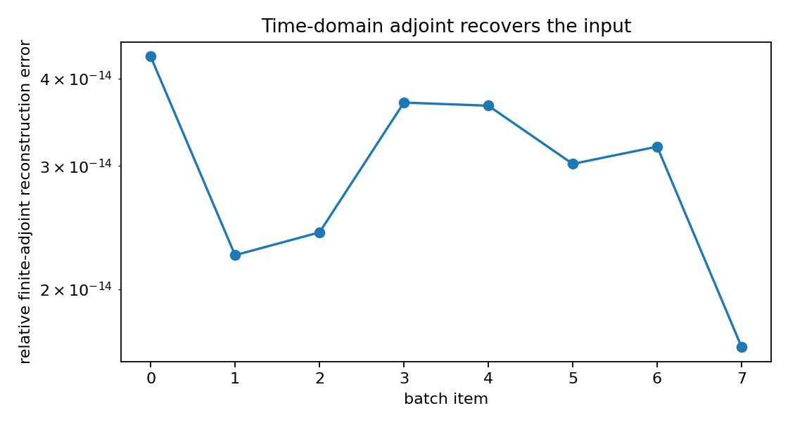
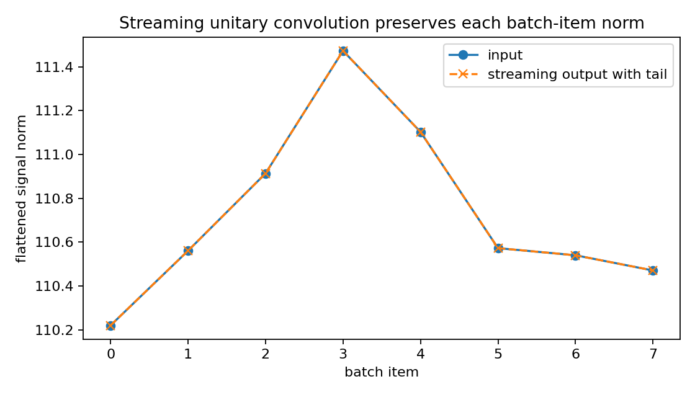
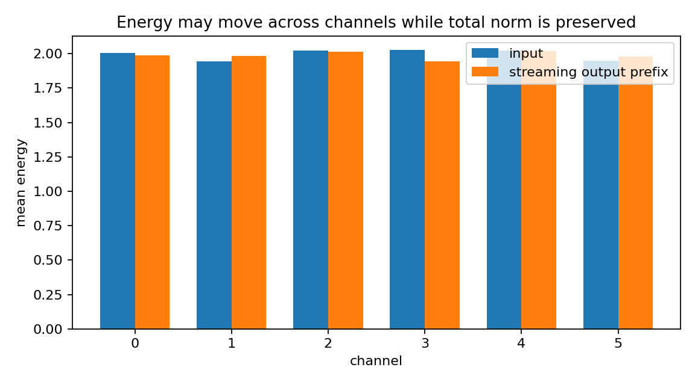
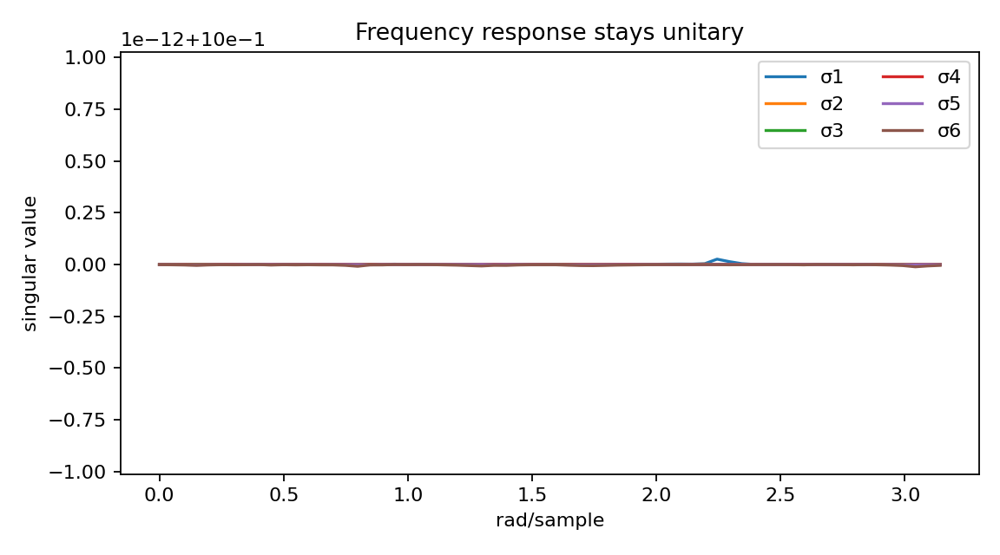
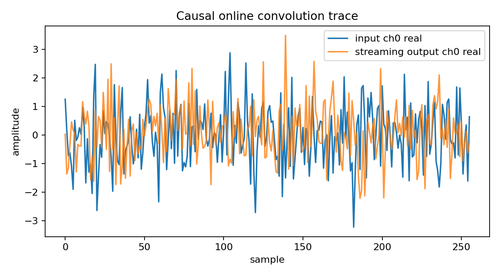

Unitary convolution block for ML-style stability
================================================

.. admonition:: Tutorial goal

   Show a streaming norm-preserving convolution-like block motivated by stable ML layers.

.. note::

   New to the terminology? See the :doc:`lattice DSP concept map <../../algorithms/concept_map>` and the :doc:`causality/data-use guide <../../theory/causality_and_data_use>` for how online, offline, block, and MIMO examples should be read.

Context
-------

Orthogonal/unitary transforms can improve numerical stability in learned models.  This demo
connects matrix-lattice ideas to norm-preserving convolution blocks as a DSP demonstration,
not a full ML framework.  Unlike a circular FFT layer, the forward map here is run by the
causal online matrix-lattice runtime.

Key idea and equations
----------------------

The streaming block applies a causal multichannel convolution

.. math::

   y[n] = \sum_{k\ge 0} H_k x[n-k].

The all-pass condition

.. math::

   H(e^{j\omega})^H H(e^{j\omega}) = I

keeps the induced :math:`\ell_2` norm controlled on the full stream:

.. math::

   \lVert y\rVert_2 \approx \lVert x\rVert_2,

after appending enough zero-input samples to include the tail.  The finite-record
adjoint diagnostic uses

.. math::

   x_{adj}[n] = \sum_{k\ge 0} H_k^H y[n+k],

which is useful for reconstruction checks but is noncausal as an online inverse.

Causality and data use
----------------------

The forward map is causal and streaming.  The adjoint reconstruction check is time-domain but finite-block/noncausal, which matches how adjoints are used in offline ML-style diagnostics.

What this example verifies
--------------------------

This verifies a DSP analogue of a norm-preserving convolution block.  The
forward map is causal and streaming; norm preservation is checked on the
full stream with tail padding, while the adjoint reconstruction diagnostic is
finite-record and noncausal.

How to read the result
----------------------

Check the input/output norm figure, singular-value plot, streaming trace, and finite-adjoint error plot; a streaming unitary convolution block should preserve each batch-item norm after its tail is included.

Run command
-----------

.. code-block:: bash

   python examples/ml_unitary_convolution_demo.py

Run status
----------

Return code: ``0``

Captured stdout
---------------

.. code-block:: text

   batch size: 8
   sequence length: 1024
   channels: 6
   order: 4
   tail samples: 1024
   real scalar parameters: 360
   max streaming norm-preservation error: 5.141e-16
   max finite-adjoint reconstruction error: 4.302e-14
   singular value range: [1.000000, 1.000000]
   causal forward: output at n uses current input and previous lattice state
   finite adjoint: reconstruction is time-domain but noncausal over the block
   takeaway: matrix lattice filters can parameterize streaming norm-preserving convolution blocks

Figures
-------

   ``ml_unitary_convolution_adjoint_error.png``

   ``ml_unitary_convolution_batch_norms.png``

   ``ml_unitary_convolution_channel_energy.png``

   ``ml_unitary_convolution_singular_values.png``

   ``ml_unitary_convolution_streaming_trace.png``

Source code
-----------

.. literalinclude:: ../../../examples/ml_unitary_convolution_demo.py
   :language: python
   :linenos:
