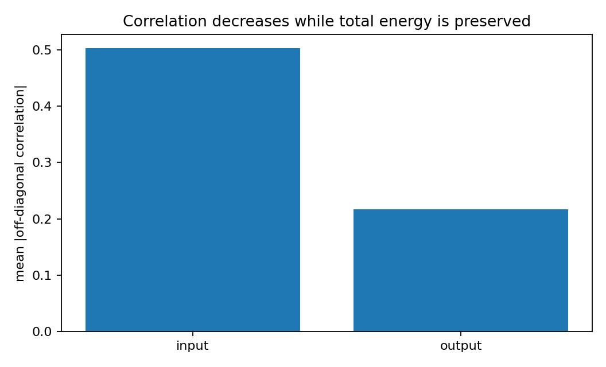
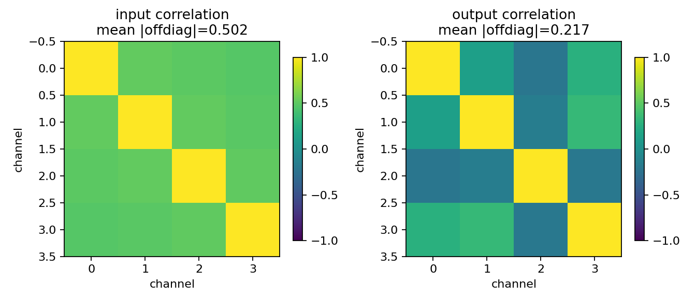
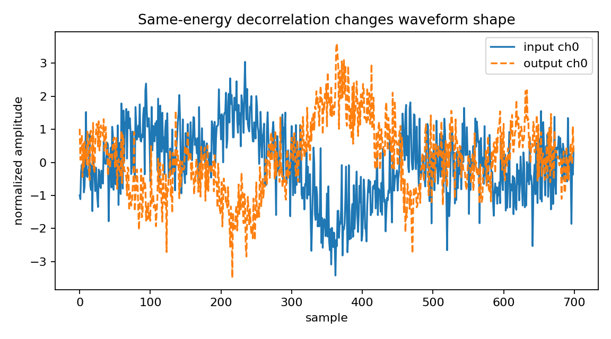

Multichannel audio decorrelation with energy preservation
=========================================================

.. admonition:: Tutorial goal

   Reduce channel correlation while keeping total signal energy roughly unchanged.

.. note::

   New to the terminology? See the :doc:`lattice DSP concept map <../../algorithms/concept_map>` and the :doc:`causality/data-use guide <../../theory/causality_and_data_use>` for how online, offline, block, and MIMO examples should be read.

Context
-------

Decorrelators are useful for spatial audio and multichannel processing demos.  The goal here
is not perceptual tuning; it is to show that matrix all-pass/lattice transforms can change
correlation structure without changing total power much.

Key idea and equations
----------------------

Let :math:`x[n]\in\mathbb{R}^c` be the input block and :math:`y[n]` the
decorrelated output.  The sample covariance matrices are

.. math::

   R_x = \mathbb{E}\{x[n]x[n]^T\},
   \qquad
   R_y = \mathbb{E}\{y[n]y[n]^T\}.

Decorrelation aims to reduce off-diagonal covariance terms, for example

.. math::

   r_{off}(R)=
   \frac{\sum_{i\ne j}|R_{ij}|}{\sum_i |R_{ii}|}.

The transform is chosen to be approximately all-pass/unitary, so total energy
should remain nearly unchanged:

.. math::

   \frac{\sum_n\lVert y[n]\rVert_2^2}
        {\sum_n\lVert x[n]\rVert_2^2}
   \approx 1.

The correlation heatmaps show the before/after coupling, while the energy
ratio checks that decorrelation did not simply attenuate the signal.

Causality and data use
----------------------

This decorrelator uses the causal ``OnlineMatrixLatticeAllPass`` runtime.  Each output frame depends only on the current input frame and previous lattice states.  The reported finite-block energy ratio can differ slightly from one because short prefixes omit the decaying all-pass tail.

What this example verifies
--------------------------

This verifies a causal forward decorrelator.  The online all-pass runtime
should reduce off-diagonal covariance/correlation while preserving total
energy after the filter tail is included.  It is a DSP diagnostic, not a
perceptual audio product claim.

How to read the result
----------------------

Use the before/after correlation matrices and summary bar plot to see the decorrelation effect; the energy ratio should remain close to one.

Run command
-----------

.. code-block:: bash

   python examples/multichannel_audio_decorrelator.py

Run status
----------

Return code: ``0``

Captured stdout
---------------

.. code-block:: text

   channels: 4
   order: 5
   max reflection singular value: 0.914259
   input mean |offdiag corr|: 0.5024
   output mean |offdiag corr|: 0.2171
   decorrelation factor: 2.31 x
   normalized energy ratio: 1.000000
   takeaway: causal MIMO all-pass filtering can decorrelate channels without using future samples

Figures
-------

   ``multichannel_audio_decorrelator_corr_summary.png``

   ``multichannel_audio_decorrelator_correlation.png``

   ``multichannel_audio_decorrelator_waveform.png``

Source code
-----------

.. literalinclude:: ../../../examples/multichannel_audio_decorrelator.py
   :language: python
   :linenos:
