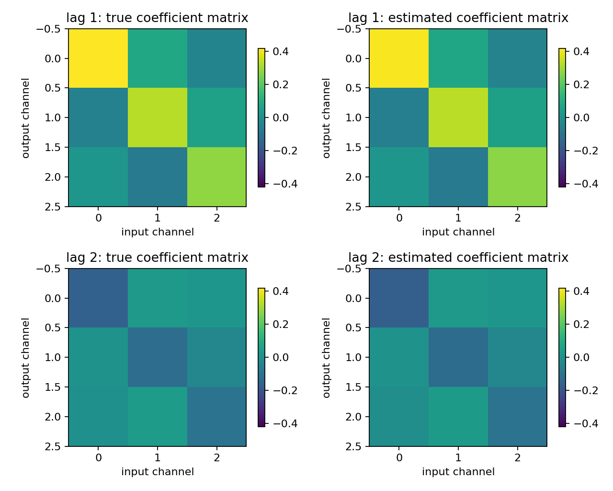
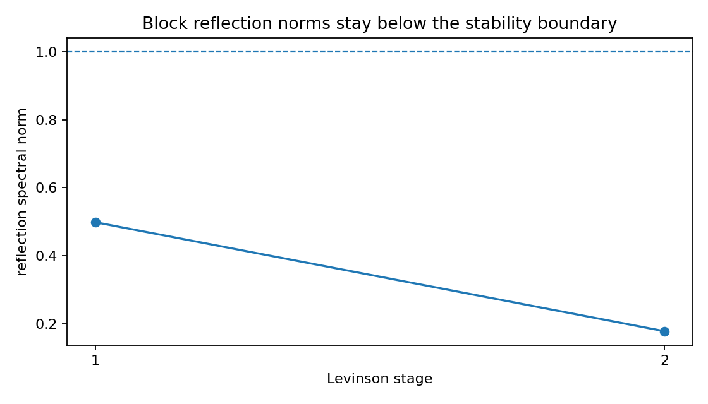
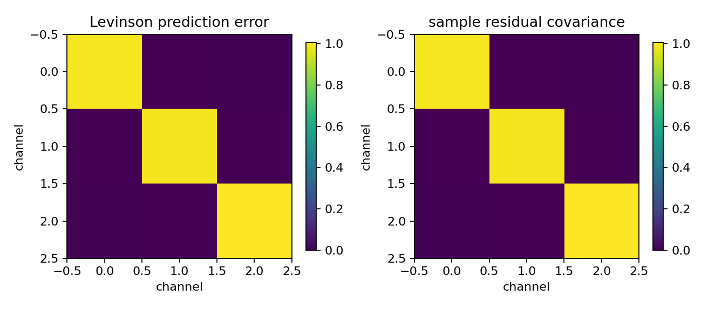

Multichannel AR with block Levinson-Durbin
==========================================

.. admonition:: Tutorial goal

   Estimate a vector AR model and compare block Levinson against a dense block-Toeplitz solve.

.. note::

   New to the terminology? See the :doc:`lattice DSP concept map <../../algorithms/concept_map>` and the :doc:`causality/data-use guide <../../theory/causality_and_data_use>` for how online, offline, block, and MIMO examples should be read.

Context
-------

Scalar AR models generalize to vector autoregressive models where each lag coefficient is a
matrix.  This tutorial shows how block Toeplitz structure and matrix reflection coefficients
enter the multichannel setting.

Key idea and equations
----------------------

Let :math:`x[n]\in\mathbb{R}^c` be a vector signal and let
:math:`e[n]` be the prediction residual.  An order-``p`` vector AR model is

.. math::

   x[n] + \sum_{k=1}^{p} A_k x[n-k] = e[n],
   \qquad A_k \in \mathbb{R}^{c\times c}.

The sample autocovariances :math:`R_\ell=\mathbb{E}\{x[n]x[n-\ell]^T\}`
form a block-Toeplitz Yule--Walker system for the matrices
:math:`A_1,\ldots,A_p`.  Block Levinson--Durbin solves this system
recursively and also exposes matrix reflection coefficients :math:`K_i`.
The scalar condition :math:`|k_i|<1` becomes the practical matrix diagnostic

.. math::

   \lVert K_i\rVert_2 < 1.

The coefficient heatmaps show the estimated :math:`A_k`; the reflection plot
checks the stage norms; the residual-covariance plot checks the remaining
multichannel prediction error.

Causality and data use
----------------------

``multichannel_autocorrelation`` and ``block_levinson_durbin`` are batch estimation steps: they use a finite multichannel record or covariance sequence.  The fitted VAR recursion is causal after the matrices are known, because prediction uses only past samples ``x[n-k]`` and the current state/history.

What this example verifies
--------------------------

This verifies the batch multichannel AR estimator.  The block Levinson result
is compared with a dense block-Toeplitz solve, reflection spectral norms are
checked, and the residual covariance shows what cross-channel prediction
error remains after fitting.

How to read the result
----------------------

Check the coefficient difference against the direct solve, then use the coefficient heatmaps, reflection-norm plot, and residual-covariance plot to see what the matrix AR fit learned.

Run command
-----------

.. code-block:: bash

   python examples/multichannel_levinson_ar.py

Run status
----------

Return code: ``0``

Captured stdout
---------------

.. code-block:: text

   channels: 3
   order: 2
   companion spectral radius: 0.635633
   direct/block-Levinson coefficient difference: 7.104e-17
   relative coefficient error vs true VAR: 2.791e-02
   reflection spectral norms: [0.498023 0.177576]
   prediction error covariance trace: 2.991384
   sample residual variance trace: 2.991453
   takeaway: block Levinson gives a classical MIMO AR/lattice baseline

Figures
-------

   ``multichannel_levinson_coefficients.png``

   ``multichannel_levinson_reflection_norms.png``

   ``multichannel_levinson_residual_covariance.png``

Source code
-----------

.. literalinclude:: ../../../examples/multichannel_levinson_ar.py
   :language: python
   :linenos:
