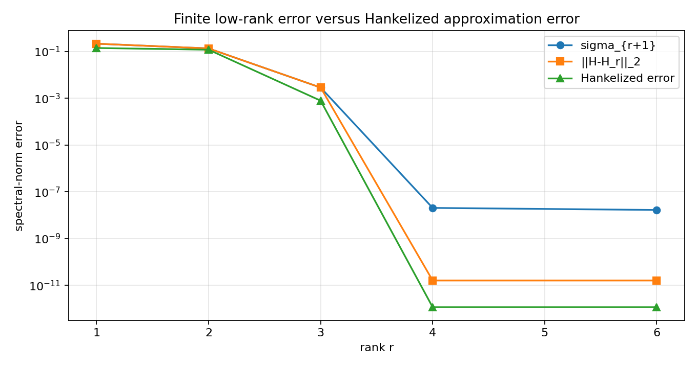
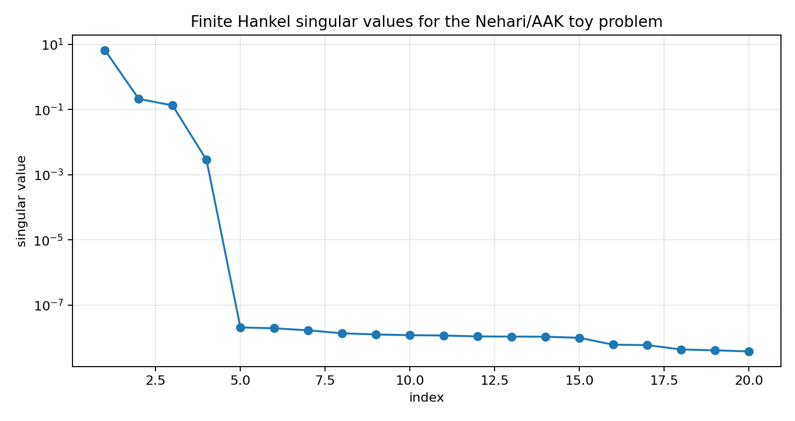
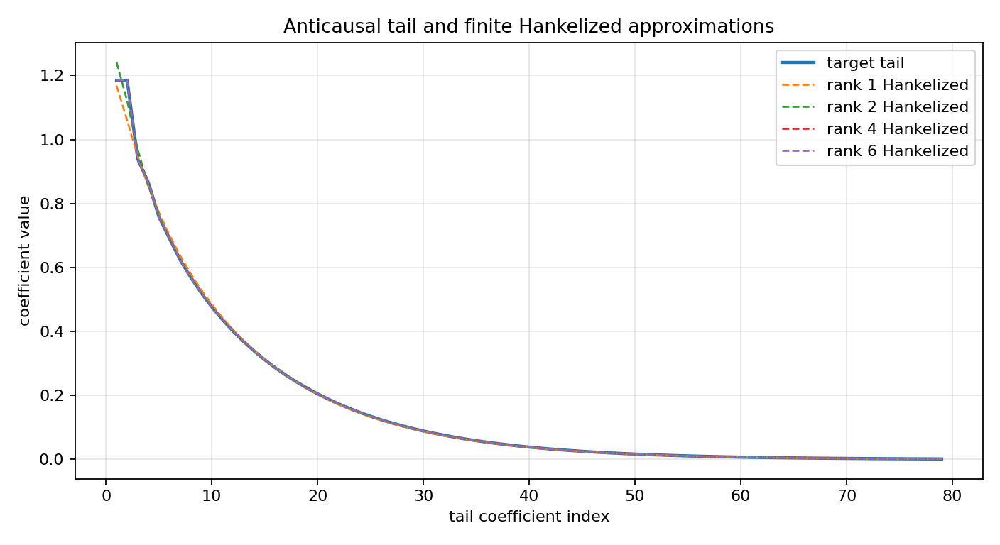

Nehari and AAK intuition from a finite SISO Hankel matrix
=========================================================

.. admonition:: Tutorial goal

   Show the finite-Hankel singular-value picture behind Nehari/AAK model-reduction theory within a finite-section scope.

.. note::

   New to the terminology? See the :doc:`lattice DSP concept map <../../algorithms/concept_map>` and the :doc:`causality/data-use guide <../../theory/causality_and_data_use>` for how online, offline, block, and MIMO examples should be read.

Context
-------

The finite-Hankel reducer already available in the package is a practical baseline.  This
tutorial explains the finite-section Nehari/AAK perspective.  It calls ``finite_nehari_approximate_tail`` to
build a finite Hankel matrix from an anticausal tail and study its singular values.

The goal is to make the intuition precise.  A low-rank Hankel structure means that much of
the input-output memory is carried by a few modes.  In the finite matrix case, the next
singular value controls the best unconstrained rank-r spectral-norm error.  AAK/Nehari is
the rational/Hankel-structured analogue of that statement.

Key idea and equations
----------------------

Given anticausal coefficients ``gamma_1, gamma_2, ...``, form the finite Hankel matrix

.. math::

   \Gamma =
   \begin{bmatrix}
     \gamma_1 & \gamma_2 & \gamma_3 & \cdots \\
     \gamma_2 & \gamma_3 & \gamma_4 & \cdots \\
     \gamma_3 & \gamma_4 & \gamma_5 & \cdots \\
     \vdots & \vdots & \vdots & \ddots
   \end{bmatrix}.

For a finite matrix, the Eckart--Young theorem gives

.. math::

   \min_{\operatorname{rank}(X)\le r} \|\Gamma-X\|_2 = \sigma_{r+1}(\Gamma).

The tutorial also Hankelizes the truncated SVD approximation by anti-diagonal averaging to
show the difference between unconstrained low-rank approximation and a Hankel-structured
approximation.

How to read the result
----------------------

Check that the finite SVD error matches the next singular value, then compare it with the Hankelized approximation error.  This is a finite-section validation bridge and not an exact Nehari/AAK solver.

Run command
-----------

.. code-block:: bash

   python examples/nehari_aak_siso_toy.py

Run status
----------

Return code: ``0``

Captured stdout
---------------

.. code-block:: text

   finite Hankel matrix: 40 x 40
   leading singular values: [6.769662, 0.213953, 0.13427, 0.002854, 0.0, 0.0, 0.0, 0.0]
   finite Eckart-Young check: ||H-H_r||_2 should equal sigma_{r+1}
   rank=1: sigma_next=2.139530e-01, svd_error=2.139530e-01, hankelized_error=1.401856e-01, tail_rel_error=4.636e-02
   rank=2: sigma_next=1.342702e-01, svd_error=1.342702e-01, hankelized_error=1.183549e-01, tail_rel_error=3.249e-02
   rank=3: sigma_next=2.854471e-03, svd_error=2.854471e-03, hankelized_error=7.838998e-04, tail_rel_error=2.210e-04
   rank=4: sigma_next=2.040098e-08, svd_error=1.609799e-11, hankelized_error=1.163741e-12, tail_rel_error=4.756e-13
   rank=6: sigma_next=1.666236e-08, svd_error=1.609806e-11, hankelized_error=1.163918e-12, tail_rel_error=4.314e-13

Figures
-------

   ``nehari_aak_toy_error_curve.png``

   ``nehari_aak_toy_singular_values.png``

   ``nehari_aak_toy_tail_approximations.png``

Generated data files
--------------------

* :download:`nehari_aak_siso_toy_summary.csv <_artifacts/nehari_aak_siso_toy/nehari_aak_siso_toy_summary.csv>`

Source code
-----------

.. literalinclude:: ../../../examples/nehari_aak_siso_toy.py
   :language: python
   :linenos:
