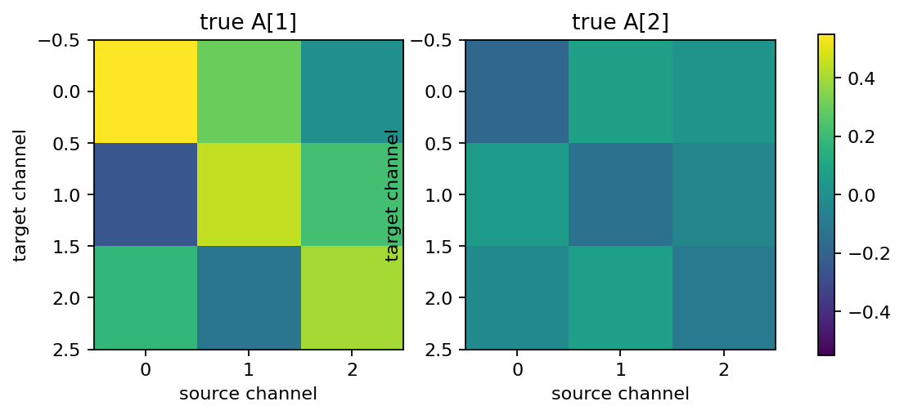
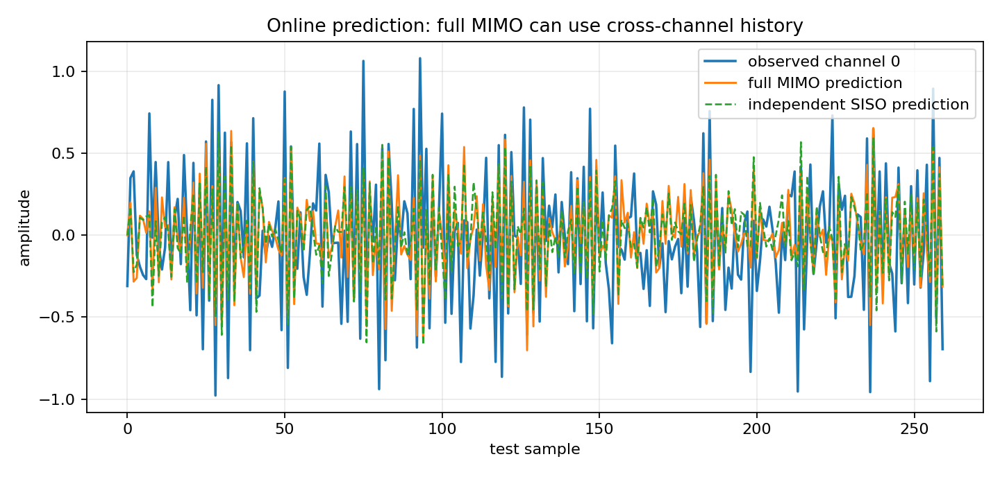
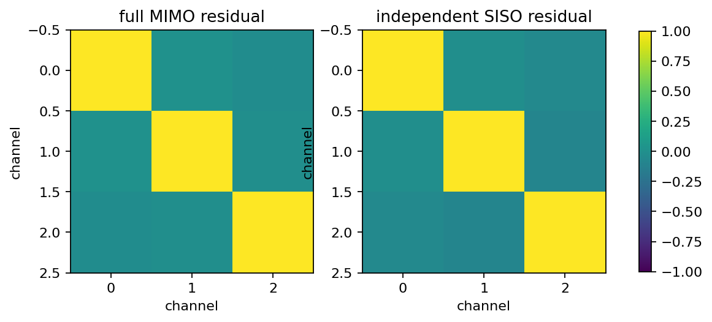
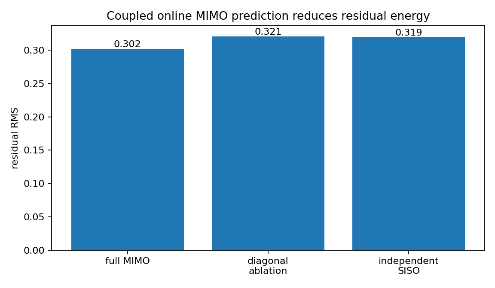

Online coupled MIMO prediction versus independent SISO
======================================================

.. admonition:: Tutorial goal

   Show that full online MIMO lattice prediction captures cross-channel dynamics that independent SISO predictors miss.

.. note::

   New to the terminology? See the :doc:`lattice DSP concept map <../../algorithms/concept_map>` and the :doc:`causality/data-use guide <../../theory/causality_and_data_use>` for how online, offline, block, and MIMO examples should be read.

Context
-------

The diagonal-MIMO tutorial is a reduction test: when reflection matrices are
diagonal, MIMO equals independent SISO.  This tutorial tests the complementary
case.  A synthetic vector AR process contains off-diagonal lag matrices, so
previous samples from one channel help predict another channel.  A full MIMO
lattice predictor can use that cross-channel history; per-channel SISO
predictors cannot.

Key idea and equations
----------------------

The training signal follows a coupled vector AR model

.. math::

   y[n] + \sum_{k=1}^{p} A_k y[n-k] = e[n],
   \qquad A_k \in \mathbb{R}^{c\times c}.

Off-diagonal entries of :math:`A_k` encode cross-channel dynamics.  The full
MIMO predictor estimates matrix reflection coefficients and predicts

.. math::

   \widehat y[n] = g\bigl(y[n-1], y[n-2], \ldots\bigr),

where :math:`g` may mix channels through matrix coefficients.  Independent
SISO baselines instead fit one predictor per channel,

.. math::

   \widehat y_i[n] = g_i\bigl(y_i[n-1], y_i[n-2], \ldots\bigr),

so they cannot use :math:`y_j[n-k]` for :math:`j\ne i`.  The example also
includes a diagonal ablation of the full MIMO reflection matrices to show what
happens when the learned off-diagonal entries are removed.

Causality and data use
----------------------

The coefficients are estimated from a finite training record.  Prediction on the held-out test record is online: each model calls ``predict()`` before ``update(y_n)``, so ``\widehat y[n]`` uses only previous test vectors or previous samples from the corresponding SISO channel.

What this example verifies
--------------------------

This verifies the reason to use MIMO rather than three independent SISO
predictors.  On a held-out coupled VAR stream, the full matrix predictor
should reduce residual RMS and, more importantly, reduce residual
cross-channel correlation relative to diagonal/SISO baselines.

How to read the result
----------------------

Compare residual RMS and residual-covariance plots.  The full MIMO residual should be smaller and less cross-correlated than the independent SISO baseline when the data really contain cross-channel dynamics.  The off-diagonal residual-correlation reduction is often the clearer MIMO diagnostic than scalar RMS alone.

Run command
-----------

.. code-block:: bash

   python examples/online_coupled_mimo_vs_siso.py

Run status
----------

Return code: ``0``

Captured stdout
---------------

.. code-block:: text

   channels: 3
   order: 2
   training samples: 6000
   test samples: 2200
   true companion spectral radius: 0.749380
   fitted companion spectral radius: 0.748557
   full MIMO reflection norms: [0.710496 0.24016 ]
   full MIMO residual RMS: 0.301616
   diagonal-ablation residual RMS: 0.320645
   independent SISO residual RMS: 0.319416
   relative RMS improvement vs independent SISO: 5.57%
   mean abs off-diagonal residual correlation, full MIMO: 0.016742
   mean abs off-diagonal residual correlation, independent SISO: 0.053008
   off-diagonal residual correlation reduction vs independent SISO: 68.42%
   causal contract: prediction is requested before update(y_n) for every test vector

Figures
-------

   ``online_coupled_mimo_coefficient_matrices.png``

   ``online_coupled_mimo_prediction_trace.png``

   ``online_coupled_mimo_residual_covariance.png``

   ``online_coupled_mimo_rms_comparison.png``

Generated data files
--------------------

* :download:`online_coupled_mimo_vs_siso_summary.csv <_artifacts/online_coupled_mimo_vs_siso/online_coupled_mimo_vs_siso_summary.csv>`

Source code
-----------

.. literalinclude:: ../../../examples/online_coupled_mimo_vs_siso.py
   :language: python
   :linenos:
