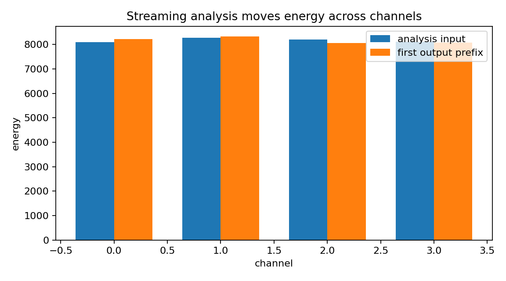
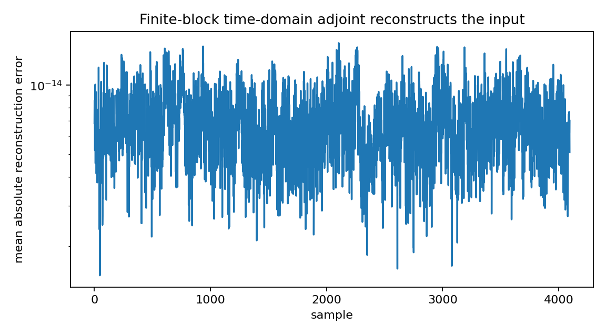
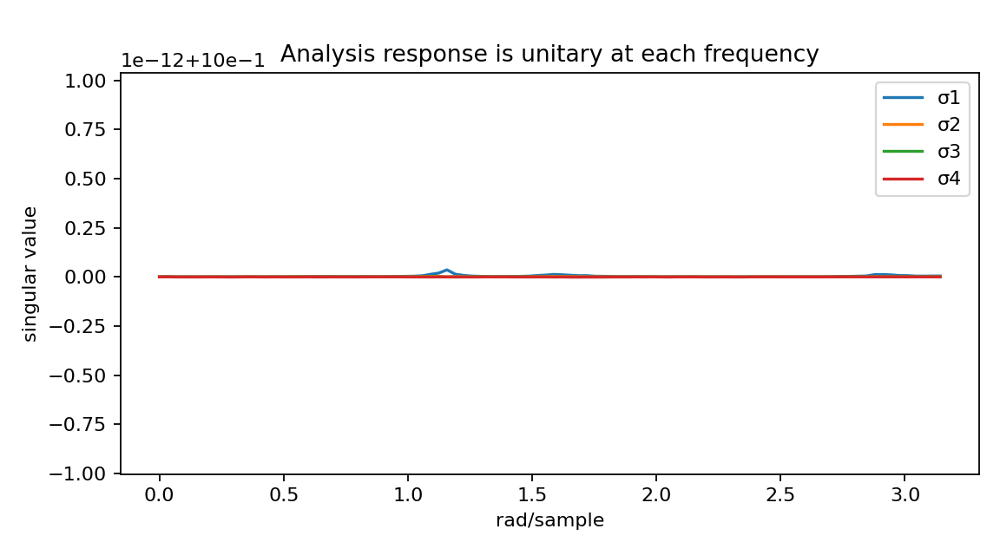
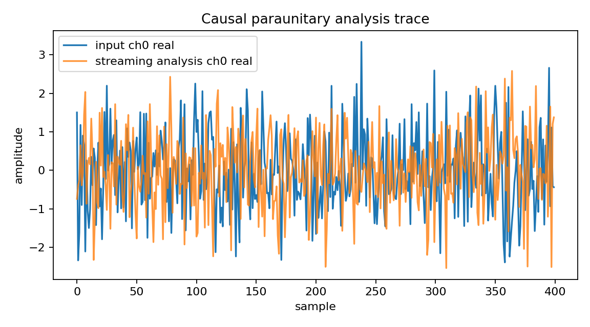

Paraunitary filter-bank behavior
================================

.. admonition:: Tutorial goal

   Demonstrate streaming analysis and finite-record adjoint reconstruction for a paraunitary-style transform.

.. note::

   New to the terminology? See the :doc:`lattice DSP concept map <../../algorithms/concept_map>` and the :doc:`causality/data-use guide <../../theory/causality_and_data_use>` for how online, offline, block, and MIMO examples should be read.

Context
-------

Paraunitary systems preserve energy and enable perfect reconstruction in multirate/filter-bank
contexts.  Matrix lattice structures are a natural way to parameterize such systems.
Here the forward analysis transform is run by the causal online lattice runtime, while
synthesis is a finite-record time-domain adjoint diagnostic.

Key idea and equations
----------------------

A paraunitary filter bank is most naturally described by its polyphase or
frequency-response matrix :math:`E(z)`.  On the unit circle, the ideal
condition is

.. math::

   E(e^{j\omega})^H E(e^{j\omega}) = I.

The online analysis path realizes the causal convolution

.. math::

   y[n] = \sum_{k\ge 0} E_k x[n-k],

and full-stream energy preservation is checked after appending a zero-input tail.
The finite-record synthesis check applies the adjoint

.. math::

   x_{adj}[n] = \sum_{k\ge 0} E_k^H y[n+k].

The adjoint is time-domain but noncausal because it needs future analysis samples.
This is the correct distinction between streaming analysis and block/transductive
reconstruction.

Causality and data use
----------------------

The forward analysis transform is causal and streaming.  The synthesis/reconstruction check is a time-domain finite-block adjoint; it is noncausal because a stable causal all-pass generally has a noncausal stable inverse.

What this example verifies
--------------------------

This verifies the split between streaming analysis and finite-record
synthesis.  The forward paraunitary-style analysis is causal and
norm-preserving after the tail is included; the adjoint reconstruction check
is time-domain but noncausal/transductive.

How to read the result
----------------------

The channel-energy, reconstruction-error, singular-value, and streaming-trace figures should show causal norm-preserving analysis plus near-perfect finite-adjoint reconstruction.

Run command
-----------

.. code-block:: bash

   python examples/paraunitary_filter_bank_demo.py

Run status
----------

Return code: ``0``

Captured stdout
---------------

.. code-block:: text

   channels: 4
   order: 3
   samples: 4096
   tail samples: 1024
   max reflection singular value: 0.937736
   unitarity error: 6.457e-14
   relative reconstruction error: 5.552e-15
   relative energy error with streamed tail: 1.669e-15
   causal analysis: output at n uses current input and stored lattice states
   finite adjoint: synthesis is time-domain but noncausal because it uses the full transformed record
   takeaway: matrix lattice all-pass stages act as streaming paraunitary analysis transforms

Figures
-------

   ``paraunitary_filter_bank_channel_energy.png``

   ``paraunitary_filter_bank_reconstruction_error.png``

   ``paraunitary_filter_bank_singular_values.png``

   ``paraunitary_filter_bank_streaming_trace.png``

Source code
-----------

.. literalinclude:: ../../../examples/paraunitary_filter_bank_demo.py
   :language: python
   :linenos:
