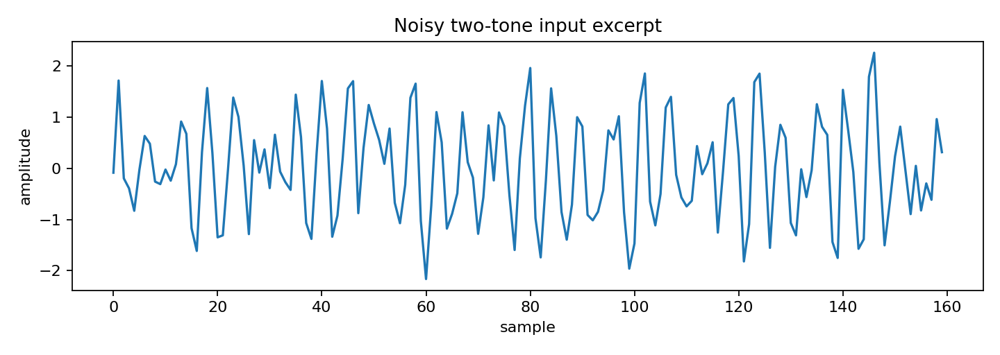
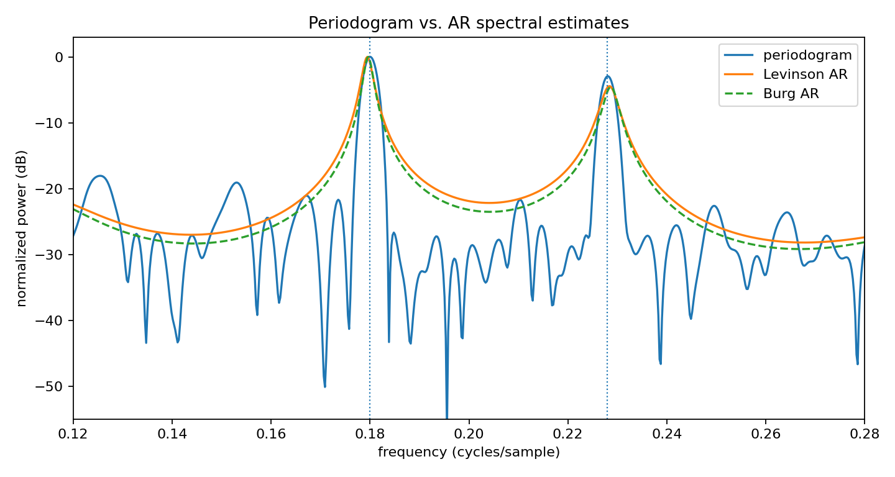

Periodogram versus AR spectral estimates
========================================

.. admonition:: Tutorial goal

   Compare a windowed periodogram with Levinson and Burg AR spectra on a noisy two-tone signal.

.. note::

   New to the terminology? See the :doc:`lattice DSP concept map <../../algorithms/concept_map>` and the :doc:`causality/data-use guide <../../theory/causality_and_data_use>` for how online, offline, block, and MIMO examples should be read.

Context
-------

This tutorial introduces the visual diagnostics that make the AR tools easier to interpret.
The periodogram is a direct Fourier estimate; AR spectra are model-based and can sharpen
peaks, but they also depend on the chosen model order.

Key idea and equations
----------------------

The periodogram estimates power directly from the DFT,

.. math::

   \hat S_{\mathrm{per}}(\omega)=|\mathrm{DFT}\{w[n]x[n]\}|^2,

while an AR spectrum uses

.. math::

   \hat S_{\mathrm{AR}}(\omega) \propto \frac{1}{|\hat A(e^{j\omega})|^2}.

How to read the result
----------------------

The vertical dotted lines mark the true tones.  Compare how broad the periodogram peaks are with the sharper AR curves, and check the CSV for numeric values.

Run command
-----------

.. code-block:: bash

   python examples/periodogram_vs_ar_spectrum.py

Run status
----------

Return code: ``0``

Captured stdout
---------------

.. code-block:: text

   true tone frequencies: [0.18, 0.228]
   AR model order: 18
   periodogram peak estimates: [0.1799, 0.228]
   Levinson AR peak estimates: [0.1794, 0.2283]
   Burg AR peak estimates: [0.1797, 0.2288]

Figures
-------

   ``periodogram_vs_ar_signal.png``

   ``periodogram_vs_ar_spectrum.png``

Generated data files
--------------------

* :download:`periodogram_vs_ar_spectrum.csv <_artifacts/periodogram_vs_ar_spectrum/periodogram_vs_ar_spectrum.csv>`

Source code
-----------

.. literalinclude:: ../../../examples/periodogram_vs_ar_spectrum.py
   :language: python
   :linenos:
