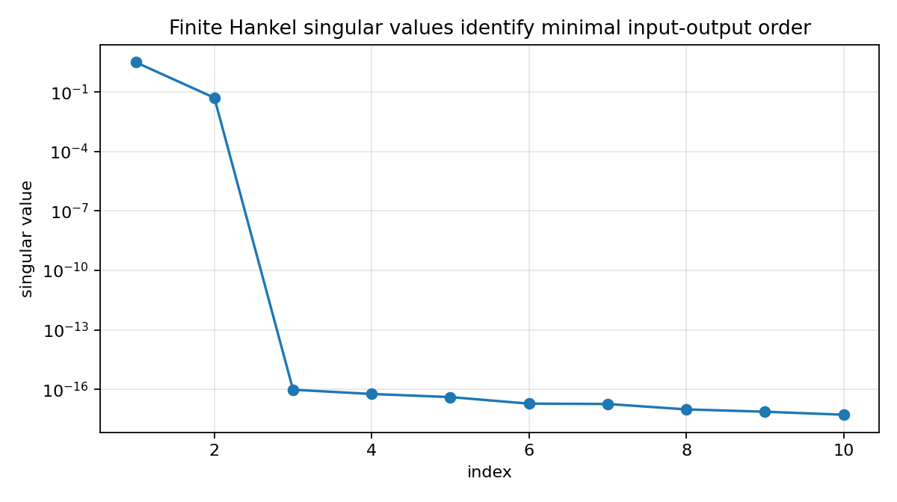

Reachability, observability, and Hankel singular values
=======================================================

.. admonition:: Tutorial goal

   Connect state-space reachability and observability with finite Hankel singular values.

.. note::

   New to the terminology? See the :doc:`lattice DSP concept map <../../algorithms/concept_map>` and the :doc:`causality/data-use guide <../../theory/causality_and_data_use>` for how online, offline, block, and MIMO examples should be read.

Context
-------

Hankel singular values are easier to interpret once they are tied to state-space
reachability and observability.  This tutorial builds a small system with
unreachable and unobservable state directions and shows that the input-output
Hankel matrix only captures directions that are both excited by inputs and seen
at outputs.

Key idea and equations
----------------------

For a state-space model ``(A, B, C, D)``, Markov parameters satisfy

.. math::

   M_k = C A^{k-1} B,

and a block Hankel matrix factors as

.. math::

   \mathcal H = \mathcal O\,\mathcal R,

where ``R`` is reachability and ``O`` is observability.

How to read the result
----------------------

The reachability and observability ranks are both three in the toy model, but the finite Hankel matrix has only two significant singular values because only two directions are both reachable and observable.

Run command
-----------

.. code-block:: bash

   python examples/reachability_observability_hankel_demo.py

Run status
----------

Return code: ``0``

Captured stdout
---------------

.. code-block:: text

   state dimension: 4
   reachability rank: 3
   observability rank: 3
   finite Hankel numerical rank (tol=1e-8): 2
   Gramian Hankel singular values: [3.22664115, 0.05166835, 0.0, 0.0]
   finite Hankel singular values: [3.22643066, 0.05165614, 0.0, 0.0, 0.0, 0.0]
   
   Interpretation: one state is unreachable, one is unobservable, and the
   input-output Hankel matrix only has two significant directions.

Figures
-------

   ``reachability_observability_hankel_singular_values.png``

Generated data files
--------------------

* :download:`reachability_observability_hankel_summary.csv <_artifacts/reachability_observability_hankel_demo/reachability_observability_hankel_summary.csv>`

Source code
-----------

.. literalinclude:: ../../../examples/reachability_observability_hankel_demo.py
   :language: python
   :linenos:
