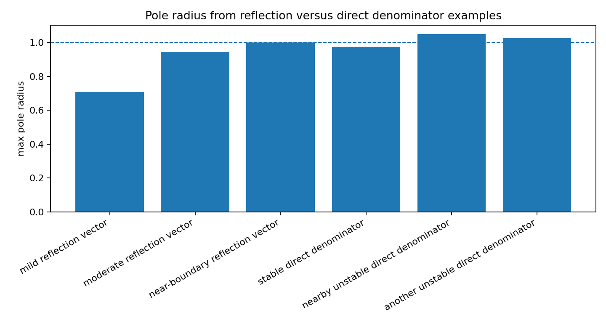

Reflection coefficients as a stability coordinate system
========================================================

.. admonition:: Tutorial goal

   Show why bounded scalar reflection/PARCOR coefficients are a practical stability coordinate system.

.. note::

   New to the terminology? See the :doc:`lattice DSP concept map <../../algorithms/concept_map>` and the :doc:`causality/data-use guide <../../theory/causality_and_data_use>` for how online, offline, block, and MIMO examples should be read.

Context
-------

Scalar IIR stability is hard to read from direct denominator coefficients.  In
lattice coordinates, the all-pole stability condition is exposed stage by stage.
This tutorial compares reflection-parameterized denominators with a few direct
denominator examples near the unit-circle boundary.

Key idea and equations
----------------------

For a scalar all-pole denominator built by the Schur step-up recursion,

.. math::

   |k_i| < 1 \quad \text{for every stage}

keeps the poles inside the unit disk.  Direct denominator coefficients do not
provide an equivalent per-coefficient test.

How to read the result
----------------------

Compare the maximum reflection magnitude with the maximum pole radius.  The direct denominator rows show why pole or reflection diagnostics are still needed outside lattice coordinates.

Run command
-----------

.. code-block:: bash

   python examples/reflection_coefficients_stability_demo.py

Run status
----------

Return code: ``0``

Captured stdout
---------------

.. code-block:: text

   reflection coefficients and scalar IIR stability
   ====================================================
   mild reflection vector:
     type: reflection
     parameters: [0.2, -0.3, 0.1]
     max |reflection|: 0.3
     max pole radius: 0.71056
     stable: True
   moderate reflection vector:
     type: reflection
     parameters: [0.75, -0.45, 0.25]
     max |reflection|: 0.75
     max pole radius: 0.946016
     stable: True
   near-boundary reflection vector:
     type: reflection
     parameters: [0.95, -0.8, 0.65]
     max |reflection|: 0.95
     max pole radius: 0.998825
     stable: True
   stable direct denominator:
     type: direct denominator
     parameters: [1.0, -1.85, 0.95]
     max |reflection|: 0.95
     max pole radius: 0.974679
     stable: True
   nearby unstable direct denominator:
     type: direct denominator
     parameters: [1.0, -2.05, 1.05]
     max |reflection|: nan
     max pole radius: 1.05
     stable: False
   another unstable direct denominator:
     type: direct denominator
     parameters: [1.0, 0.0, 1.05]
     max |reflection|: nan
     max pole radius: 1.0247
     stable: False

Figures
-------

   ``reflection_coefficients_stability_pole_radius.png``

Generated data files
--------------------

* :download:`reflection_coefficients_stability_summary.csv <_artifacts/reflection_coefficients_stability_demo/reflection_coefficients_stability_summary.csv>`

Source code
-----------

.. literalinclude:: ../../../examples/reflection_coefficients_stability_demo.py
   :language: python
   :linenos:
