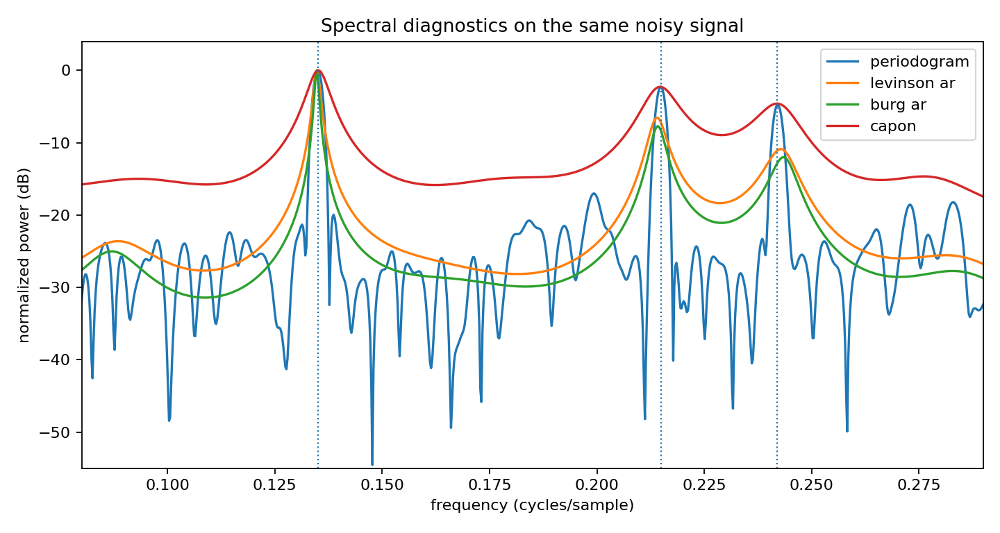
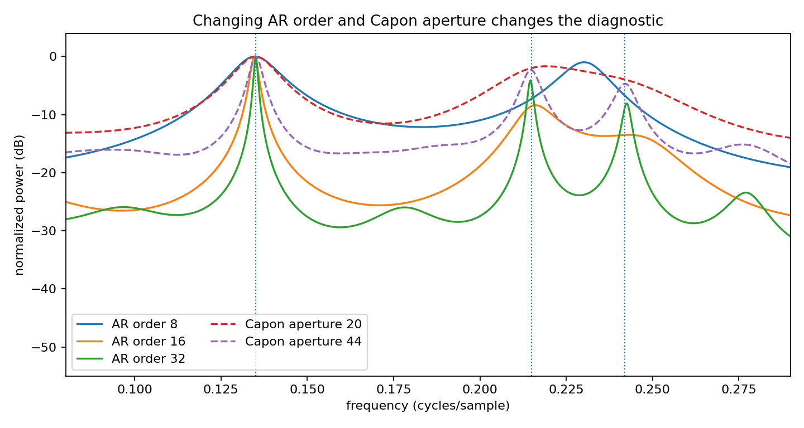

Spectral diagnostics comparison and tuning
==========================================

.. admonition:: Tutorial goal

   Compare periodogram, AR, Burg, and Capon spectra, then vary model order/aperture.

.. note::

   New to the terminology? See the :doc:`lattice DSP concept map <../../algorithms/concept_map>` and the :doc:`causality/data-use guide <../../theory/causality_and_data_use>` for how online, offline, block, and MIMO examples should be read.

Context
-------

This is the tutorial page to read after the two focused spectral examples.  It keeps the
signal fixed and changes the diagnostic method or its tuning parameter so the reader can see
how visual conclusions depend on modeling choices.

Key idea and equations
----------------------

The tunable quantities are model complexity parameters: AR order ``p`` and Capon aperture
``M``.  Larger values can increase resolution, but they can also amplify finite-sample noise.

How to read the result
----------------------

Use the second figure as a tuning guide: peaks should align with true tones, but excessive sharpness or spurious peaks are a warning sign.

Run command
-----------

.. code-block:: bash

   python examples/spectral_diagnostics_comparison.py

Run status
----------

Return code: ``0``

Captured stdout
---------------

.. code-block:: text

   true tone frequencies: [0.135, 0.215, 0.242]
   main AR order: 24
   main Capon aperture: 36

Figures
-------

   ``spectral_diagnostics_comparison.png``

   ``spectral_diagnostics_tuning.png``

Generated data files
--------------------

* :download:`spectral_diagnostics_comparison.csv <_artifacts/spectral_diagnostics_comparison/spectral_diagnostics_comparison.csv>`

Source code
-----------

.. literalinclude:: ../../../examples/spectral_diagnostics_comparison.py
   :language: python
   :linenos:
