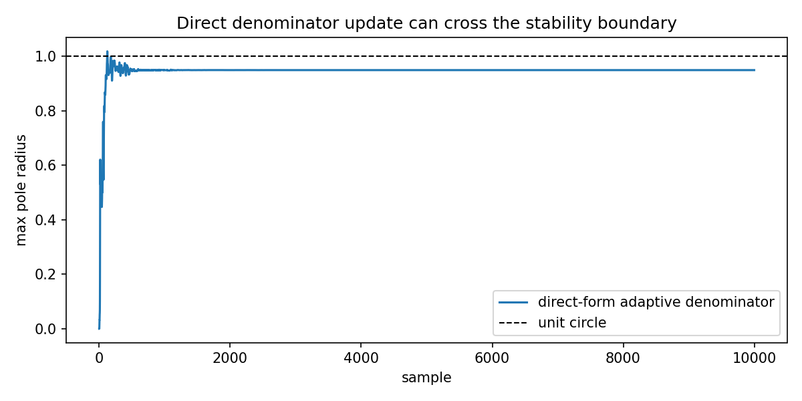

Why direct-form adaptive IIR updates can become unstable
========================================================

.. admonition:: Tutorial goal

   Compare an unconstrained denominator update with bounded reflection-parameterized adaptation.

.. note::

   New to the terminology? See the :doc:`lattice DSP concept map <../../algorithms/concept_map>` and the :doc:`causality/data-use guide <../../theory/causality_and_data_use>` for how online, offline, block, and MIMO examples should be read.

Context
-------

FIR LMS already has a real learning-rate problem: the step size controls convergence,
misadjustment, and divergence.  Adaptive IIR keeps that tuning issue and adds a structural
one, because denominator coefficients move the poles.  This tutorial intentionally uses a
simple aggressive direct-form update to show the failure mode, then compares it with an
adaptive lattice model whose reflection coefficients remain bounded.

Key idea and equations
----------------------

FIR LMS uses

.. math::

   w[n+1] = w[n] + \mu x_n e[n],

so step-size selection is already part of the design.  Direct-form IIR adaptation also
requires all poles of ``A(z)`` to stay inside the unit circle.  In reflection form, the
scalar sufficient condition is simply

.. math::

   |k_i| < 1-\epsilon.

How to read the result
----------------------

Look at the pole-radius figure.  Values above 1 indicate instability in the direct denominator update; the lattice path enforces stability by construction.

Run command
-----------

.. code-block:: bash

   python examples/stability_vs_direct_iir.py

Run status
----------

Return code: ``0``

Captured stdout
---------------

.. code-block:: text

   target denominator: [1.0, 0.369, -0.55]
   target max pole radius: 0.94873
   
   direct-form max pole radius: 1.01772
   direct-form final finite MSE: 5.42434811044316e-23
   
   lattice learned reflection: [0.74967, -0.65528]
   lattice learned denominator: [1.0, 0.25842, -0.65528]
   lattice max pole radius: 0.94896
   lattice final MSE: 0.012732257568221895
   
   Takeaway: the lattice path may still need tuning, but denominator stability
   is enforced by the reflection parameterization instead of hoped for after
   a direct coefficient update.
   A low finite-window MSE is not itself a stability certificate.

Figures
-------

   ``stability_vs_direct_iir.png``

Source code
-----------

.. literalinclude:: ../../../examples/stability_vs_direct_iir.py
   :language: python
   :linenos:
