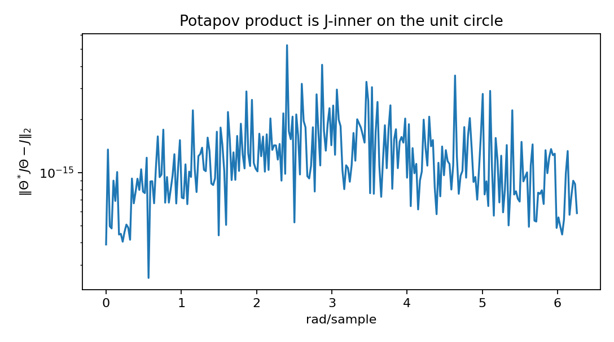
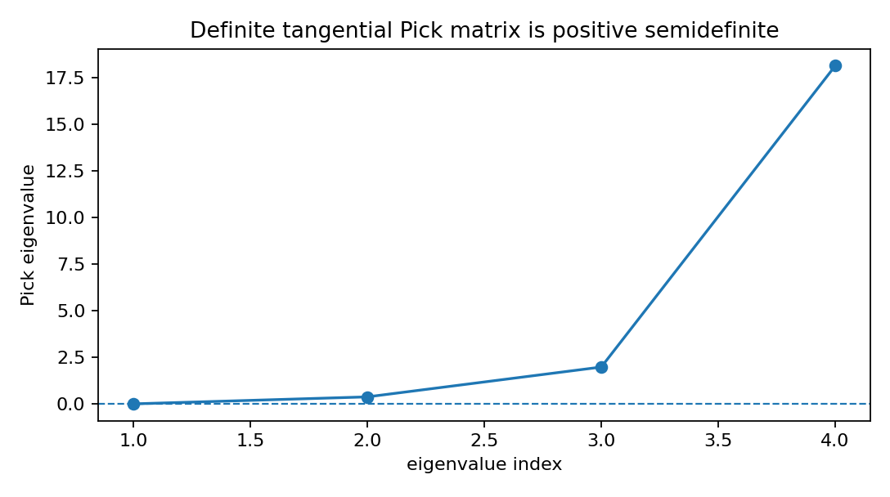

Tangential Schur Pick and J-inner diagnostics
=============================================

.. admonition:: Tutorial goal

   Check definite right-tangential Schur data with a Pick matrix and verify elementary Potapov J-inner factors.

.. note::

   New to the terminology? See the :doc:`lattice DSP concept map <../../algorithms/concept_map>` and the :doc:`causality/data-use guide <../../theory/causality_and_data_use>` for how online, offline, block, and MIMO examples should be read.

Context
-------

Tangential interpolation asks a matrix-valued Schur function to match only
selected input directions rather than every column of the transfer matrix.
This tutorial uses data generated from a known constant contraction so the
Pick certificate, interpolation residual, and J-inner diagnostics can all be
checked without hiding a difficult synthesis problem inside the example.

Key idea and equations
----------------------

The right tangential data are

.. math::

   S(z_i)u_i = v_i, \qquad \lVert S\rVert_\infty \le 1.

The RKHS/de Branges--Rovnyak kernel for a Schur function is

.. math::

   K_S(z,w)=\frac{I-S(z)^HS(w)}{1-\overline z w}.

Testing this kernel on tangential directions gives the finite Pick Gram
matrix

.. math::

   P_{ij}=u_i^H K_S(z_i,z_j)u_j
         =\frac{u_i^H u_j-v_i^H v_j}{1-\overline{z_i}z_j}.

Feasibility in the definite problem requires :math:`P\succeq0`.
For each strict rank-one datum, the graph vector
:math:`\xi_i=[v_i;u_i]` has negative J-norm for

.. math::

   J=\begin{bmatrix}I_{out}&0\\0&-I_{in}\end{bmatrix}.

The scalar Blaschke factor and its Potapov--Blaschke lift are

.. math::

   b_a(z)=\frac{z-a}{1-\overline a z},
   \qquad
   \Theta_i(z)=I+(b_{z_i}(z)-1)P_{\xi_i}.

The projection :math:`P_{\xi_i}` is J-orthogonal.  The resulting
:math:`\Theta_i` is J-inner on the unit circle and annihilates
:math:`\xi_i` at :math:`z_i`.

Causality and data use
----------------------

This is finite interpolation-data analysis, not streaming filtering.  It is an offline Pick/J-inner diagnostic that explains the matrix-lattice background.

What this example verifies
--------------------------

This verifies the finite definite tangential-Schur baseline.  The Pick
matrix should be positive semidefinite, the known constant contraction
should interpolate the data to roundoff, elementary Potapov factors should
annihilate their graph vectors, and the factor product should be J-inner on
the unit circle.

How to read the result
----------------------

The Pick eigenvalues should be nonnegative, the constant solution residual should be near roundoff, and the J-inner residual should be near numerical precision.

Run command
-----------

.. code-block:: bash

   python examples/tangential_schur_pick_jinner.py

Run status
----------

Return code: ``0``

Captured stdout
---------------

.. code-block:: text

   points: 4
   input dimension: 2
   output dimension: 2
   total tangential conditions: 4
   known Schur spectral norm: 0.450000
   Pick min eigenvalue: 1.634317e-02
   Pick condition number: 1.111128e+03
   definite Pick test says feasible: True
   constant-solution interpolation residual: 3.370e-16
   Potapov product J-inner max residual: 5.260e-15
   first factor annihilation residual: 1.799e-16
   scope: finite definite Pick/RKHS/J-inner diagnostics
   not implemented here: full recursive tangential-Schur manifold parametrization

Figures
-------

   ``potapov_j_inner_residual.png``

   ``tangential_pick_eigenvalues.png``

Source code
-----------

.. literalinclude:: ../../../examples/tangential_schur_pick_jinner.py
   :language: python
   :linenos:
