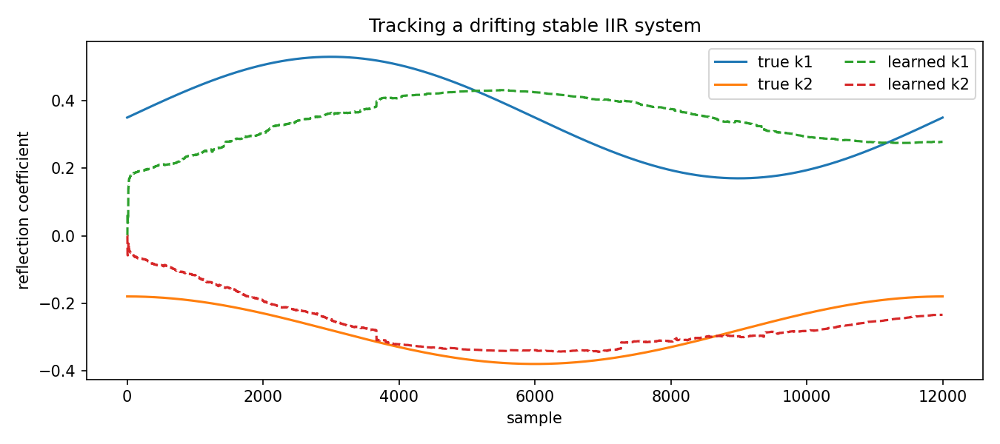

Tracking a drifting stable IIR system
=====================================

.. admonition:: Tutorial goal

   Track a target system whose parameters slowly change over time.

.. note::

   New to the terminology? See the :doc:`lattice DSP concept map <../../algorithms/concept_map>` and the :doc:`causality/data-use guide <../../theory/causality_and_data_use>` for how online, offline, block, and MIMO examples should be read.

Context
-------

Real adaptive problems are not always stationary.  This tutorial changes the target system
gradually and checks whether bounded reflection adaptation can track the drift without
crossing the stability boundary.

Key idea and equations
----------------------

A useful diagnostic is the moving error power

.. math::

   \operatorname{MSE}_t = \frac{1}{W}\sum_{i=t-W+1}^{t} e_i^2.

How to read the result
----------------------

The figure should show the tracking error over time.  Slow drift should be followed; abrupt or very fast drift would require different tuning.

Run command
-----------

.. code-block:: bash

   python examples/tracking_drifting_iir_system.py

Run status
----------

Return code: ``0``

Captured stdout
---------------

.. code-block:: text

   true final reflection: [0.3499, -0.18]
   learned final reflection: [0.278, -0.2344]
   initial MSE: 0.07171581264812597
   final MSE: 0.001748078090650818
   minimum stability margin: 0.5686182643689661

Figures
-------

   ``tracking_drifting_iir_system.png``

Source code
-----------

.. literalinclude:: ../../../examples/tracking_drifting_iir_system.py
   :language: python
   :linenos:
